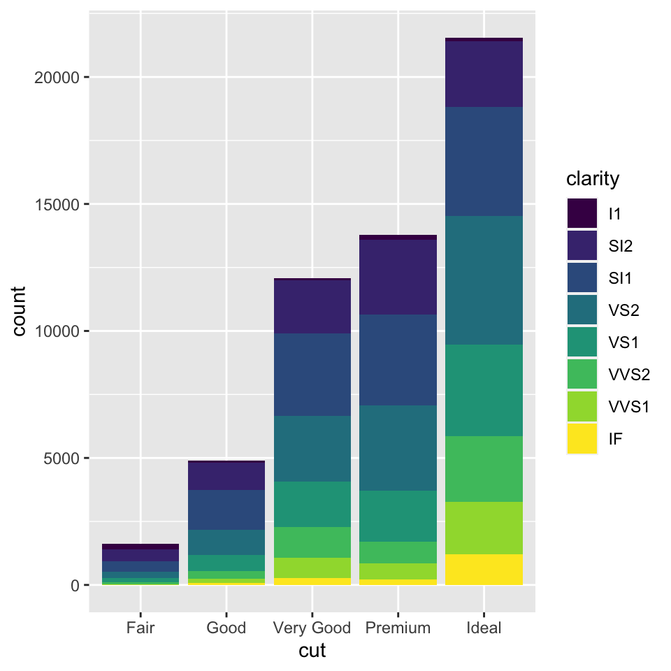
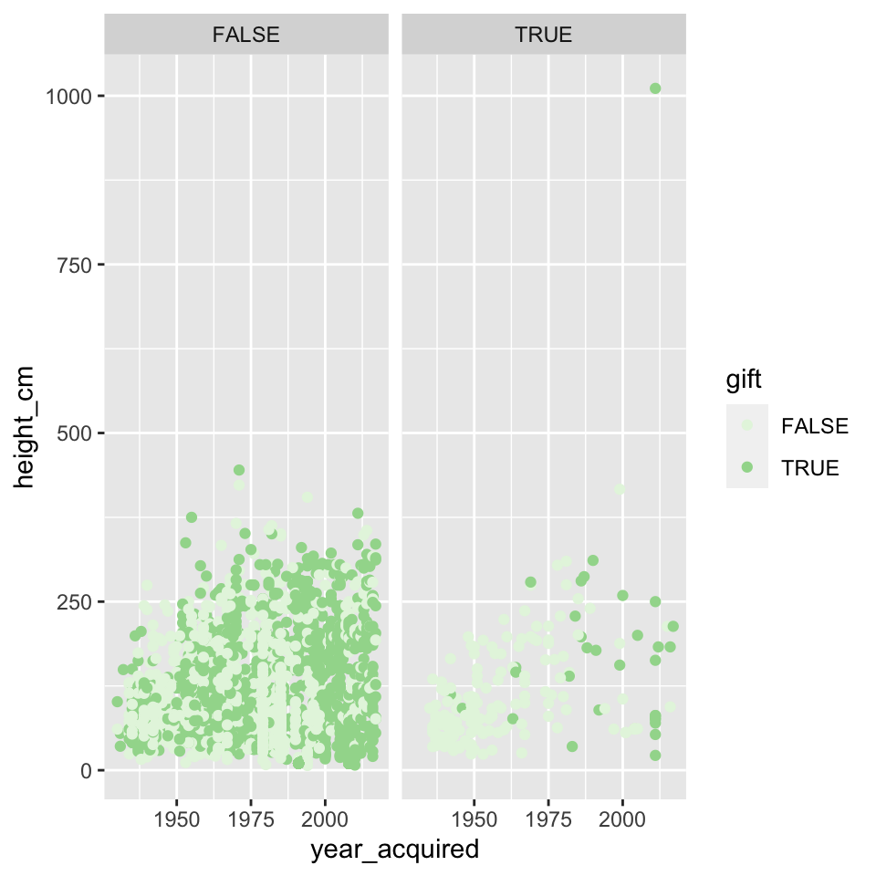
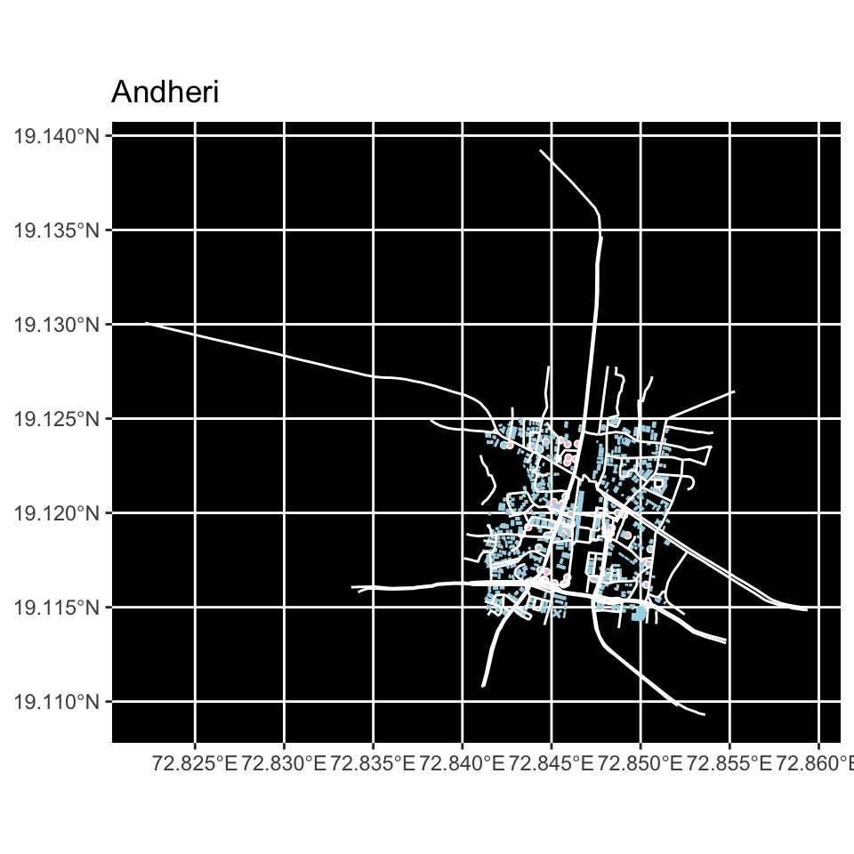

## Introduction

Hello.

Im Aarushi and I've opted for IADP. I'm pretty new to coding in general. The following works are the ones I made based on what we learnt in this course. I have tried to include different graphs for a bit more variety.


## Graph 1

**The diamonds dataset contains the prices of over 50,000 round cut diamonds.**

1.It inclused the price of diamonds(in USD)

2.carat   
   weight of the diamond)  
   
3.cut  
   quality of the cut - Fair, Good, Very Good, Premium, Ideal  
   
4.color  
   diamond colour from D (best) to J (worst)  
   
5.clarity  
   a measurement of how clear the diamond is (I1 (worst), SI2, SI1, VS2, VS1, VVS2, VVS1, IF (best))  
   
6.x  
   length in mm  
   
7.y  
   width in mm  
   
8.z  
   depth in mm  
   
9.depth  
   total depth percentage = z / mean  
   
10.table  
   width of top of diamond relative to widest point  


```
## # A tibble: 6 x 10
##   carat cut       color clarity depth table price     x     y     z
##   <dbl> <ord>     <ord> <ord>   <dbl> <dbl> <int> <dbl> <dbl> <dbl>
## 1  0.23 Ideal     E     SI2      61.5    55   326  3.95  3.98  2.43
## 2  0.21 Premium   E     SI1      59.8    61   326  3.89  3.84  2.31
## 3  0.23 Good      E     VS1      56.9    65   327  4.05  4.07  2.31
## 4  0.29 Premium   I     VS2      62.4    58   334  4.2   4.23  2.63
## 5  0.31 Good      J     SI2      63.3    58   335  4.34  4.35  2.75
## 6  0.24 Very Good J     VVS2     62.8    57   336  3.94  3.96  2.48
```

```
## Rows: 53,940
## Columns: 10
## $ carat   <dbl> 0.23, 0.21, 0.23, 0.29, 0.31, 0.24, 0.24, 0.26, 0.22, 0.23, 0.~
## $ cut     <ord> Ideal, Premium, Good, Premium, Good, Very Good, Very Good, Ver~
## $ color   <ord> E, E, E, I, J, J, I, H, E, H, J, J, F, J, E, E, I, J, J, J, I,~
## $ clarity <ord> SI2, SI1, VS1, VS2, SI2, VVS2, VVS1, SI1, VS2, VS1, SI1, VS1, ~
## $ depth   <dbl> 61.5, 59.8, 56.9, 62.4, 63.3, 62.8, 62.3, 61.9, 65.1, 59.4, 64~
## $ table   <dbl> 55, 61, 65, 58, 58, 57, 57, 55, 61, 61, 55, 56, 61, 54, 62, 58~
## $ price   <int> 326, 326, 327, 334, 335, 336, 336, 337, 337, 338, 339, 340, 34~
## $ x       <dbl> 3.95, 3.89, 4.05, 4.20, 4.34, 3.94, 3.95, 4.07, 3.87, 4.00, 4.~
## $ y       <dbl> 3.98, 3.84, 4.07, 4.23, 4.35, 3.96, 3.98, 4.11, 3.78, 4.05, 4.~
## $ z       <dbl> 2.43, 2.31, 2.31, 2.63, 2.75, 2.48, 2.47, 2.53, 2.49, 2.39, 2.~
```

**Two bar graphs of the diamonds.**

**The first divides the diamonds based on the cut and the colour indicates the clarity. The second divides them based on the depth and the colour divides them based on clarity.**



## Graph 2


**The below dataset lists the names of artists, their birth and death years. the titles of the paintings they have made, the year it was aquired, their gender, department etc.**


```
## Rows: 2,253
## Columns: 23
## $ title             <chr> "Rope and People, I", "Fire in the Evening", "Portra~
## $ artist            <chr> "Joan Miró", "Paul Klee", "Paul Klee", "Pablo Picass~
## $ artist_bio        <chr> "(Spanish, 1893–1983)", "(German, born Switzerland. ~
## $ artist_birth_year <dbl> 1893, 1879, 1879, 1881, 1880, 1879, 1943, 1880, 1839~
## $ artist_death_year <dbl> 1983, 1940, 1940, 1973, 1946, 1953, 1977, 1950, 1906~
## $ num_artists       <dbl> 1, 1, 1, 1, 1, 1, 1, 1, 1, 1, 1, 1, 1, 1, 1, 1, 1, 1~
## $ n_female_artists  <dbl> 0, 0, 0, 0, 0, 0, 0, 0, 0, 0, 0, 0, 0, 0, 0, 0, 0, 0~
## $ n_male_artists    <dbl> 1, 1, 1, 1, 1, 1, 1, 1, 1, 1, 1, 1, 1, 1, 1, 1, 1, 1~
## $ artist_gender     <chr> "Male", "Male", "Male", "Male", "Male", "Male", "Mal~
## $ year_acquired     <dbl> 1936, 1970, 1966, 1955, 1939, 1968, 1997, 1931, 1934~
## $ year_created      <dbl> 1935, 1929, 1927, 1919, 1925, 1919, 1970, 1929, 1885~
## $ circumference_cm  <lgl> NA, NA, NA, NA, NA, NA, NA, NA, NA, NA, NA, NA, NA, ~
## $ depth_cm          <dbl> NA, NA, NA, NA, NA, NA, NA, NA, NA, NA, NA, NA, NA, ~
## $ diameter_cm       <lgl> NA, NA, NA, NA, NA, NA, NA, NA, NA, NA, NA, NA, NA, ~
## $ height_cm         <dbl> 104.8, 33.8, 60.3, 215.9, 50.8, 129.2, 200.0, 54.6, ~
## $ length_cm         <lgl> NA, NA, NA, NA, NA, NA, NA, NA, NA, NA, NA, NA, NA, ~
## $ width_cm          <dbl> 74.6, 33.3, 36.8, 78.7, 54.0, 89.9, 200.0, 38.1, 96.~
## $ seat_height_cm    <lgl> NA, NA, NA, NA, NA, NA, NA, NA, NA, NA, NA, NA, NA, ~
## $ purchase          <lgl> FALSE, FALSE, FALSE, FALSE, FALSE, FALSE, FALSE, FAL~
## $ gift              <lgl> TRUE, FALSE, FALSE, TRUE, TRUE, FALSE, TRUE, TRUE, F~
## $ exchange          <lgl> FALSE, FALSE, FALSE, FALSE, TRUE, FALSE, FALSE, FALS~
## $ classification    <chr> "Painting", "Painting", "Painting", "Painting", "Pai~
## $ department        <chr> "Painting & Sculpture", "Painting & Sculpture", "Pai~
```

**The graph below is a scatter plot of the height in cm of the works and the year they were acquired. Here there is a facet wrap used which divides the points in two i.e. purchase TRUE or FALSE, where the light green is True and dark green is False**



## Graph 3

**The map below is a map of Andheri, Mumbai. The pink shapes indicate the amenities and the blue ones show the buildings in andheri. The white is for the highway. I set the background of the map to black so that the light blue, white and pink stands out. **


```
##        min      max
## x 72.83420 72.87420
## y 19.09588 19.13588
```

```
##  num [1:2, 1:2] 72.8 19.1 72.9 19.1
##  - attr(*, "dimnames")=List of 2
##   ..$ : chr [1:2] "x" "y"
##   ..$ : chr [1:2] "min" "max"
```




## My Course Reflection  


This course was about using R language on Rstudio to plot graphs and maps.

I learnt how to edit text in a markdown (eg. add links, use bold/italic text, create lists etc) and also how to import datasets and use them to create various kinds of scatter graphs, bar graphs etc. I also learnt to make maps of any place and also plot the buildings, highways amenities etc on it.

I feel like this was something  totally new to me and I would not have dipped my toes into coding if it were not for this workshop. I do feel like it will help me in the long run as I am now a little familiar with coding.


