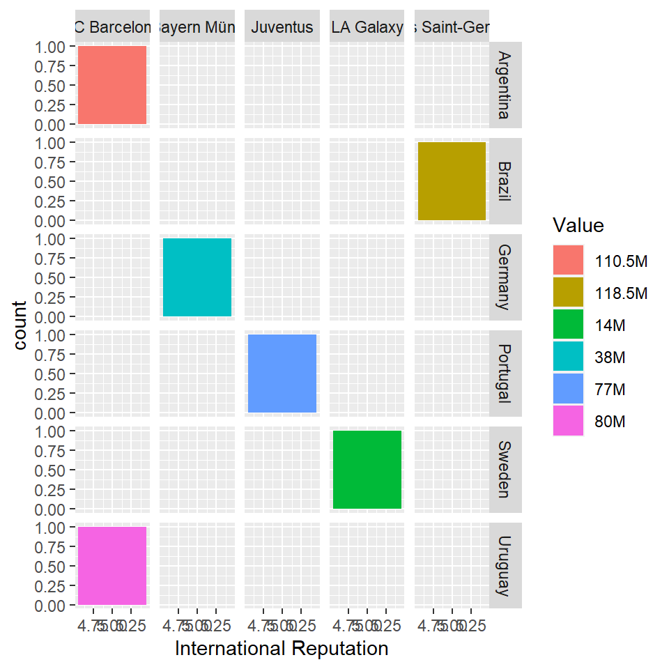
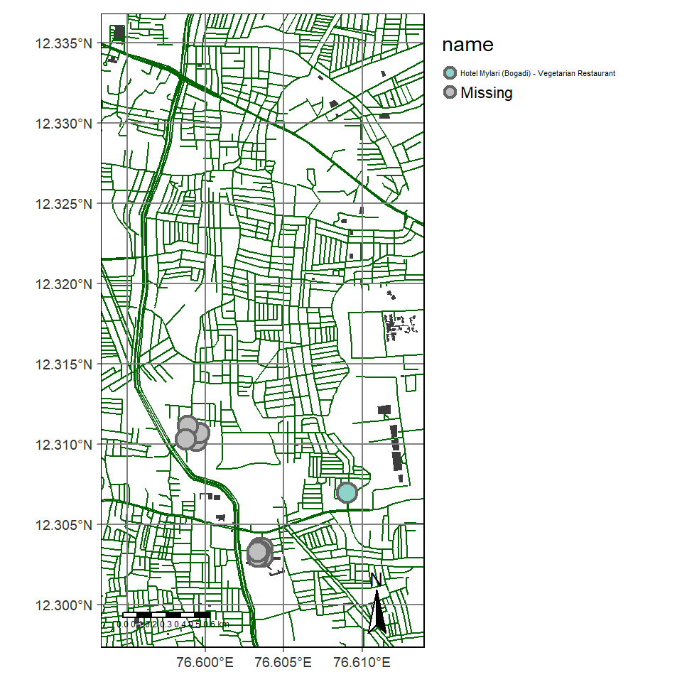

> Aren't we all just rows in a larger dataset?


## Graph 1: 

### Concised FIFA dataset

The following is a datset of all the players in the game FIFA-19 and their player attributes. The initial dataset was very large, this is a concised version of the same.


```
## # A tibble: 18,207 x 17
##    Name                Age Nationality Overall Potential Club  Value Wage  Position
##    <chr>             <dbl> <chr>         <dbl>     <dbl> <chr> <chr> <chr> <chr>   
##  1 L. Messi             31 Argentina      94.7      94.8 FC B~ 110.~ 565K  RF      
##  2 Cristiano Ronaldo    33 Portugal       94.5      94.5 Juve~ 77M   405K  ST      
##  3 Neymar Jr            26 Brazil         92.2      93.7 Pari~ 118.~ 290K  LW      
##  4 De Gea               27 Spain          91.7      93.4 Manc~ 72M   260K  GK      
##  5 K. De Bruyne         27 Belgium        91.5      92.2 Manc~ 102M  355K  RCM     
##  6 E. Hazard            27 Belgium        91.2      91.9 Chel~ 93M   340K  LF      
##  7 L. Modric            32 Croatia        91.4      91.8 Real~ 67M   420K  RCM     
##  8 L. Suárez            31 Uruguay        91.6      91.7 FC B~ 80M   455K  RS      
##  9 Sergio Ramos         32 Spain          91.3      91.5 Real~ 51M   380K  RCB     
## 10 J. Oblak             25 Slovenia       90.7      93.2 Atlé~ 68M   94K   GK      
## # ... with 18,197 more rows, and 8 more variables: Preferred Foot <chr>,
## #   Body Type <chr>, Skill Moves <dbl>, BallControl <dbl>, SprintSpeed <dbl>,
## #   GKHandling <dbl>, International Reputation <dbl>, GKReflexes <dbl>
```


### What is the value of most internaltionally reputed players and which nationality and club do they belong to?



## Graph 2: Making a map with some nice places to eat in Rajajinagar

### Interactive dark mode



## Graph 3: The successors of the Michigan lake house

The following is a manually curated dataset of the characters in Bojack horseman, season 4, episode 10,11. I created a visual network for the same. 


```
## # A tibble: 16 x 5
##       id name             sex    species   profession 
##    <int> <chr>            <chr>  <chr>     <chr>      
##  1     1 Andy             Male   Dragonfly Homemaker  
##  2     2 Beatrice         Female Horse     Homemaker  
##  3     3 Butterscotch     Male   Horse     Writer     
##  4     4 Camilia          Female Swan      Homemaker  
##  5     5 Crackerjack      Male   Horse     Soldier    
##  6     6 Diane            Female Human     Writer     
##  7     7 Henrietta        Female Human     Maid       
##  8     8 Mrs Sugarman     Female Horse     Homemaker  
##  9     9 Sugarman         Male   Horse     Businessman
## 10    10 Bojack           Male   Horse     Actor      
## 11    11 Corban           Male   Goat      Businessman
## 12    12 Sally            Male   Human     Soldier    
## 13    13 Todd             Male   Human     Businessman
## 14    14 Mr Peanutbutter  Male   Dog       Actor      
## 15    15 Princess Carolyn Female Cat       Manager    
## 16    16 Hollyhock        Female Horse     Student
```

```
## # A tibble: 25 x 2
##     from    to
##    <int> <int>
##  1     2    10
##  2     7     2
##  3     4     2
##  4     9     2
##  5     8     9
##  6     2    11
##  7     2     3
##  8     3    10
##  9     7     3
## 10     8     2
## # ... with 15 more rows
```

### Visual network based on species


```
## # A tibble: 16 x 5
##       id label            sex    group     profession 
##    <int> <chr>            <chr>  <chr>     <chr>      
##  1     1 Andy             Male   Dragonfly Homemaker  
##  2     2 Beatrice         Female Horse     Homemaker  
##  3     3 Butterscotch     Male   Horse     Writer     
##  4     4 Camilia          Female Swan      Homemaker  
##  5     5 Crackerjack      Male   Horse     Soldier    
##  6     6 Diane            Female Human     Writer     
##  7     7 Henrietta        Female Human     Maid       
##  8     8 Mrs Sugarman     Female Horse     Homemaker  
##  9     9 Sugarman         Male   Horse     Businessman
## 10    10 Bojack           Male   Horse     Actor      
## 11    11 Corban           Male   Goat      Businessman
## 12    12 Sally            Male   Human     Soldier    
## 13    13 Todd             Male   Human     Businessman
## 14    14 Mr Peanutbutter  Male   Dog       Actor      
## 15    15 Princess Carolyn Female Cat       Manager    
## 16    16 Hollyhock        Female Horse     Student
```

```{=html}
<div id="htmlwidget-2be1335be8e51a63d3d4" style="width:480px;height:480px;" class="visNetwork html-widget"></div>
<script type="application/json" data-for="htmlwidget-2be1335be8e51a63d3d4">{"x":{"nodes":{"id":[1,2,3,4,5,6,7,8,9,10,11,12,13,14,15,16],"label":["Andy","Beatrice","Butterscotch","Camilia","Crackerjack","Diane","Henrietta","Mrs Sugarman","Sugarman","Bojack","Corban","Sally","Todd","Mr Peanutbutter","Princess Carolyn","Hollyhock"],"sex":["Male","Female","Male","Female","Male","Female","Female","Female","Male","Male","Male","Male","Male","Male","Female","Female"],"group":["Dragonfly","Horse","Horse","Swan","Horse","Human","Human","Horse","Horse","Horse","Goat","Human","Human","Dog","Cat","Horse"],"profession":["Homemaker","Homemaker","Writer","Homemaker","Soldier","Writer","Maid","Homemaker","Businessman","Actor","Businessman","Soldier","Businessman","Actor","Manager","Student"]},"edges":{"from":[2,7,4,9,8,2,2,3,7,8,9,8,5,1,5,8,6,6,10,6,15,10,13,16,16],"to":[10,2,2,2,9,11,3,10,3,2,5,5,2,10,12,12,10,14,14,13,13,13,14,10,2]},"nodesToDataframe":true,"edgesToDataframe":true,"options":{"width":"100%","height":"100%","nodes":{"shape":"dot","font":{"size":30}},"manipulation":{"enabled":false},"groups":{"Human":{"shape":"icon","icon":{"code":"f183","size":75,"color":"red"},"shadow":{"enabled":true}},"Horse":{"shape":"icon","icon":{"code":"f111","size":75,"color":"slateblue"},"shadow":{"enabled":true}},"Swan":{"shape":"icon","icon":{"code":"f056","size":70,"color":"#4e0000"},"shadow":{"enabled":false}},"Goat":{"shape":"icon","icon":{"code":"f056","size":50,"color":"#9d0000"},"shadow":{"enabled":false}},"Dragonfly":{"shape":"icon","icon":{"code":"f056","size":30,"color":"#ff6262"},"shadow":{"enabled":false}},"Cat":{"shape":"icon","icon":{"code":"f056","size":20,"color":"#ff9d9d"},"shadow":{"enabled":false}},"useDefaultGroups":true,"Dog":{"shape":"icon","icon":{"code":"f056","size":55,"color":"#b14e4e"},"shadow":{"enabled":false}}},"interaction":{"hover":true,"hoverConnectedEdges":true,"navigationButtons":true,"selectConnectedEdges":true,"zoomView":true}},"groups":["Dragonfly","Horse","Swan","Human","Goat","Dog","Cat"],"width":null,"height":null,"idselection":{"enabled":false},"byselection":{"enabled":false},"main":null,"submain":null,"footer":null,"background":"rgba(0, 0, 0, 0)","iconsRedraw":true,"legend":{"width":0.2,"useGroups":true,"position":"left","ncol":1,"stepX":100,"stepY":100,"zoom":true},"tooltipStay":300,"tooltipStyle":"position: fixed;visibility:hidden;padding: 5px;white-space: nowrap;font-family: verdana;font-size:14px;font-color:#000000;background-color: #f5f4ed;-moz-border-radius: 3px;-webkit-border-radius: 3px;border-radius: 3px;border: 1px solid #808074;box-shadow: 3px 3px 10px rgba(0, 0, 0, 0.2);"},"evals":[],"jsHooks":[]}</script>
```


## Reflection

Coding is something I have always enjoyed doing. Similarly this course was enjoyable as well. The course constantly kept me challenged and on my feet at all times. It was nice to spend a lot of waking and sometimes even sleeping hours trying to figure out why something is not working. It was nice to relive that feeling of finally figuring out a faulty code (it's usually the bracket)). Over all this course was good wrap to the year and was a fun introduction to R. R studio is a very powerful tool which I am sure I will explore a lot more in the years to come. I want to thank Arvind for introducing me to R. He was really patient with all my doubts and kept our enthusiasm high all through. He's the coolest boomer I know which is kinda sus..

