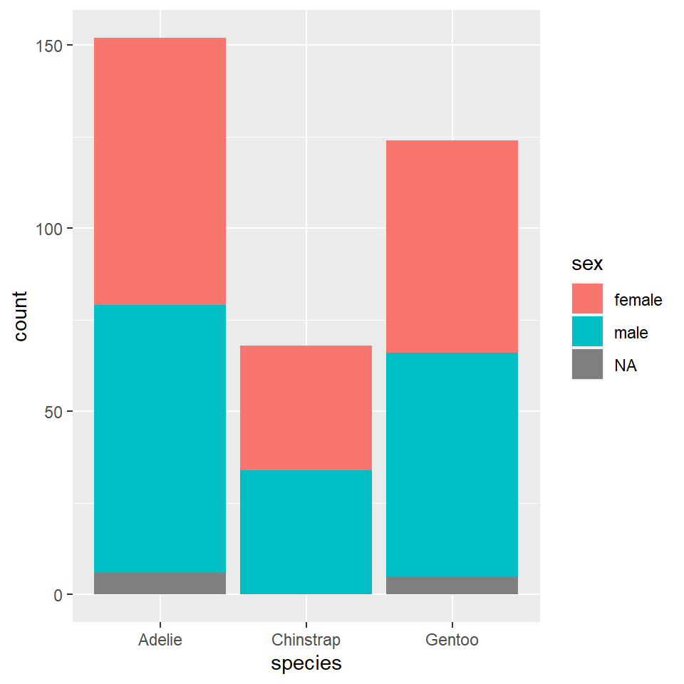

## Introduction

> HI!! I'm Aditi and you're going to see a few of my favorite graphs and maps that I made using R Studio.

## Graph 1

 

## Graph 2

## Graph 3

## My Course Reflection

This course was about.....

What I learnt....

How it will help my practice as an aspiring artist and designer....

Arvind is a horrible teacher and simply does not get what we need.
Boomers should be allowed to teach any more in Srishti.

Etc.

Jai Hind.

