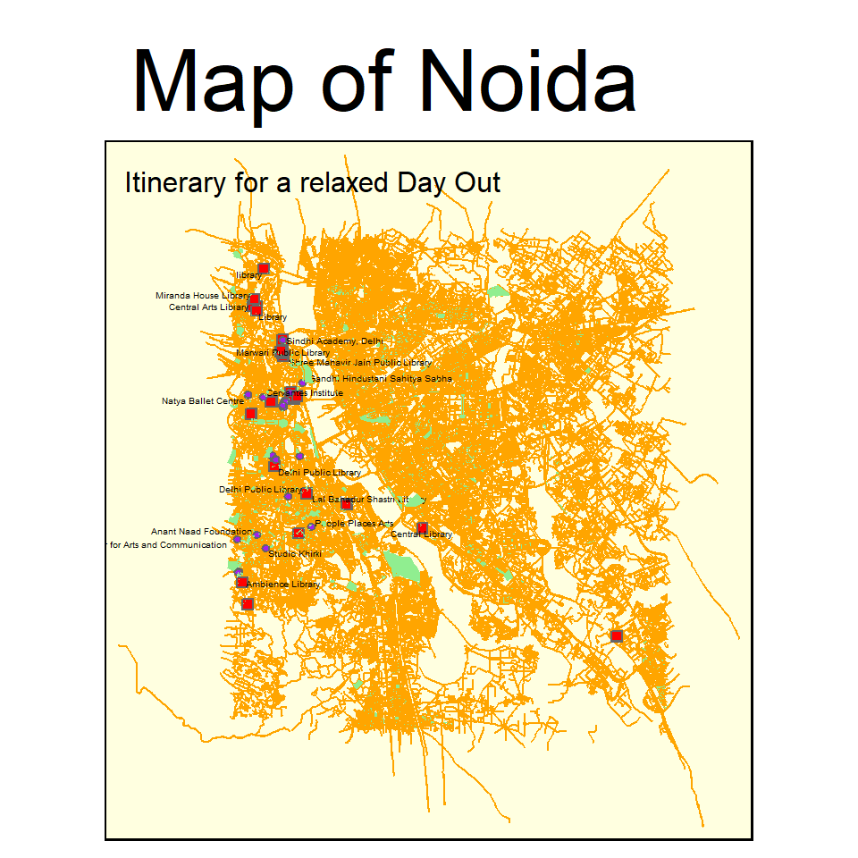

## Introduction

> Hi! I'm Ananya and in the following sections you'll see what I've done in the last two weeks. Every graph represnts an answer to a question that I've included aabove the graph. Enjoy :)

## Graph 1 - Using the Gapminder Dataset

*Gapminder* consists of data like population,life expentancy and GDP per capita of 142 countries collected between 1952-2007 in increments of 5 years. For this particular graph I've chosen to focus on the data from Asia.

### 1.Which Country has had the highest growh in GDP per cap in the last 10 years?


```r
twenty_first <- asia%>%
  filter (year > "1996")

ggplot(twenty_first) + geom_line(aes(x = year,
                                     y = gdpPercap,
                                     colour = country)) +
  theme_classic()
```


## Graph 2 - Mapping using the osm package!

For this assignment on maps I chose to make a map of my hometown - Noida. In it I wanted to highlight the parks, libraries and art centres.
Note - OSM stands for Open Street Map and helps us extract map related data for any area we want.

### 2.Where can I go for a relaxed day out in Noida?


```r
# Getting Map data

dat_H <- extract_osm_objects (key = 'highway', bbox = bbox_noida)
dat_L <- extract_osm_objects (key = "amenity", 
                             value = "library", 
                             return_type = "point", bbox = bbox_noida)
dat_Art <- extract_osm_objects (key = "amenity", 
                             value = "arts_centre", 
                             return_type = "point", bbox = bbox_noida)
dat_P <- extract_osm_objects (key = "park", return_type = "polygon",
                              bbox = bbox_noida)
```


```r
# Group1

noida_map <-  
  
  tm_shape(dat_H) +
  tm_lines(col = "orange") +
  
  tm_shape(dat_L) +
  tm_dots(size = 0.2, col = "red",shape = 22) +
  tm_text("name", auto.placement = TRUE, size = 0.3) +
  
  tm_shape(dat_Art) +
  tm_dots(size = 0.1, col = "purple",shape = 21) +
  tm_text("name", auto.placement = TRUE, size = 0.3) +
  
  tm_shape(dat_P) +
  tm_fill(size = "pop2020", col = "lightgreen") +
  
  # Group2
  
  tm_layout(main.title = "Map of Noida", main.title.size = 3, title = "Itinerary for a relaxed Day Out", title.size = 1, frame = TRUE, frame.lwd = 2, bg.color = "lightyellow") 

noida_map
```


 

## Graph 3 - F.R.I.E.N.D.S! (The best one yet)

The following map represents the connections between the characters in the famous american sitcom 'Friends' and the network they form. The dataset required to create this map has been created entirely by me and is based on the first ten episodes of the first season. 
For this, I've used the visNetwork package that helps in plotting interactive network works.


```r
friends_nodes_vis %>%

  visNetwork(nodes = ., edges = friends_edges_vis,main = "The Friends Network",submain = "Alexa play *I'll be there for you* ", background = "lightyellow")%>% 
  visNodes(font = list(size = 30))%>% 
  
  # Colour and icons for each of the gender-groups
  visGroups(groupname = "F", shape = "icon", 
            icon = list(code = "f182", size = 75, color = "orange"))%>% 
  
  visGroups(groupname = "M", shape = "icon", 
            icon = list(code = "f183", size = 75, color = "lightpink"))%>% 
  
   addFontAwesome()
```

```{=html}
<div id="htmlwidget-d840b653711862863e6f" style="width:480px;height:480px;" class="visNetwork html-widget"></div>
<script type="application/json" data-for="htmlwidget-d840b653711862863e6f">{"x":{"nodes":{"id":[1,2,3,4,5,6,7,8,9,10,11,12,13,14,15,16,17,18,19,20,21,22,23,24,25,26,27,28],"label":["Alan","Angela","Aurora","Barry","Bob","Carol Willick","Chandler Bing","David","Frannie","Fun Bobby","Geller Dad","Geller Mom","Janice","Joey Tribbiani","Max","Mindy","Monica Geller","Mr. Heckles","Paolo","Paul","Phoebe Buffay","Rachel Green","Rachel's Dad","Ross Geller","Sandy","Susan Bunch","Terry","Marcel"],"group":["M","F","F","M","M","F","M","M","F","M","M","F","F","M","M","F","F","M","M","M","F","F","M","M","F","F","M","M"],"episode":[3,5,6,2,2,1,1,10,1,10,2,2,5,1,10,4,1,7,7,1,1,1,1,1,10,2,9,9]},"edges":{"from":[1,2,2,7,7,7,7,8,9,11,11,12,13,14,14,14,14,14,14,17,17,17,17,17,18,18,19,21,21,21,21,21,22,22,22,22,22,22,22,22,24,24,24,24,24,24,24,24,26],"to":[7,5,17,17,24,13,3,15,17,17,14,17,21,17,7,24,22,2,25,24,22,20,1,10,22,21,21,17,24,22,7,8,24,23,4,14,16,19,7,27,14,7,22,6,17,19,12,28,24]},"nodesToDataframe":true,"edgesToDataframe":true,"options":{"width":"100%","height":"100%","nodes":{"shape":"dot","font":{"size":30}},"manipulation":{"enabled":false},"groups":{"F":{"shape":"icon","icon":{"code":"f182","size":75,"color":"orange"}},"useDefaultGroups":true,"M":{"shape":"icon","icon":{"code":"f183","size":75,"color":"lightpink"}}}},"groups":["M","F"],"width":null,"height":null,"idselection":{"enabled":false},"byselection":{"enabled":false},"main":{"text":"The Friends Network","style":"font-family:Georgia, Times New Roman, Times, serif;font-weight:bold;font-size:20px;text-align:center;"},"submain":{"text":"Alexa play *I'll be there for you* ","style":"font-family:Georgia, Times New Roman, Times, serif;font-size:12px;text-align:center;"},"footer":null,"background":"lightyellow","iconsRedraw":true},"evals":[],"jsHooks":[]}</script>
```


## My Course Reflection

> Reflection: When I was dropping comp science in the 11th grade simply because of how much I despised working with Python it never occured to me that I would have to code for 2 weeks straight just a few years later. As frightening as this workshop seemed in the beginning I actually found myself growing fonder of this adorable (yet very troublesome) thing called R. I now feel a lot better about coding and even though there are a lot of things that I now want to change in my earlier assignments I quite how I'm leaving this workshop with a skill that I can use in all my future projects :)

> Ps. The Alice in the Wonderland metaphors were partly the reason that kept me going throughout this workshop thanks to our favourite boomer!


