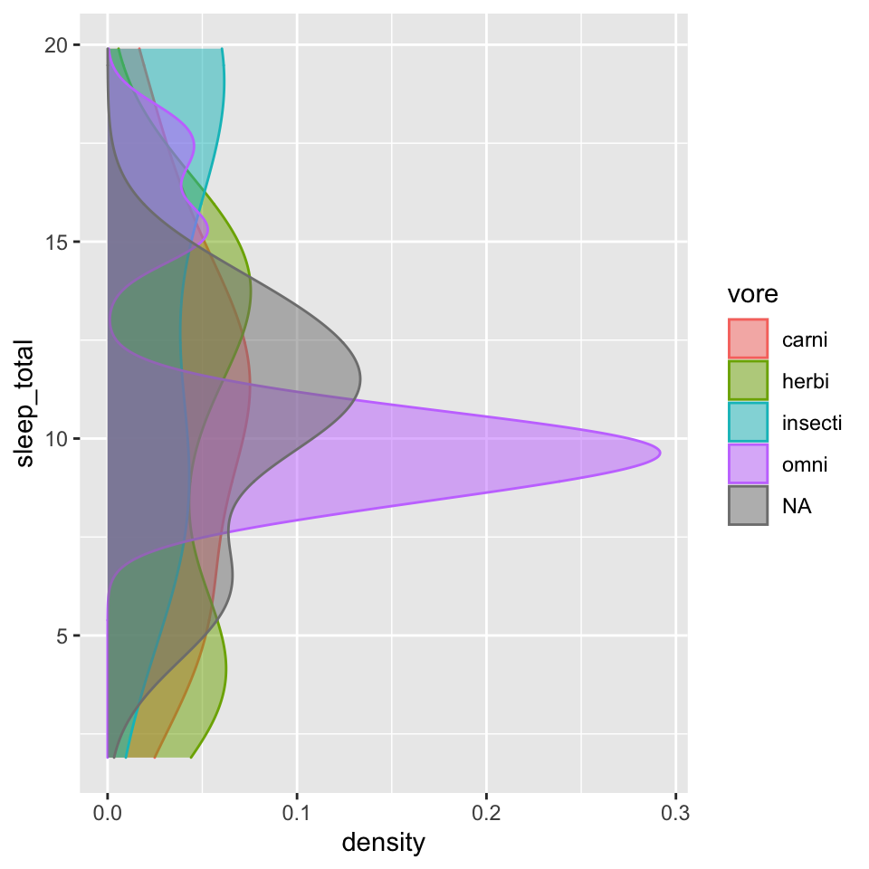
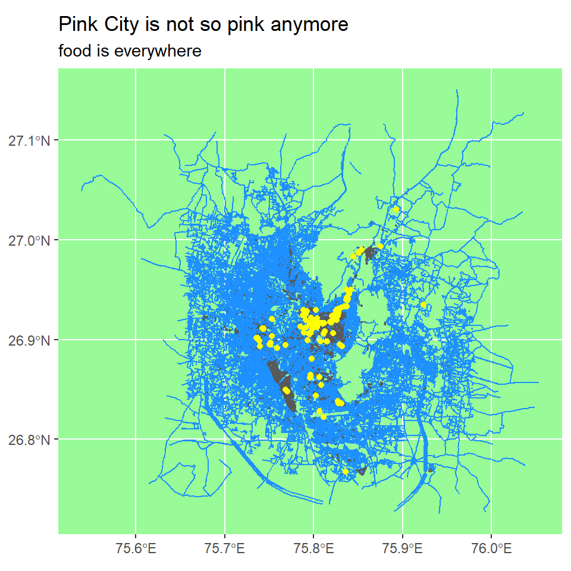
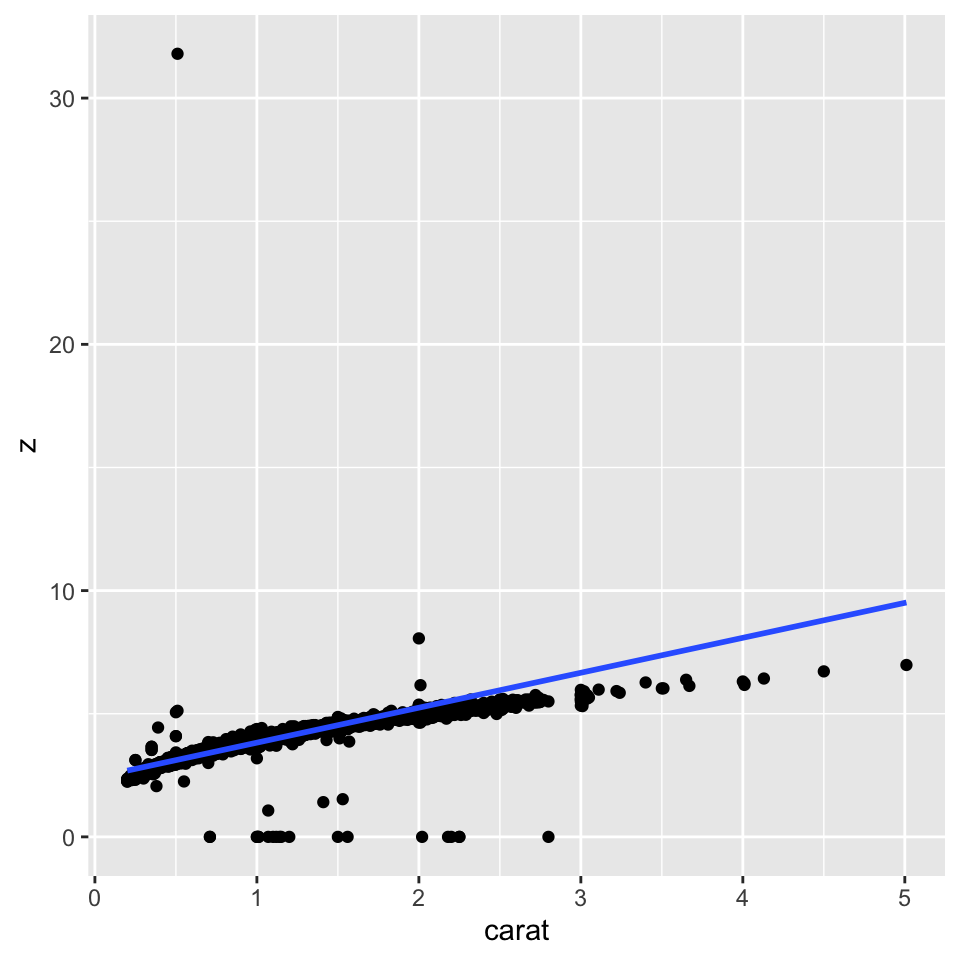

## Introduction

> I'm going to show few graphs and plots. It was fun exausting myself and work whole night. I get it that i still suck at it. Duh I think i'll try to get better at this and keep practicing as the outcome of the chunks are pretty cool. 

## Graph 1

I used geom_sf to make the graph, it was more fun than i expected. The way graph came up looked satisfying. 


bbox_jaipur <- searchbbox(querystring = "Jaipur, India")
dat_jaipur_H <- extract_osm_objects(bbox_jaipur, "highway")
dat_jaipur_B <- extract_osm_objects(bbox_jaipur, "building")
dat_jaipur_R <- extract_osm_objects(bbox = bbox_jaipur, key = "amenity", value = "restaurant", return_type = "point")

## Using geom_sf()
ggplot() + 
  geom_sf(data = dat_jaipur_H, colour = "dodger blue") + 
  geom_sf(data = dat_jaipur_B, fill = "orange") + 
  geom_sf(data = dat_jaipur_R, colour = "Yellow", fill = "red") + 
  theme(panel.background = element_rect(fill = "palegreen")) + 
  labs(title = "Pink City is not so pink anymore", subtitle = "food is everywhere")


This graph is about the sleeping patterns of mammals. I used ggplot to make the graph.
The fun part about the graph is, it's also sleeping the way I want to. 


```r
ggplot(msleep) + 
    geom_density(aes(y = sleep_total, 
                 color = vore, 
                 fill = vore), 
                 alpha = 0.5)
```



The graph shows the the different sleep patterns.


This graph is about the the number of hours animals sleep in a day.
FUN FACT: I don't get to sleep for 4 hours straight. 
p.s.: These mammals are lucky I must say. huh.


```r
ggplot(msleep) + geom_line(aes(sleep_cycle, sleep_total, group= vore, color= vore))
```

```
## Warning: Removed 51 row(s) containing missing values (geom_path).
```



## Graph 2

This dataset is about the diamonds. Related to color and carat. 


```r
ggplot(diamonds, 
       mapping = aes(x = color, 
           y = x)) +
  geom_point() +
  geom_smooth(method = "lm")
```

```
## `geom_smooth()` using formula 'y ~ x'
```


```r
ggplot(diamonds, 
       mapping = aes(x = carat, 
           y = z)) +
  geom_point() +
  geom_smooth(method = "lm")
```

```
## `geom_smooth()` using formula 'y ~ x'
```



## Graph 3

This graph is about the names. I used arvind's name cause idk some error is showing up when i am trying for mine. 
Oh btw i used ggplot to make this plot.


```r
plot 
```

```
## function (x, y, ...) 
## UseMethod("plot")
## <bytecode: 0x0000000015fcc428>
## <environment: namespace:base>
```

## My Course Reflection

This course was all about patience and sitting still on your chair and work with keen eyes cause one single comma will ruin your whole work. 
It was a fun workshop. Arvind made it much easy than i thought. 
Definitely helped me with the patience thing.

Thankyou.
