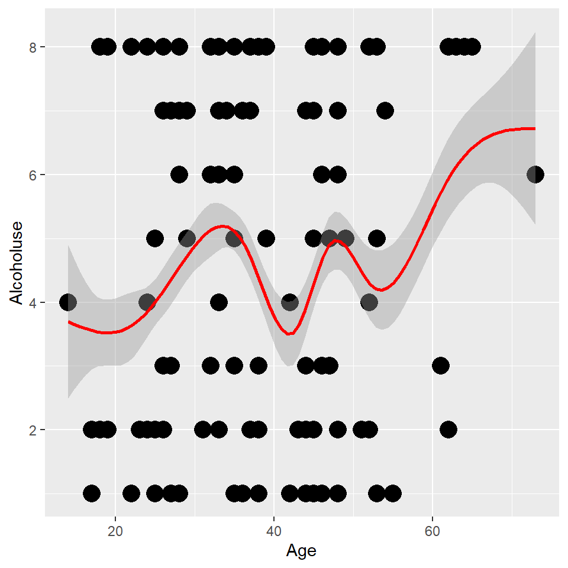
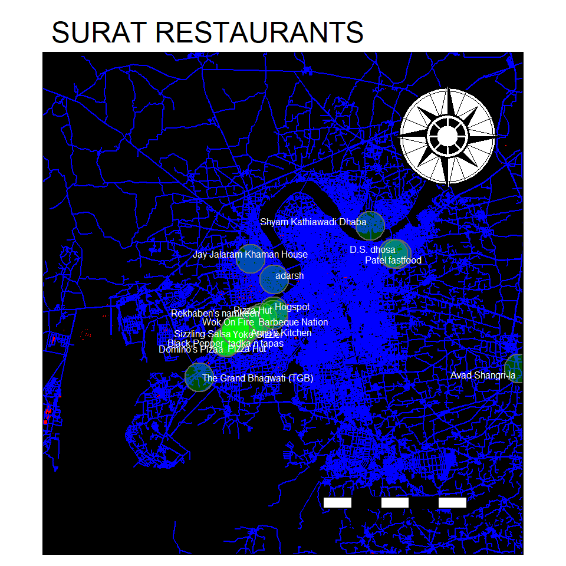

# GRAPH 1

> "No matter what the statistics say, there is always a way." 
>
>~Bernie Siegel


```r
#GRAPH FUNCTION

ggplot(data = cancer, mapping = aes(x = Age, y = Alcoholuse))+
geom_point(size = 5)+
  geom_smooth(colour = "red")
```

```
## `geom_smooth()` using method = 'gam' and formula 'y ~ s(x, bs = "cs")'
```




I figured that writing about cancer might make me come off as *important*, and plus it was pretty easy for me to *get my hands on this data set*.  
Boy, am i tempted to put something political here, but really here's what a cancer looks like:  
 


# GRAPH 2

> સુરતનો નકશો


```r
SURAT_TMAP <- tm_shape (dat_B) +
  tm_fill(col = "red") +
tm_shape (dat_H) +
  tm_lines(col="blue", lwd = 1)+
tm_shape (dat_R) +
  tm_dots (size = 3, col = "green", shape = 21, alpha = 0.3) +
  tm_text("name", auto.placement = TRUE, size = 0.5, col = "white") + 

tm_compass (type = "rose", position = c("right", "top")) +
tm_scale_bar (width = 4, text.size = 1) +
  
    tm_layout(main.title = "SURAT RESTAURANTS",
            bg.color = "black",
            inner.margins = c(0, 0, 0, 0))

SURAT_TMAP
```

```
## Scale bar width set to 0.25 of the map width
```




In this graph, I made a map of Surat using data from Open Source Map and plotted all the restaurants on the map. all the green dots indicate the presence of a restaurant in that area, along with the name of the restaurant.  
Now, i case you're in surat, and you're searching for one of the 53 recorded restaurants, you can just use m map to find out the approximate location :D

# GRAPH 3

> I don't spend alot of time thinking 'what if', and I guess that's happiness
> -Ted Mosby


```r
#seperation
HIMYM_nodes_vis %>%

  visNetwork(nodes = ., edges = HIMYM_edges_vis) %>% 
  visNodes(font = list(size = 40)) %>% 
  
  # Colour and icons for each of the gender-groups
  visGroups(groupname = "Female", shape = "icon", 
            icon = list(code = "f182", size = 75, color = "tomato"),
            shadow = list(enabled = TRUE)) %>% 
  
  visGroups(groupname = "Male", shape = "icon", 
            icon = list(code = "f183", size = 75, color = "slateblue"), 
            shadow = list(enabled = TRUE)) %>% 
  
  visGroups(groupname = "Transgender?", shape = "icon", 
            icon = list(code = "f22c", size = 75, color = "fuchsia"), 
            shadow = list(enabled = TRUE)) %>% 
  
  #visLegend() %>%
  #Add the fontawesome icons!!
  addFontAwesome() %>% 
  
  # Add Interaction Controls
  visInteraction(navigationButtons = TRUE,
                 hover = TRUE,
                 selectConnectedEdges = TRUE,
                 hoverConnectedEdges = TRUE,
                 zoomView = TRUE)
```

```{=html}
<div id="htmlwidget-a88e5bf874e5aab3fbe7" style="width:480px;height:480px;" class="visNetwork html-widget"></div>
<script type="application/json" data-for="htmlwidget-a88e5bf874e5aab3fbe7">{"x":{"nodes":{"id":[1,2,3,4,5,6,7,8,9,10],"X":[1,2,3,4,5,6,7,8,9,10],"label":["Barney","Ted Mosby","Lily Aldrin","Marshall","Robin","Yasmin","Ranjit","Son","Daughter","Mother"],"group":["Male","Male","Female","Male","Female","Female","Male","Male","Female","Female"],"occupation":["Bank","Architect","Teacher","Lawyer","Reporter","","Cab driver","","","Bass player"]},"edges":{"from":[1,1,1,1,1,2,2,2,2,2,2,2,2,4,2,10,10],"to":[7,2,3,4,5,1,3,4,5,6,7,8,9,3,10,8,9]},"nodesToDataframe":true,"edgesToDataframe":true,"options":{"width":"100%","height":"100%","nodes":{"shape":"dot","font":{"size":40}},"manipulation":{"enabled":false},"groups":{"Female":{"shape":"icon","icon":{"code":"f182","size":75,"color":"tomato"},"shadow":{"enabled":true}},"Male":{"shape":"icon","icon":{"code":"f183","size":75,"color":"slateblue"},"shadow":{"enabled":true}},"useDefaultGroups":true,"Transgender?":{"shape":"icon","icon":{"code":"f22c","size":75,"color":"fuchsia"},"shadow":{"enabled":true}}},"interaction":{"hover":true,"hoverConnectedEdges":true,"navigationButtons":true,"selectConnectedEdges":true,"zoomView":true}},"groups":["Male","Female"],"width":null,"height":null,"idselection":{"enabled":false},"byselection":{"enabled":false},"main":null,"submain":null,"footer":null,"background":"rgba(0, 0, 0, 0)","iconsRedraw":true,"tooltipStay":300,"tooltipStyle":"position: fixed;visibility:hidden;padding: 5px;white-space: nowrap;font-family: verdana;font-size:14px;font-color:#000000;background-color: #f5f4ed;-moz-border-radius: 3px;-webkit-border-radius: 3px;border-radius: 3px;border: 1px solid #808074;box-shadow: 3px 3px 10px rgba(0, 0, 0, 0.2);"},"evals":[],"jsHooks":[]}</script>
```


How I Met Your Mother is one of my favorite shows, so using a couple libraries from R, I made an interactive map of the relationships between the different characters from the show...
I love the spring mechanics of this graph and playing with it is pretty fun XD


# Final Thoughts

 

> "I like living at the intersection of the humanities and technology"  
> -Steve Jobs


After a really long time, it felt like the good old days when I was the best in my class at computers, I found it really easy to understand the concepts and everything, but I don't think I would have ever noticed R as a language if it weren't for Arvind. I don't think I will ever code in HTML again unless it's to learn with some software like DreamWeaver, I feel like R markdown is a really powerful tool to write reports and submit graphs. I also don't know if my work will ever demand me to use any of this, but I feel like it's really great to have a skill like this in my portfolio. Another great thing about R is that it has such a huge community so even if I forget what I've learned 2-3 years down the line, I can always Google, and chances are I will get an answer.  
One thing I want to learn in the future is how I can turn some of the graphs I've made into animations, maybe for a PowerPoint presentation or a video.  
I also just quickly want to say that Arvind was such an angel. I find it quite common that a lot of the class lags behind in computer class, but in Arvind's class, it never felt like everyone was clueless, it really felt like everyone was working, and understanding all the concepts, and more importantly, no matter how many times we asked the same questions Arvind patiently answered, and that is really hard to find. It's a shame we couldn't work in person, I have a feeling that if that were the case we would've been able to learn a lot more.  

