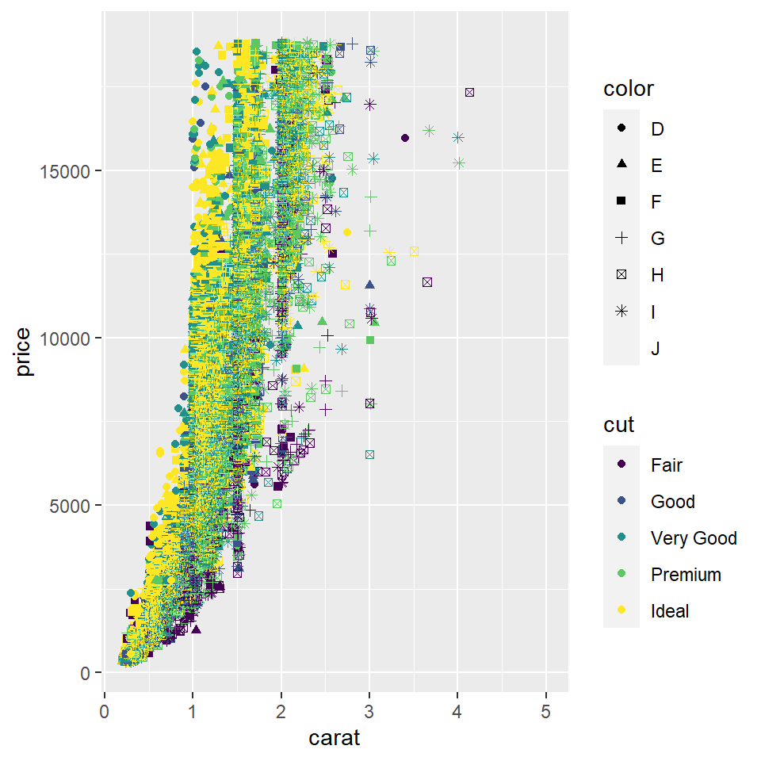
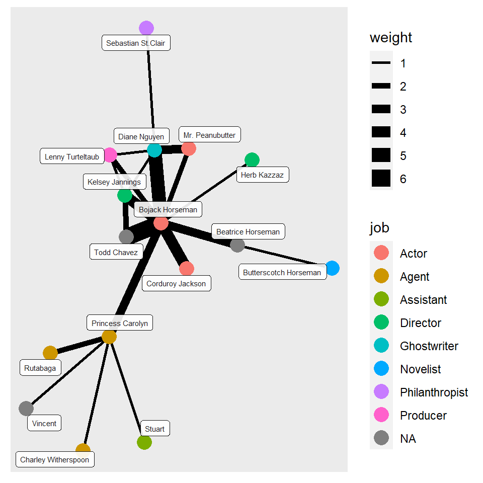

### Set up chunk


### 1.Graph using geometric objects. 

I used the diamonds dataset for this graph. In the graph, I plotted the carat of the diamond on the x axis and the price on the y axis. The cut is depicted in different colours and the color of each diamond is depicted in different shapes.


```
## # A tibble: 53,940 x 10
##    carat cut       color clarity depth table price     x     y     z
##    <dbl> <ord>     <ord> <ord>   <dbl> <dbl> <int> <dbl> <dbl> <dbl>
##  1  0.23 Ideal     E     SI2      61.5    55   326  3.95  3.98  2.43
##  2  0.21 Premium   E     SI1      59.8    61   326  3.89  3.84  2.31
##  3  0.23 Good      E     VS1      56.9    65   327  4.05  4.07  2.31
##  4  0.29 Premium   I     VS2      62.4    58   334  4.2   4.23  2.63
##  5  0.31 Good      J     SI2      63.3    58   335  4.34  4.35  2.75
##  6  0.24 Very Good J     VVS2     62.8    57   336  3.94  3.96  2.48
##  7  0.24 Very Good I     VVS1     62.3    57   336  3.95  3.98  2.47
##  8  0.26 Very Good H     SI1      61.9    55   337  4.07  4.11  2.53
##  9  0.22 Fair      E     VS2      65.1    61   337  3.87  3.78  2.49
## 10  0.23 Very Good H     VS1      59.4    61   338  4     4.05  2.39
## # ... with 53,930 more rows
```




The colour and the carat of each diamond is plotted on this graph.


### 2. Plotting the map of Thane with restaurants and buildings. 


In this map, I have shown the restaurants in pink and the roads in blue in Thane.


### 3.Network Graphs for Bojack Horseman. 

I created two datasets - one with nodes and the other with edges.The nodes dataset consists of the names, sex, species and job. The edges dataset consists of the number of times a conversation has taken place between each character has a conversation.

*Reading the Data*

```
## # A tibble: 16 x 5
##       id name                  sex   species  job             
##    <dbl> <chr>                 <chr> <chr>    <chr>           
##  1     1 Bojack Horseman       M     "Horse"  "Actor"         
##  2     2 Princess Carolyn      F     "Cat"    "Agent"         
##  3     3 Todd Chavez           M     "Human"   <NA>           
##  4     4 Diane Nguyen          F     "Human"  "Ghostwriter"   
##  5     5 Mr. Peanubutter       M     "Dog"    "Actor"         
##  6     6 Herb Kazzaz           M     "Human"  "Director"      
##  7     7 Stuart                M     "Human"  "Assistant "    
##  8     8 Corduroy Jackson      M     "Human"  "Actor"         
##  9     9 Vincent               M     "Human"   <NA>           
## 10    10 Lenny Turteltaub      M     "Turtle" "Producer "     
## 11    11 Kelsey Jannings       F     "Human " "Director"      
## 12    12 Sebastian St.Clair    M     "Tiger"  "Philanthropist"
## 13    13 Rutabaga              M     "Rabbit" "Agent "        
## 14    14 Charley Witherspoon   M     "Frog"   "Agent"         
## 15    15 Beatrice Horseman     F     "Horse"   <NA>           
## 16    16 Butterscotch Horseman M     "Horse"  "Novelist"
```

```
## # A tibble: 20 x 4
##     from    to weight type          
##    <dbl> <dbl>  <dbl> <chr>         
##  1    15    16      1 "Family "     
##  2    15     1      3 "Family"      
##  3     3     1      6 "Friends"     
##  4     2     9      1 "Friends"     
##  5     1     2      3 "Professional"
##  6     7     2      1 "Professional"
##  7     5     4      3 "Friends "    
##  8     4     1      5 "Professional"
##  9     1     5      2 "Friends"     
## 10     8     1      4 "Professional"
## 11    10     1      2 "Professional"
## 12     4    11      1 "Professional"
## 13    11     3      2 "Friends"     
## 14    11     1      4 "Professional"
## 15    12     4      1 "Professional"
## 16    13     2      2 "Professional"
## 17     6     1      1 "Friends"     
## 18    10    11      1 "Professional"
## 19     4    10      1 "Professional"
## 20    14     2      1 "Professional"
```

*creating the graph*


```
## # A tbl_graph: 16 nodes and 20 edges
## #
## # An undirected simple graph with 1 component
## #
## # Node Data: 16 x 5 (active)
##      id name             sex   species job        
##   <dbl> <chr>            <chr> <chr>   <chr>      
## 1     1 Bojack Horseman  M     Horse   Actor      
## 2     2 Princess Carolyn F     Cat     Agent      
## 3     3 Todd Chavez      M     Human   <NA>       
## 4     4 Diane Nguyen     F     Human   Ghostwriter
## 5     5 Mr. Peanubutter  M     Dog     Actor      
## 6     6 Herb Kazzaz      M     Human   Director   
## # ... with 10 more rows
## #
## # Edge Data: 20 x 4
##    from    to weight type     
##   <int> <int>  <dbl> <chr>    
## 1    15    16      1 "Family "
## 2     1    15      3 "Family" 
## 3     1     3      6 "Friends"
## # ... with 17 more rows
```


*In the graphs plotted below I have depicted the conversations had by the characters og Bojack Horseman in Season 2 episode 1. The thickness of each line connecting the names shows the amount of conversations they have had in that one episode. In the graph using ggraph I have specified their jobs.*




### Reflection
This workshop has been like a rollercoaster ride. There were many ups and downs. It started off with the basics but later on even though I was finding it a bit hard to keep up I am glad I still did. With each assignment I understood more and more as I made mistakes and thus had to go through many trial and error runs. This made every code chunk running without an error almost feel like an eureka moment The process was slow but I finally did manage to get along with R studio. Joining the class every morning while Arvind would blast music really kept me motivated somehow. 
Overall the entire class was something new as I had never ventured so deep into the digital world. 


