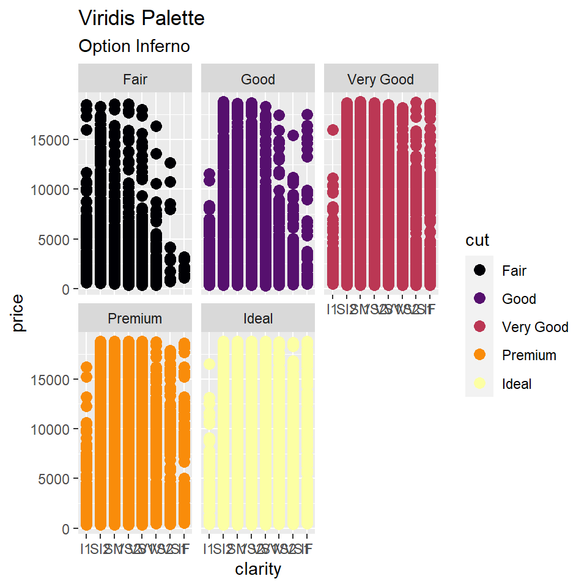
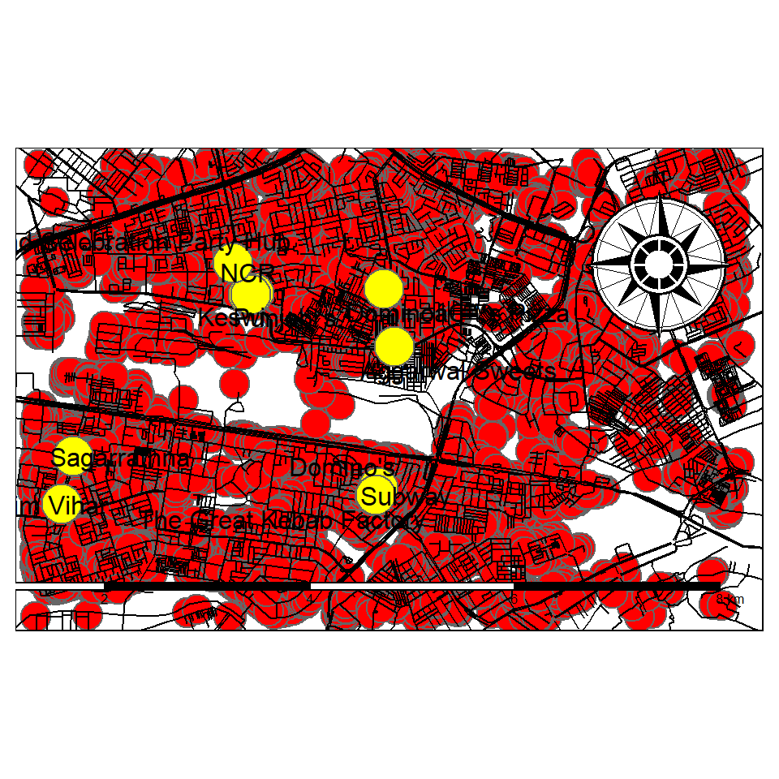

> # **Graph No1.**  
> 
> #### In this graph, we've explored a total of three variables, i.e., clarity, cut and the price of the diamonds dataset.  Using the RColorBrewer package, colours have also been added.  
> ######  _Via LAB04_  
> 


```r
ggplot(diamonds) + geom_point(aes(x = clarity, y = price, color = cut), size = 3) + scale_colour_viridis_d(option = "inferno") + labs(title = "Viridis Palette", subtitle = "Option Inferno") + facet_wrap(~cut)
```




#### *SETUP-Adding the longitude and lattitude of Delhi to create maps of my surrounding areas and*


```r
bbox <- osmplotr::get_bbox(c(77.10,28.66,77.17,28.70))

bbox_l <- osmdata::getbb("Delhi, India") 
#bbox_p <- prettymapr::searchbbox("Delhi, India") 
```


```r
dat_B <- extract_osm_objects (key = 'building', bbox = bbox) 
```

```
## Issuing query to Overpass API ...
```

```
## Rate limit: 0
```

```
## Query complete!
```

```
## converting OSM data to sf format
```

```r
dat_H <- extract_osm_objects (key = 'highway', bbox = bbox)
```

```
## Issuing query to Overpass API ...
```

```
## Rate limit: 0
```

```
## Query complete!
```

```
## converting OSM data to sf format
```

```r
dat_P <- extract_osm_objects (key = 'park', bbox = bbox)
```

```
## Issuing query to Overpass API ...
```

```
## Rate limit: 0
```

```
## Query complete!
```

```
## converting OSM data to sf format
```

```r
dat_G <- extract_osm_objects (key = 'landuse', value = 'grass', bbox = bbox)
```

```
## Issuing query to Overpass API ...
```

```
## Rate limit: 0
```

```
## Query complete!
```

```
## converting OSM data to sf format
```

```
## Warning in extract_osm_objects(key = "landuse", value = "grass", bbox = bbox):
## No valid data returned. (Maybe try a different 'return_type')
```

```r
dat_T <- extract_osm_objects (key = 'natural', value = 'tree', bbox = bbox)
```

```
## Issuing query to Overpass API ...
```

```
## Rate limit: 0
```

```
## Query complete!
```

```
## converting OSM data to sf format
```

```
## Warning in extract_osm_objects(key = "natural", value = "tree", bbox = bbox): No
## valid data returned. (Maybe try a different 'return_type')
```

```r
dat_R <- extract_osm_objects(bbox = bbox, key = "amenity", value = "restaurant", return_type = "point") 
```

```
## Issuing query to Overpass API ...
```

```
## Rate limit: 0
```

```
## Query complete!
```

```
## converting OSM data to sf format
```


```r
tmap_mode("plot")
```

```
## tmap mode set to plotting
```


> # **Graph No2.**  
>
> #### Using the data from around my lacation, plotting graphs of various features.  
> ######  _Via LAB06_  


```r
#1
tm_shape(dat_B) + tm_bubbles(col = "red") +
  
#2
  tm_shape(dat_H) + tm_lines(col = "black", lwd = 1) +

#3
  tm_shape(dat_R) + tm_dots(size = 3, col = "yellow", shape = 21) + tm_text("name", auto.placement = TRUE) + 
  tm_compass(type = "rose", position = c("right", "top")) + tm_scale_bar(width = 1, position = c("right", "bottom")) + 
   labs(title = "It's a bloody red city")
```




#### *SETUP-Reading data-ga*


```r
hillhouse_nodes <- read_csv("data/hillhouse-nodes.csv")
```

```
## 
## -- Column specification --------------------------------------------------------
## cols(
##   name = col_character(),
##   sex = col_character(),
##   race = col_character(),
##   birthyear = col_double(),
##   position = col_character(),
##   haircolour = col_character(),
##   sign = col_character()
## )
```

```r
hillhouse_nodes
```

```
## # A tibble: 24 x 7
##    name                      sex   race  birthyear position haircolour sign    
##    <chr>                     <chr> <chr>     <dbl> <chr>    <chr>      <chr>   
##  1 Eleanor Crain Vance       F     White      1986 Daughter brown      Pisces  
##  2 Theodora Crain            F     White      1982 Daughter brownblack Libra   
##  3 Hugh Desmond Lester Crain M     White      1959 Father   brownblack Aquarius
##  4 Olivia Crain              F     White      1982 Mother   brownblack Virgo   
##  5 Shirley Crain Harris      F     White      1980 Daughter brown      Aquarius
##  6 Steven Crain              M     White      1979 Son      brown      Aries   
##  7 Luke Crain                M     White      1986 Son      brownblack Pisces  
##  8 Poppy Hill                F     White        NA Ghost    Burgundy   <NA>    
##  9 Clara Dudley              F     White        NA Maid     black      <NA>    
## 10 Kevin Harris              M     White      1975 Other    black      <NA>    
## # ... with 14 more rows
```

```r
hillhouse_edges <- read_csv("data/hillhouse-edges.csv")
```

```
## 
## -- Column specification --------------------------------------------------------
## cols(
##   from = col_character(),
##   to = col_character(),
##   type = col_character(),
##   ID = col_double()
## )
```

```r
hillhouse_edges
```

```
## # A tibble: 18 x 4
##    from                      to                   type          ID
##    <chr>                     <chr>                <chr>      <dbl>
##  1 Theodora Crain            Trish Park           benefits       1
##  2 Shirley Crain Harris      Kevin Harris         married        2
##  3 Luke Crain                Abigail              friends        3
##  4 Luke Crain                Joey                 friends        4
##  5 Hugh Desmond Lester Crain Olivia Crain         married        5
##  6 Steven Crain              Leigh Crain          married        6
##  7 Clara Dudley              Horace Dudley        married        7
##  8 Ryan Quale                Shirley Crain Harris benefits       8
##  9 Jayden Harris             Allie Harris         siblings       9
## 10 Olivia Crain              Clara Dudley         owners        10
## 11 Theodora Crain            Dr. John Montague    associates    11
## 12 Shirley Crain Harris      Theodora Crain       siblings      12
## 13 Steven Crain              Shirley Crain Harris siblings      13
## 14 Eleanor Crain Vance       Luke Crain           twins         14
## 15 Eleanor Crain Vance       Steven Crain         siblings      15
## 16 Theodora Crain            Eleanor Crain Vance  siblings      16
## 17 Luke Crain                Shirley Crain Harris siblings      17
## 18 Eleanor Crain Vance       Arthur Vance         married       18
```

```r
ga <- tbl_graph(nodes = hillhouse_nodes, 
                edges = hillhouse_edges, 
                directed = FALSE)
ga
```

```
## # A tbl_graph: 24 nodes and 18 edges
## #
## # An undirected simple graph with 8 components
## #
## # Node Data: 24 x 7 (active)
##   name                      sex   race  birthyear position haircolour sign    
##   <chr>                     <chr> <chr>     <dbl> <chr>    <chr>      <chr>   
## 1 Eleanor Crain Vance       F     White      1986 Daughter brown      Pisces  
## 2 Theodora Crain            F     White      1982 Daughter brownblack Libra   
## 3 Hugh Desmond Lester Crain M     White      1959 Father   brownblack Aquarius
## 4 Olivia Crain              F     White      1982 Mother   brownblack Virgo   
## 5 Shirley Crain Harris      F     White      1980 Daughter brown      Aquarius
## 6 Steven Crain              M     White      1979 Son      brown      Aries   
## # ... with 18 more rows
## #
## # Edge Data: 18 x 4
##    from    to type        ID
##   <int> <int> <chr>    <dbl>
## 1     2    13 benefits     1
## 2     5    10 married      2
## 3     7    15 friends      3
## # ... with 15 more rows
```


> # **Graph No3.**  
> 
> 
> #### A different graph style - set graph   
> ######  _Via LAB07_  
> 


```r
set_graph_style()

ga %>% 
  activate(nodes) %>% 
  mutate(degree = centrality_degree()) %>% 
  activate(edges) %>% 
  mutate(betweenness = centrality_edge_betweenness()) %>%
  ggraph(layout = "nicely") +
  geom_edge_link(aes(alpha = betweenness)) +
  geom_node_point(aes(size = degree, colour = degree)) + 
  facet_graph(type ~ race) +
  scale_color_gradient(guide = "legend") +
  labs(title = "Haunting of the hill house", subtitle = "Third graph", caption = "Ngl, I'm tired now..")
```

```
## Warning in grid.Call(C_stringMetric, as.graphicsAnnot(x$label)): font family not
## found in Windows font database
```

```
## Warning in grid.Call(C_textBounds, as.graphicsAnnot(x$label), x$x, x$y, : font
## family not found in Windows font database
```

```
## Warning in grid.Call(C_stringMetric, as.graphicsAnnot(x$label)): font family not
## found in Windows font database

## Warning in grid.Call(C_stringMetric, as.graphicsAnnot(x$label)): font family not
## found in Windows font database
```

```
## Warning in grid.Call(C_textBounds, as.graphicsAnnot(x$label), x$x, x$y, : font
## family not found in Windows font database

## Warning in grid.Call(C_textBounds, as.graphicsAnnot(x$label), x$x, x$y, : font
## family not found in Windows font database
```

```
## Warning in grid.Call(C_stringMetric, as.graphicsAnnot(x$label)): font family not
## found in Windows font database

## Warning in grid.Call(C_stringMetric, as.graphicsAnnot(x$label)): font family not
## found in Windows font database

## Warning in grid.Call(C_stringMetric, as.graphicsAnnot(x$label)): font family not
## found in Windows font database
```

```
## Warning in grid.Call(C_textBounds, as.graphicsAnnot(x$label), x$x, x$y, : font
## family not found in Windows font database

## Warning in grid.Call(C_textBounds, as.graphicsAnnot(x$label), x$x, x$y, : font
## family not found in Windows font database

## Warning in grid.Call(C_textBounds, as.graphicsAnnot(x$label), x$x, x$y, : font
## family not found in Windows font database

## Warning in grid.Call(C_textBounds, as.graphicsAnnot(x$label), x$x, x$y, : font
## family not found in Windows font database

## Warning in grid.Call(C_textBounds, as.graphicsAnnot(x$label), x$x, x$y, : font
## family not found in Windows font database

## Warning in grid.Call(C_textBounds, as.graphicsAnnot(x$label), x$x, x$y, : font
## family not found in Windows font database
```

```
## Warning in grid.Call.graphics(C_text, as.graphicsAnnot(x$label), x$x, x$y, :
## font family not found in Windows font database

## Warning in grid.Call.graphics(C_text, as.graphicsAnnot(x$label), x$x, x$y, :
## font family not found in Windows font database

## Warning in grid.Call.graphics(C_text, as.graphicsAnnot(x$label), x$x, x$y, :
## font family not found in Windows font database

## Warning in grid.Call.graphics(C_text, as.graphicsAnnot(x$label), x$x, x$y, :
## font family not found in Windows font database

## Warning in grid.Call.graphics(C_text, as.graphicsAnnot(x$label), x$x, x$y, :
## font family not found in Windows font database

## Warning in grid.Call.graphics(C_text, as.graphicsAnnot(x$label), x$x, x$y, :
## font family not found in Windows font database

## Warning in grid.Call.graphics(C_text, as.graphicsAnnot(x$label), x$x, x$y, :
## font family not found in Windows font database

## Warning in grid.Call.graphics(C_text, as.graphicsAnnot(x$label), x$x, x$y, :
## font family not found in Windows font database

## Warning in grid.Call.graphics(C_text, as.graphicsAnnot(x$label), x$x, x$y, :
## font family not found in Windows font database

## Warning in grid.Call.graphics(C_text, as.graphicsAnnot(x$label), x$x, x$y, :
## font family not found in Windows font database

## Warning in grid.Call.graphics(C_text, as.graphicsAnnot(x$label), x$x, x$y, :
## font family not found in Windows font database

## Warning in grid.Call.graphics(C_text, as.graphicsAnnot(x$label), x$x, x$y, :
## font family not found in Windows font database

## Warning in grid.Call.graphics(C_text, as.graphicsAnnot(x$label), x$x, x$y, :
## font family not found in Windows font database

## Warning in grid.Call.graphics(C_text, as.graphicsAnnot(x$label), x$x, x$y, :
## font family not found in Windows font database
```

```
## Warning in grid.Call(C_textBounds, as.graphicsAnnot(x$label), x$x, x$y, : font
## family not found in Windows font database

## Warning in grid.Call(C_textBounds, as.graphicsAnnot(x$label), x$x, x$y, : font
## family not found in Windows font database

## Warning in grid.Call(C_textBounds, as.graphicsAnnot(x$label), x$x, x$y, : font
## family not found in Windows font database

## Warning in grid.Call(C_textBounds, as.graphicsAnnot(x$label), x$x, x$y, : font
## family not found in Windows font database

## Warning in grid.Call(C_textBounds, as.graphicsAnnot(x$label), x$x, x$y, : font
## family not found in Windows font database

## Warning in grid.Call(C_textBounds, as.graphicsAnnot(x$label), x$x, x$y, : font
## family not found in Windows font database

## Warning in grid.Call(C_textBounds, as.graphicsAnnot(x$label), x$x, x$y, : font
## family not found in Windows font database
```


#### _During this workshop, it was a heck load of digital work but I'm not complaining though. This might have been the first time I've stared at my screen for so long but I did get to learn something. I wouldn't persoanlly want to take anything forward from this class in my future because I don't have any personal interests in coding or using a digital platform in general. But, I sure was intrigued by the level of learning and the amount of enthusiasm some of my classmates showed._


## FIN.
###### (_Thanks for watching me struggle_)


