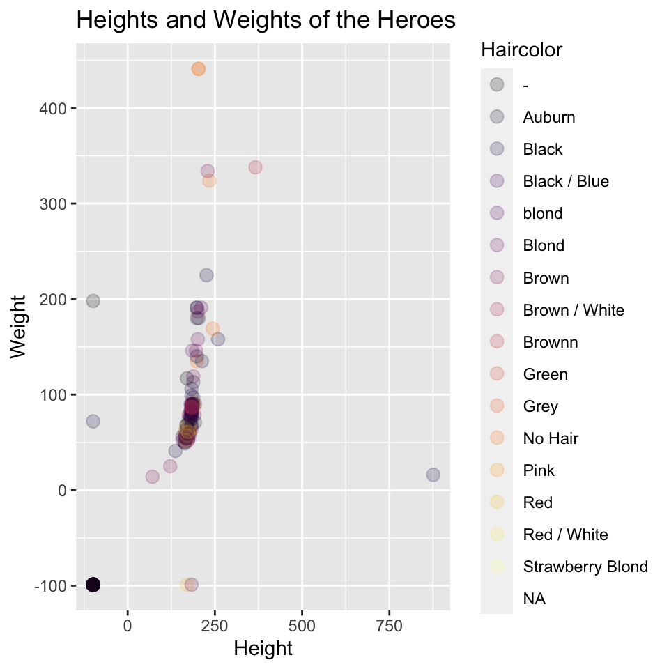
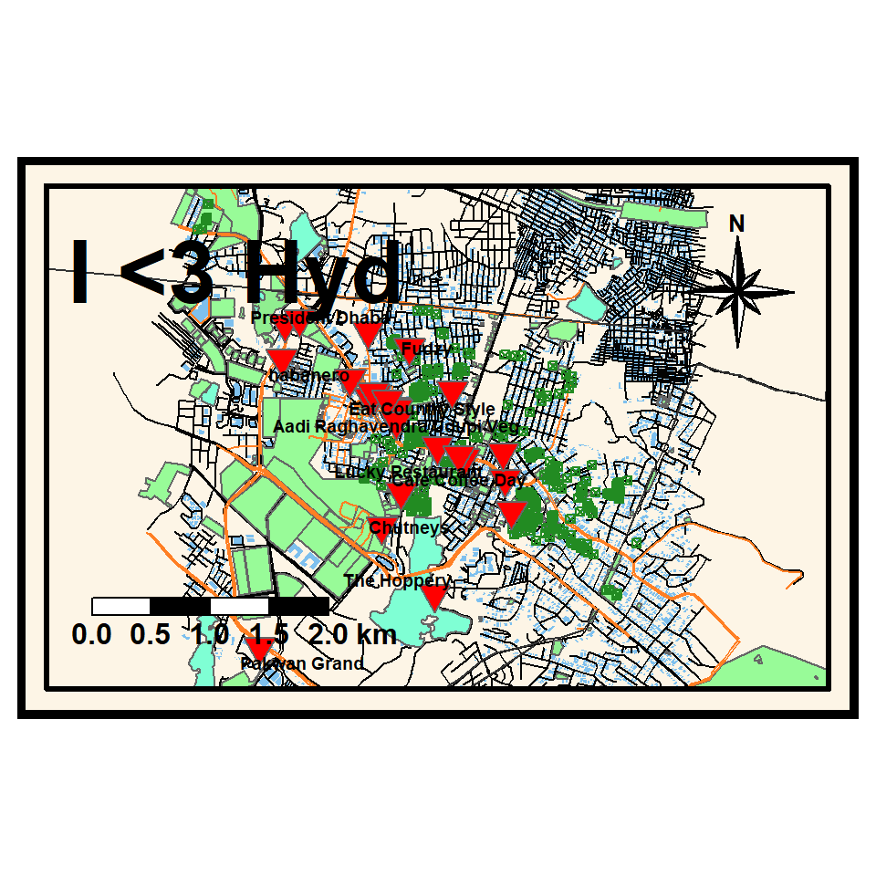
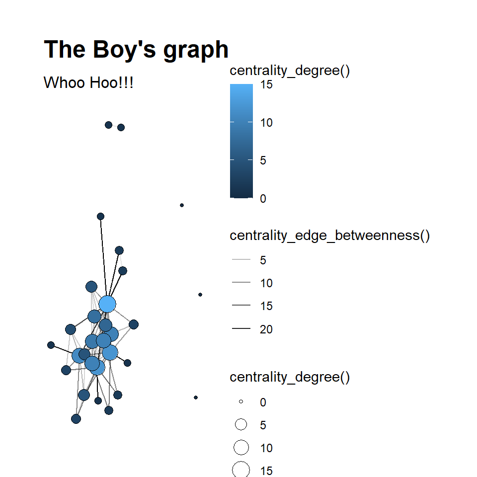

```{=html} 
<style type="text/css">
h1.title {
  font-size: 48px;
  font-family: "Arial"
  color: Black;
  text-align: center;
}
h4.author { 
    font-size: 20px;
  font-family: "Times New Roman", Times, serif;
  color: gray;
  text-align: right;
}
h4.date { 
  font-size: 15px;
  font-family: "Times New Roman", Times, serif;
  color: grey;
  text-align: right;
}
</style>
```
<br>

------------------------------------------------------------------------

<br>

## **Height and Weight of the Heroes along with their Hair colour**


```
## # A tibble: 817 x 25
##     ...1 name          Gender Eyecolor Race  Haircolor Height Publisher Skincolor
##    <dbl> <chr>         <chr>  <chr>    <chr> <chr>      <dbl> <chr>     <chr>    
##  1     0 A-Bomb        Male   yellow   Human No Hair      203 Marvel C~ -        
##  2     1 Abe Sapien    Male   blue     Icth~ No Hair      191 Dark Hor~ blue     
##  3     2 Abin Sur      Male   blue     Unga~ No Hair      185 DC Comics red      
##  4     3 Abomination   Male   green    Huma~ No Hair      203 Marvel C~ -        
##  5     4 Abraxas       Male   blue     Cosm~ Black        -99 Marvel C~ -        
##  6     5 Absorbing Man Male   blue     Human No Hair      193 Marvel C~ -        
##  7     6 Adam Monroe   Male   blue     -     Blond        -99 NBC - He~ -        
##  8     7 Adam Strange  Male   blue     Human Blond        185 DC Comics -        
##  9     8 Agent 13      Female blue     -     Blond        173 Marvel C~ -        
## 10     9 Agent Bob     Male   brown    Human Brown        178 Marvel C~ -        
## # ... with 807 more rows, and 16 more variables: Alignment <chr>, Weight <dbl>,
## #   intelligence <chr>, strength <chr>, speed <chr>, durability <chr>,
## #   power <chr>, combat <chr>, mindcontrol <chr>, mattermanipulation <chr>,
## #   telepathy <chr>, telekinesis <chr>, shapeshifting <chr>, timetravel <chr>,
## #   elementcontrol <chr>, sizechanging <chr>
```

```
## Rows: 817
## Columns: 25
## $ ...1               <dbl> 0, 1, 2, 3, 4, 5, 6, 7, 8, 9, 10, 11, 12, 13, 14, 1~
## $ name               <chr> "A-Bomb", "Abe Sapien", "Abin Sur", "Abomination", ~
## $ Gender             <chr> "Male", "Male", "Male", "Male", "Male", "Male", "Ma~
## $ Eyecolor           <chr> "yellow", "blue", "blue", "green", "blue", "blue", ~
## $ Race               <chr> "Human", "Icthyo Sapien", "Ungaran", "Human / Radia~
## $ Haircolor          <chr> "No Hair", "No Hair", "No Hair", "No Hair", "Black"~
## $ Height             <dbl> 203, 191, 185, 203, -99, 193, -99, 185, 173, 178, 1~
## $ Publisher          <chr> "Marvel Comics", "Dark Horse Comics", "DC Comics", ~
## $ Skincolor          <chr> "-", "blue", "red", "-", "-", "-", "-", "-", "-", "~
## $ Alignment          <chr> "good", "good", "good", "bad", "bad", "bad", "good"~
## $ Weight             <dbl> 441, 65, 90, 441, -99, 122, -99, 88, 61, 81, 104, 1~
## $ intelligence       <chr> "85", "100", "80", "80", "80", "90", "95", "75", "8~
## $ strength           <chr> "30", "20", "100", "50", "10", "40", "30", "90", "1~
## $ speed              <chr> "60", "30", "80", "55", "25", "45", "35", "55", "80~
## $ durability         <chr> "60", "50", "100", "45", "40", "55", "65", "65", "9~
## $ power              <chr> "40", "35", "100", "100", "30", "55", "100", "100",~
## $ combat             <chr> "70", "100", "80", "55", "50", "85", "85", "65", "9~
## $ mindcontrol        <chr> "0", "0", "0", "0", "0", "0", "0", "0", "1", "0", "~
## $ mattermanipulation <chr> "0", "0", "0", "0", "0", "0", "0", "0", "0", "1", "~
## $ telepathy          <chr> "0", "0", "1", "0", "0", "0", "0", "0", "0", "0", "~
## $ telekinesis        <chr> "0", "0", "0", "0", "0", "0", "0", "0", "0", "0", "~
## $ shapeshifting      <chr> "0", "0", "0", "0", "0", "0", "0", "0", "0", "0", "~
## $ timetravel         <chr> "0", "0", "0", "0", "0", "0", "0", "0", "0", "1", "~
## $ elementcontrol     <chr> "0", "0", "0", "0", "0", "0", "0", "0", "0", "0", "~
## $ sizechanging       <chr> "0", "0", "1", "0", "0", "0", "0", "0", "0", "0", "~
```



<font size="3"> The above graph is a point graph, it specifies height and weight of the heroes according to their hair colour. I added the function alpha, as the points are too cluttered. </font>

<br>

------------------------------------------------------------------------

<br>

## **Restaurants in Madhapur, Hyderabad**

### ***My Heart is in Hyd, Hyd is for Food***


```
##   [1] NA                                          
##   [2] "italian"                                   
##   [3] NA                                          
##   [4] NA                                          
##   [5] NA                                          
##   [6] "indian"                                    
##   [7] "pizza"                                     
##   [8] "international"                             
##   [9] NA                                          
##  [10] NA                                          
##  [11] NA                                          
##  [12] NA                                          
##  [13] "coffee_shop"                               
##  [14] "sushi"                                     
##  [15] NA                                          
##  [16] "regional"                                  
##  [17] NA                                          
##  [18] "indian"                                    
##  [19] "chinese"                                   
##  [20] NA                                          
##  [21] NA                                          
##  [22] NA                                          
##  [23] NA                                          
##  [24] NA                                          
##  [25] NA                                          
##  [26] NA                                          
##  [27] NA                                          
##  [28] NA                                          
##  [29] NA                                          
##  [30] NA                                          
##  [31] "mexican"                                   
##  [32] NA                                          
##  [33] NA                                          
##  [34] NA                                          
##  [35] "indian;regional;chinese"                   
##  [36] NA                                          
##  [37] NA                                          
##  [38] NA                                          
##  [39] NA                                          
##  [40] NA                                          
##  [41] NA                                          
##  [42] NA                                          
##  [43] NA                                          
##  [44] "indian"                                    
##  [45] NA                                          
##  [46] "indian;asian"                              
##  [47] NA                                          
##  [48] NA                                          
##  [49] "chicken;chinese;fish;indian;regional"      
##  [50] NA                                          
##  [51] "indian"                                    
##  [52] "chinese;indian"                            
##  [53] NA                                          
##  [54] "asian;chicken;indian"                      
##  [55] NA                                          
##  [56] NA                                          
##  [57] NA                                          
##  [58] NA                                          
##  [59] "Biryanis;chinese;South_Indian;North_Indian"
##  [60] NA                                          
##  [61] NA                                          
##  [62] NA                                          
##  [63] NA                                          
##  [64] NA                                          
##  [65] NA                                          
##  [66] NA                                          
##  [67] NA                                          
##  [68] NA                                          
##  [69] NA                                          
##  [70] NA                                          
##  [71] "indian"                                    
##  [72] NA                                          
##  [73] NA                                          
##  [74] NA                                          
##  [75] NA                                          
##  [76] NA                                          
##  [77] NA                                          
##  [78] NA                                          
##  [79] "regional"                                  
##  [80] NA                                          
##  [81] NA                                          
##  [82] NA                                          
##  [83] "vietnamese"                                
##  [84] NA                                          
##  [85] NA                                          
##  [86] NA                                          
##  [87] NA                                          
##  [88] NA                                          
##  [89] NA                                          
##  [90] NA                                          
##  [91] NA                                          
##  [92] "indonesian"                                
##  [93] NA                                          
##  [94] NA                                          
##  [95] NA                                          
##  [96] NA                                          
##  [97] NA                                          
##  [98] NA                                          
##  [99] NA                                          
## [100] NA                                          
## [101] NA                                          
## [102] NA                                          
## [103] NA                                          
## [104] NA                                          
## [105] NA                                          
## [106] NA                                          
## [107] NA                                          
## [108] NA                                          
## [109] NA                                          
## [110] NA                                          
## [111] NA                                          
## [112] NA                                          
## [113] NA                                          
## [114] NA                                          
## [115] NA                                          
## [116] NA                                          
## [117] NA                                          
## [118] NA                                          
## [119] NA                                          
## [120] NA                                          
## [121] NA                                          
## [122] NA                                          
## [123] NA                                          
## [124] NA                                          
## [125] NA                                          
## [126] NA                                          
## [127] NA                                          
## [128] NA                                          
## [129] NA                                          
## [130] NA                                          
## [131] NA                                          
## [132] NA                                          
## [133] NA                                          
## [134] NA                                          
## [135] NA                                          
## [136] NA                                          
## [137] NA                                          
## [138] "indian"                                    
## [139] NA                                          
## [140] NA                                          
## [141] "regional;kebab;indian;chicken"             
## [142] NA                                          
## [143] NA                                          
## [144] NA                                          
## [145] NA                                          
## [146] NA                                          
## [147] NA                                          
## [148] NA                                          
## [149] NA                                          
## [150] NA                                          
## [151] NA                                          
## [152] NA
```


```
## Rows: 24
## Columns: 38
## $ osm_id             <chr> "349270034", "1275490936", "1275490943", "136511600~
## $ name               <chr> "Olive Garden", "Gingercourt", "Pizza Hut", "Sweet ~
## $ addr.city          <chr> NA, NA, NA, NA, NA, NA, NA, NA, NA, NA, "Hyderabad"~
## $ addr.housename     <chr> NA, NA, NA, NA, NA, NA, NA, NA, NA, NA, NA, NA, NA,~
## $ addr.housenumber   <chr> NA, NA, NA, NA, NA, NA, NA, NA, NA, NA, NA, NA, NA,~
## $ addr.postcode      <chr> NA, NA, NA, NA, NA, NA, "500081", NA, NA, NA, "5000~
## $ addr.street        <chr> NA, NA, NA, NA, NA, NA, NA, NA, "Hitec City - Konda~
## $ air_conditioning   <chr> NA, NA, NA, NA, NA, NA, NA, NA, NA, NA, NA, NA, NA,~
## $ amenity            <chr> "restaurant", "restaurant", "restaurant", "restaura~
## $ brewery            <chr> NA, NA, NA, NA, NA, NA, NA, NA, NA, NA, NA, NA, NA,~
## $ capacity           <chr> NA, NA, NA, NA, NA, NA, NA, NA, "70", NA, NA, NA, N~
## $ changing_table     <chr> NA, NA, NA, NA, NA, NA, NA, NA, NA, NA, NA, NA, NA,~
## $ created_by         <chr> NA, NA, NA, NA, NA, NA, NA, NA, NA, NA, NA, NA, NA,~
## $ cuisine            <chr> "italian", "indian", "pizza", "international", "cof~
## $ diet.vegan         <chr> NA, NA, NA, NA, NA, NA, NA, NA, NA, NA, NA, NA, NA,~
## $ diet.vegetarian    <chr> NA, NA, NA, NA, NA, NA, NA, NA, NA, NA, NA, NA, NA,~
## $ internet_access    <chr> NA, NA, NA, NA, NA, NA, NA, NA, NA, NA, NA, NA, NA,~
## $ level              <chr> NA, NA, NA, NA, NA, NA, NA, NA, NA, NA, NA, NA, NA,~
## $ microbrewery       <chr> NA, NA, NA, NA, NA, NA, NA, NA, NA, NA, NA, NA, NA,~
## $ name.te            <chr> "ఆలివà±\215 గారà±\215డెనà±\215"~
## $ opening_hours      <chr> NA, NA, NA, NA, NA, NA, NA, "11:00-22:00", "11:00-2~
## $ outdoor_seating    <chr> NA, NA, NA, NA, NA, NA, NA, NA, NA, NA, "yes", NA, ~
## $ payment.cash       <chr> NA, NA, NA, NA, NA, NA, NA, NA, NA, NA, NA, NA, NA,~
## $ payment.maestro    <chr> NA, NA, NA, NA, NA, NA, NA, NA, NA, NA, NA, NA, NA,~
## $ payment.notes      <chr> NA, NA, NA, NA, NA, NA, NA, NA, NA, NA, NA, NA, NA,~
## $ payment.visa       <chr> NA, NA, NA, NA, NA, NA, NA, NA, NA, NA, NA, NA, NA,~
## $ phone              <chr> NA, NA, NA, NA, NA, NA, NA, NA, NA, NA, NA, NA, NA,~
## $ reservation        <chr> NA, NA, NA, NA, NA, NA, NA, NA, NA, NA, NA, NA, NA,~
## $ smoking            <chr> NA, NA, NA, NA, NA, NA, "outside", "no", "no", NA, ~
## $ stars              <chr> NA, NA, NA, NA, NA, NA, NA, NA, NA, NA, NA, NA, NA,~
## $ takeaway           <chr> NA, NA, NA, NA, NA, NA, NA, NA, NA, NA, NA, NA, NA,~
## $ toilets            <chr> NA, NA, NA, NA, NA, NA, NA, NA, NA, NA, NA, NA, NA,~
## $ toilets.access     <chr> NA, NA, NA, NA, NA, NA, NA, NA, NA, NA, NA, NA, NA,~
## $ toilets.wheelchair <chr> NA, NA, NA, NA, NA, NA, NA, NA, NA, NA, NA, NA, NA,~
## $ tourism            <chr> NA, NA, NA, NA, NA, NA, NA, NA, NA, NA, NA, NA, NA,~
## $ website            <chr> NA, NA, NA, NA, NA, NA, NA, NA, NA, NA, NA, NA, NA,~
## $ wheelchair         <chr> NA, NA, NA, NA, NA, NA, NA, "no", "no", NA, NA, NA,~
## $ geometry           <POINT [°]> POINT (78.38597 17.44503), POINT (78.39351 17~
```



<font size="3"> I wanted to show restaurants in Madhapur, which is a part of Hyderabad. As for the overall map, I waned to show buildings, parks, highways, trees, water bodes... I also represented them with suppurate colors which symbolizes them. The red triangular bullets are the named restraints in Madhapur along with their name.I also included a 8 star compass and a scale bar. </font>

<br>

------------------------------------------------------------------------

<br>

## **Connections between the characters**

### 


```
## # A tibble: 30 x 13
##    name      id realname sex   race  birthyear sign  playedby height Citizenship
##    <chr>  <dbl> <chr>    <chr> <chr>     <dbl> <chr> <chr>    <chr>  <chr>      
##  1 Homel~     1 John     Male  White      1975 Scor~ Antony ~ 180 cm American   
##  2 Starl~     2 Annie J~ Fema~ White      1994 Canc~ Erin Mo~ 168 cm American   
##  3 Billy~     3 William~ Male  White      1972 Gemi~ Karl Ur~ 185 cm British    
##  4 Hughi~     4 Hugh Ca~ Male  White      1992 Taur~ Jack Qu~ 185 cm American   
##  5 Black~     5 <NA>     Male  Black      1988 Sagi~ Nathan ~ 188 cm American   
##  6 Trans~     6 <NA>     Male  White      1980 Libra Alex Ha~ 176 cm American   
##  7 Frenc~     7 Serge    Male  White      1985 Canc~ Tomer K~ 179 cm French Alg~
##  8 Storm~     8 Klara R~ Fema~ White      1982 Canc~ Aya Cash 154 cm Nazi German
##  9 The D~     9 Kevin M~ Male  White      1985 Canc~ Chace C~ 178 cm American   
## 10 Mothe~    10 Marvin ~ Male  Black      1974 Aries Laz Alo~ 182 cm American   
## # ... with 20 more rows, and 3 more variables: status <chr>, Species <chr>,
## #   Affiliation <chr>
```

```
## # A tibble: 73 x 4
##    from       to                weight type        
##    <chr>      <chr>              <dbl> <chr>       
##  1 Homelander Starlight              3 Professional
##  2 Homelander Billy Butcher          1 Enemy       
##  3 Homelander The Deep               4 Competition 
##  4 Homelander Madelyn Stillwell      5 Benefits    
##  5 Homelander Queen Maeve            2 Friends     
##  6 Homelander A-Train                3 Competition 
##  7 Homelander Ashley Barrett         3 Professional
##  8 Homelander Black Noir             2 Professional
##  9 Starlight  Billy Butcher          1 Friends     
## 10 Starlight  Hughie Campbell        6 Benefits    
## # ... with 63 more rows
```


```
## # A tbl_graph: 30 nodes and 73 edges
## #
## # An undirected simple graph with 5 components
## #
## # Node Data: 30 x 13 (active)
##   name     id realname sex   race  birthyear sign  playedby height Citizenship
##   <chr> <dbl> <chr>    <chr> <chr>     <dbl> <chr> <chr>    <chr>  <chr>      
## 1 Home~     1 John     Male  White      1975 Scor~ Antony ~ 180 cm American   
## 2 Star~     2 Annie J~ Fema~ White      1994 Canc~ Erin Mo~ 168 cm American   
## 3 Bill~     3 William~ Male  White      1972 Gemi~ Karl Ur~ 185 cm British    
## 4 Hugh~     4 Hugh Ca~ Male  White      1992 Taur~ Jack Qu~ 185 cm American   
## 5 Blac~     5 <NA>     Male  Black      1988 Sagi~ Nathan ~ 188 cm American   
## 6 Tran~     6 <NA>     Male  White      1980 Libra Alex Ha~ 176 cm American   
## # ... with 24 more rows, and 3 more variables: status <chr>, Species <chr>,
## #   Affiliation <chr>
## #
## # Edge Data: 73 x 4
##    from    to weight type        
##   <int> <int>  <dbl> <chr>       
## 1     1     2      3 Professional
## 2     1     3      1 Enemy       
## 3     1     9      4 Competition 
## # ... with 70 more rows
```



<font size="3"> The graph above shows which of the characters in the shows, "The Boy's" has the most connections with others, the bigger the circles in the graph, the more intense the relation between characters. Also, the thickness of the lines specifies the weight of the dialog in the particular episodes (S1 E1,2,3,4). </font>

<br>

------------------------------------------------------------------------

<br>

### ***Reflection***

<font size="3"> This course has been a great starter pack on data visualization using R. The viewpoint of of this course is of using R to create geometric metaphors. Diverse domains have their own uniquely structured data.

We understood the idea of data and types of variables in data. These lead us to creating different kinds of graphs based on variable type, using R. We looked at diverse domains, such as Geography, Networks and Education and plot geometric visuals based on the data we find in these domains. This helped us not only appreciate the data but give us a view of the underlying realities and ideas in each of these domains.

We started off by learning about code chunks and how to run them, with this we plotted our first graph on baby names. Then we went through R markdown and created a short articales using all the features we learnt. We also learnt a great deal about graphs and maps in R markdown, and how to change their colour, size, shape... We also created our own datasets in Excel and then imported them into R and plotted grapes using the data we created. We also created maps on our hometown using tmaps and ggplot, and marked buildings, roads, parks... We mainly plotted a lot of grapes and maps in this course.

I started off the course thinking that coding would be boring, but after the course I found myself being interested and curious about coding even thought some times it could be frustrating, if we get a lot of errors.

Our facilitator Arvind has been a great help, he replies intently whenever we have any doubt related to coding.

Overall this course has been a great starter kit for R. </font>

<br>

------------------------------------------------------------------------

<br>


