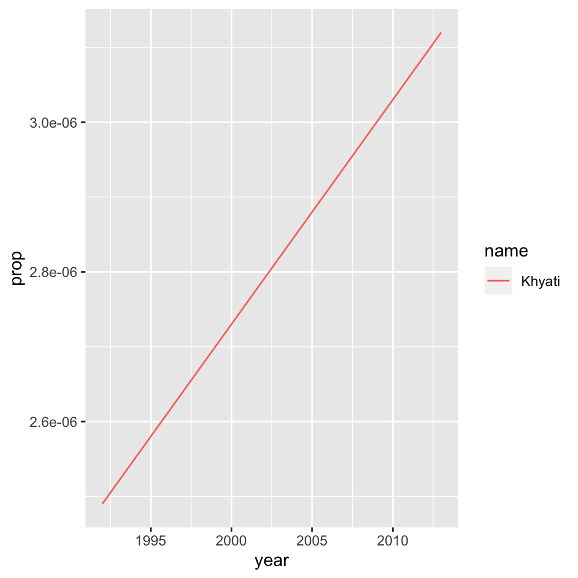
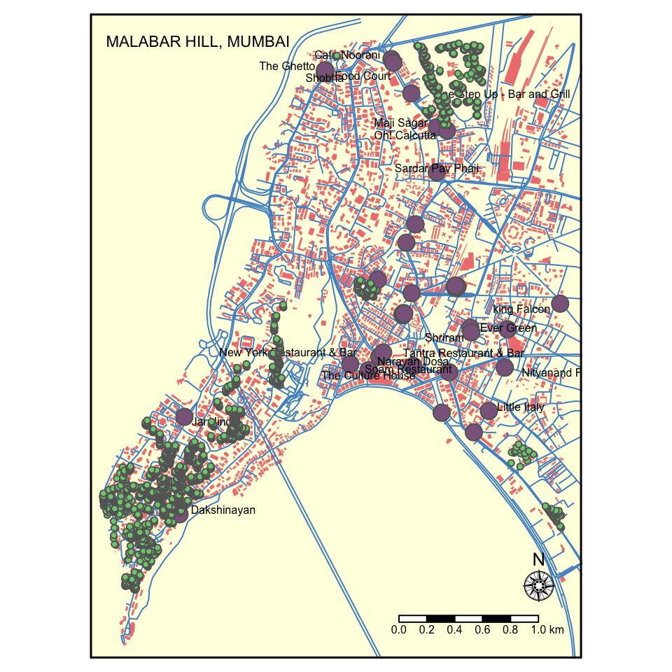
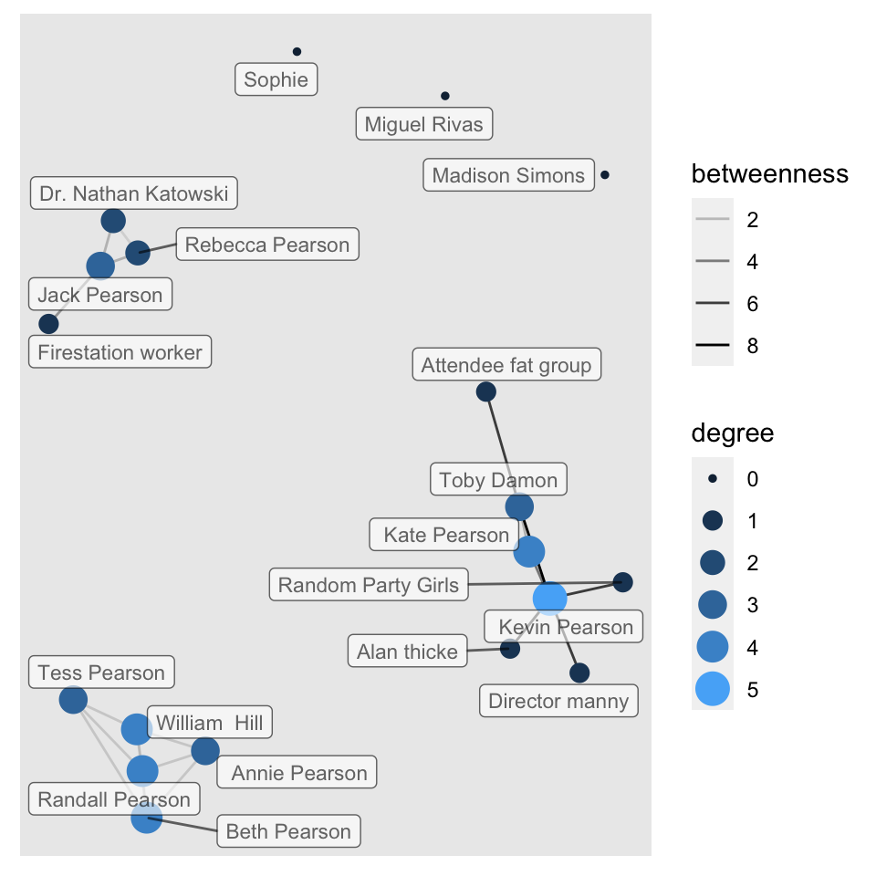
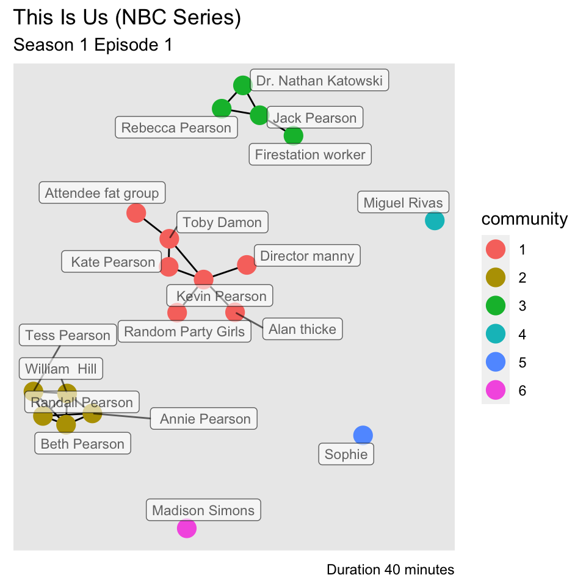

## Introduction

Hi, I am Khyati and this is my journey exploring graphs, maps and networks!

## Graph 1

### Name Graphs

For one of the assignments we had to plot out names on graphs using the baby names data set.This Data is about Different Baby Names with their Gender, Name, Count and Overall Rank in proportion to the overall data. 


```r
glimpse(babynames) # dplyr
```

```
## Rows: 1,924,665
## Columns: 5
## $ year <dbl> 1880, 1880, 1880, 1880, 1880, 1880, 1880, 1880, 1880, 1880, 1880,…
## $ sex  <chr> "F", "F", "F", "F", "F", "F", "F", "F", "F", "F", "F", "F", "F", …
## $ name <chr> "Mary", "Anna", "Emma", "Elizabeth", "Minnie", "Margaret", "Ida",…
## $ n    <int> 7065, 2604, 2003, 1939, 1746, 1578, 1472, 1414, 1320, 1288, 1258,…
## $ prop <dbl> 0.07238359, 0.02667896, 0.02052149, 0.01986579, 0.01788843, 0.016…
```

```r
head(babynames) # base R
```

```
## # A tibble: 6 × 5
##    year sex   name          n   prop
##   <dbl> <chr> <chr>     <int>  <dbl>
## 1  1880 F     Mary       7065 0.0724
## 2  1880 F     Anna       2604 0.0267
## 3  1880 F     Emma       2003 0.0205
## 4  1880 F     Elizabeth  1939 0.0199
## 5  1880 F     Minnie     1746 0.0179
## 6  1880 F     Margaret   1578 0.0162
```

```r
tail(babynames) # same
```

```
## # A tibble: 6 × 5
##    year sex   name       n       prop
##   <dbl> <chr> <chr>  <int>      <dbl>
## 1  2017 M     Zyhier     5 0.00000255
## 2  2017 M     Zykai      5 0.00000255
## 3  2017 M     Zykeem     5 0.00000255
## 4  2017 M     Zylin      5 0.00000255
## 5  2017 M     Zylis      5 0.00000255
## 6  2017 M     Zyrie      5 0.00000255
```

```r
names(babynames) # same
```

```
## [1] "year" "sex"  "name" "n"    "prop"
```

Plotting my name on a graph -


```r
library(babynames) # contains the actual data
library(dplyr) # for manipulating data
library(ggplot2) # for plotting data

# manipulate_name_data
mydata <- babynames %>%
  filter( name == "Khyati" | name == "Khyathi") %>% 
  filter( sex == "F") 

mydata
```

```
## # A tibble: 2 × 5
##    year sex   name       n       prop
##   <dbl> <chr> <chr>  <int>      <dbl>
## 1  1992 F     Khyati     5 0.00000249
## 2  2013 F     Khyati     6 0.00000312
```

```r
glimpse(mydata)
```

```
## Rows: 2
## Columns: 5
## $ year <dbl> 1992, 2013
## $ sex  <chr> "F", "F"
## $ name <chr> "Khyati", "Khyati"
## $ n    <int> 5, 6
## $ prop <dbl> 2.49e-06, 3.12e-06
```

```r
plot <- ggplot(mydata, aes(x = year, 
                           y = prop,  
                           group = name, 
                           color = name,
                           colorspaces = sex)) + 
  geom_line() 
  
plot
```



It was interesting to find out how rare the name is in the US. The graph output was also different from the usual, indicating the gradual but constant increase in the usage of the name.

## Graph 2
### Mapping your Home Town

In this assignment, we had to map our home town. Initially, I started mapping Mumbai as a whole but later found out it was a large data set to handle on one map. I further scaled it to Malabar Hill and plotted the buildings, highways , famous restaurants and highways linked on the map.


```
## Using default API key for pickpoint.io. If batch geocoding, please get your own (free) API key at https://app.pickpoint.io/sign-up
## Using default API key for pickpoint.io. If batch geocoding, please get your own (free) API key at https://app.pickpoint.io/sign-up
```

```
## Issuing query to Overpass API ...
```

```
## Rate limit: 0
```

```
## Query complete!
```

```
## converting OSM data to sf format
```

```
## Issuing query to Overpass API ...
```

```
## Rate limit: 0
```

```
## Query complete!
```

```
## converting OSM data to sf format
```

```
## Issuing query to Overpass API ...
```

```
## Rate limit: 0
```

```
## Query complete!
```

```
## converting OSM data to sf format
```

```
## Issuing query to Overpass API ...
```

```
## Rate limit: 0
```

```
## Query complete!
```

```
## converting OSM data to sf format
```


```r
#1
tm_shape(dat_malabarhill_B) + tm_fill(col="lightcoral") +
  
#2  
tm_shape(dat_malabarhill_H) + tm_lines(col="steelblue3" , lwd = 1) +
  
#3
tm_shape(dat_malabarhill_R) + tm_dots(size = 0.7 , col="plum4" , shape = 21) + tm_text("name", auto.placement = TRUE, size =  0.5 , alpha = 1) + 
  
#4
tm_shape(dat_malabarhill_T) + tm_dots(size = 0.1 , col="palegreen3" , shape = 21) +  
  
#5  
tm_compass(type = "rose" , position = c("right" , "bottom") , size = 1.5) + 
tm_scale_bar(width = 4 , position = c("right" , "bottom" , text.size = 1)) + 
tm_layout( title = "MALABAR HILL, MUMBAI" , title.size = 0.7 , title.color = "black" ,title.position = c("left" , "top"), frame = TRUE, frame.lwd = 3 , bg.color = "lightyellow")
```

```
## Scale bar width set to 0.25 of the map width
```



## Graph 3
### Creating Network Graphs for Tv show - This Is Us

For this assignment, the task was to explore and analyse drama using Network Graphs. The TV show I chose was 'This Is Us'. To analyse the show, I saw the first episode of season 1 and explored the connections between the main and guest characters. It was fun to see the connections evolve during the episode and it gave me a better understanding of the show.


```
## Rows: 19 Columns: 7
```

```
## ── Column specification ────────────────────────────────────────────────────────
## Delimiter: ","
## chr (5): name, sex, race, cast(season 1), occupation
## dbl (2): node id, birthyear
```

```
## 
## ℹ Use `spec()` to retrieve the full column specification for this data.
## ℹ Specify the column types or set `show_col_types = FALSE` to quiet this message.
```

```
## Rows: 21 Columns: 4
```

```
## ── Column specification ────────────────────────────────────────────────────────
## Delimiter: ","
## chr (1): type
## dbl (3): from, to, weight
```

```
## 
## ℹ Use `spec()` to retrieve the full column specification for this data.
## ℹ Specify the column types or set `show_col_types = FALSE` to quiet this message.
```

```
## # A tibble: 19 × 7
##       id name                sex   race  `cast(season 1)` birthyear occupation  
##    <int> <chr>               <chr> <chr> <chr>                <dbl> <chr>       
##  1     1 Jack Pearson        M     white main                  1944 constructio…
##  2     2 Rebecca Pearson     F     white main                  1950 housewife/s…
##  3     3 Randall Pearson     M     black main                  1980 businessman 
##  4     4  Kate Pearson       F     white main                  1980 personal as…
##  5     5  Kevin Pearson      M     white main                  1980 actor       
##  6     6 Beth Pearson        F     black main                    NA lawyer      
##  7     7 Toby Damon          M     white main                    NA IT employee 
##  8     8 William  Hill       M     black main                    NA musician    
##  9     9 Miguel Rivas        M     other recurring               NA constructio…
## 10    10 Sophie              F     white recurring               NA nurse       
## 11    11 Tess Pearson        F     black recurring             2008 student     
## 12    12  Annie Pearson      F     black recurring               NA student     
## 13    13 Dr. Nathan Katowski M     white guest                   NA doctor      
## 14    14 Madison Simons      F     white recurring               NA <NA>        
## 15    15 Random Party Girls  F     other guest                   NA <NA>        
## 16    16 Director manny      M     white guest                   NA director    
## 17    17 Attendee fat group  F     white guest                   NA <NA>        
## 18    18 Alan thicke         M     white guest                   NA actor       
## 19    19 Firestation worker  M     white guest                   NA firestation…
```

```
## # A tibble: 21 × 4
##     from    to weight type  
##    <dbl> <dbl>  <dbl> <chr> 
##  1     1     2     31 family
##  2     4     4      1 self  
##  3     3    12      4 family
##  4     5    15      9 friend
##  5     5     4     28 family
##  6     1    13     27 family
##  7     2    13     21 family
##  8     5    16     11 work  
##  9     3     6     19 family
## 10     6    12      2 family
## # … with 11 more rows
```


```
## # A tbl_graph: 19 nodes and 21 edges
## #
## # An undirected multigraph with 6 components
## #
## # Node Data: 19 × 7 (active)
##      id name            sex   race  `cast(season 1)` birthyear occupation       
##   <int> <chr>           <chr> <chr> <chr>                <dbl> <chr>            
## 1     1 Jack Pearson    M     white main                  1944 construction wor…
## 2     2 Rebecca Pearson F     white main                  1950 housewife/singer 
## 3     3 Randall Pearson M     black main                  1980 businessman      
## 4     4  Kate Pearson   F     white main                  1980 personal assista…
## 5     5  Kevin Pearson  M     white main                  1980 actor            
## 6     6 Beth Pearson    F     black main                    NA lawyer           
## # … with 13 more rows
## #
## # Edge Data: 21 × 4
##    from    to weight type  
##   <int> <int>  <dbl> <chr> 
## 1     1     2     31 family
## 2     4     4      1 self  
## 3     3    12      4 family
## # … with 18 more rows
```


```r
# visualizing between-ness and degree of nodes
tiu %>% 
  activate(nodes) %>% 
  mutate(degree = centrality_degree()) %>% 
  
  activate(edges) %>% 
 
  mutate(betweenness = centrality_edge_betweenness()) %>%
 
  ggraph(layout = "nicely") +
  geom_edge_link(aes(alpha = betweenness)) +
  geom_node_point(aes(size = degree, colour = degree)) + 
  
  scale_color_gradient(guide = "legend") +
  
  geom_node_label(aes(label = name), 
                  repel = TRUE, max.overlaps = 20,
                  alpha = 0.6,
                  size = 3)
```



```r
# visualize communities of nodes
tiu %>% 
                      
  activate(nodes) %>%
  mutate(community = as.factor(group_louvain())) %>% 
  ggraph(layout = "graphopt") + 
  geom_edge_link() + 
  geom_node_point(aes(color = community), size = 5) +
  geom_node_label(aes(label = name), 
                  repel = TRUE, max.overlaps = 20,
                  alpha = 0.6,
                  size = 3) +
  
labs(title = "This Is Us (NBC Series)",
       subtitle = "Season 1 Episode 1",
       caption = "Duration 40 minutes")
```



```r
tiu
```

```
## # A tbl_graph: 19 nodes and 21 edges
## #
## # An undirected multigraph with 6 components
## #
## # Node Data: 19 × 7 (active)
##      id name            sex   race  `cast(season 1)` birthyear occupation       
##   <int> <chr>           <chr> <chr> <chr>                <dbl> <chr>            
## 1     1 Jack Pearson    M     white main                  1944 construction wor…
## 2     2 Rebecca Pearson F     white main                  1950 housewife/singer 
## 3     3 Randall Pearson M     black main                  1980 businessman      
## 4     4  Kate Pearson   F     white main                  1980 personal assista…
## 5     5  Kevin Pearson  M     white main                  1980 actor            
## 6     6 Beth Pearson    F     black main                    NA lawyer           
## # … with 13 more rows
## #
## # Edge Data: 21 × 4
##    from    to weight type  
##   <int> <int>  <dbl> <chr> 
## 1     1     2     31 family
## 2     4     4      1 self  
## 3     3    12      4 family
## # … with 18 more rows
```

From the above graphs, we come to know that there were three obvious connections (work,family,friends) with three parallel stories running side by side. the individual nodes indicate the characters which appear later in season 1 and have not yet engaged into conversation with the main characters.

## My Course Reflection

Throughout the two weeks of this workshop, I realized that it’s important to remember that learning coding/programming language is very similar to learning a spoken language in the sense that you need to be using it regularly or it will not stick. Learning 'R' as a coding language was a trip of ups and downs. It did get overwhelming at times as we had to process a lot of information in such a short amount of time. However, the joy of your codes working and finally seeing the desired outcome surpassed it. The best parts of this workshop were when we listened to music every morning before class started and the part where we coded as a class and tried new things. I realized that you can use 'R' to clean, analyze, and graph my data. It can be used for research to estimate and display results which will be helpful for future projects. This course was really helpful and i wish to explore it more:)
