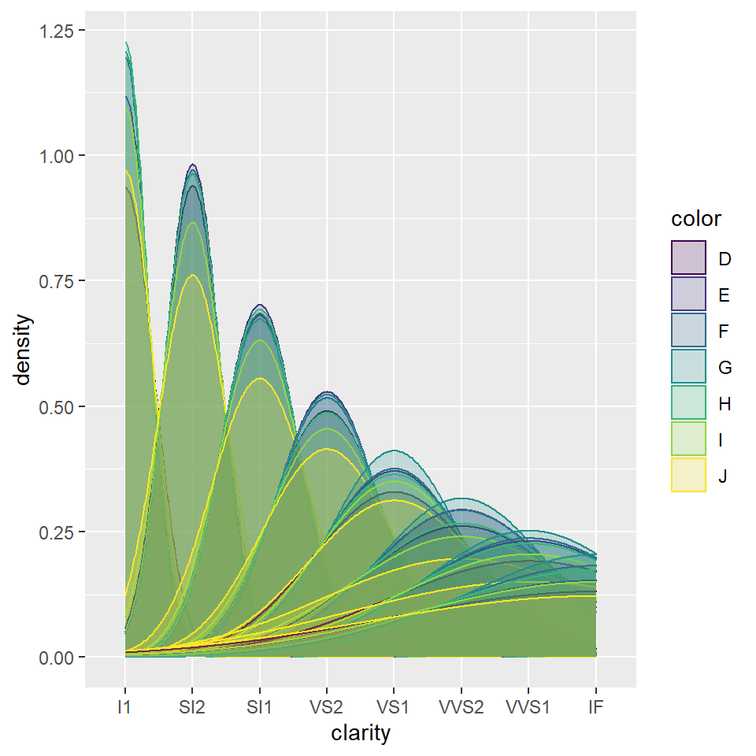
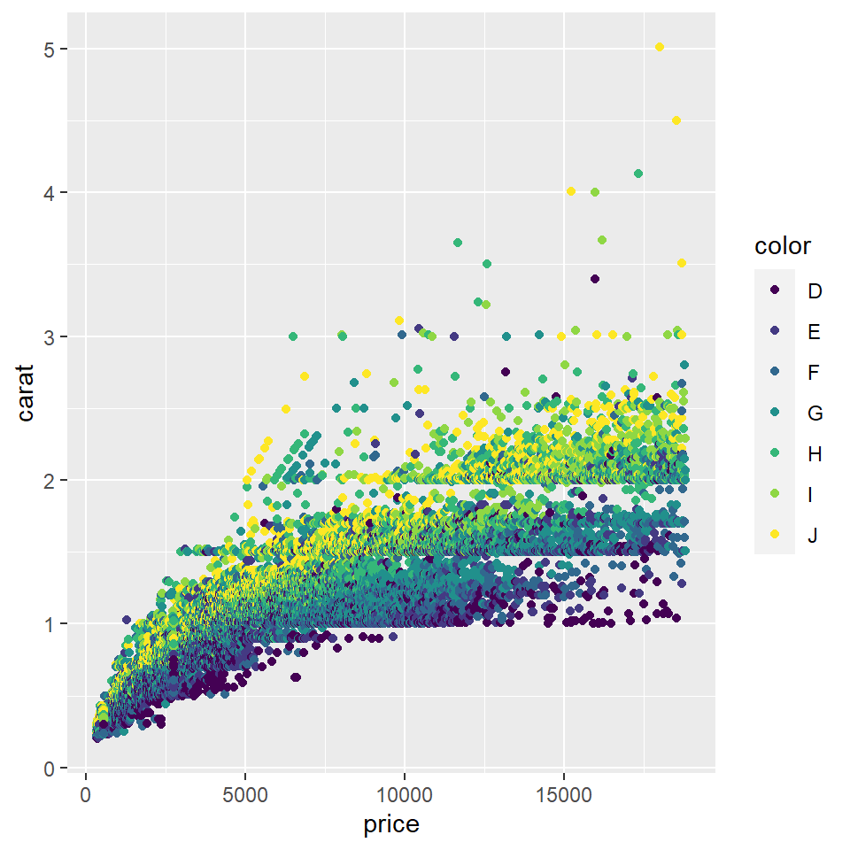
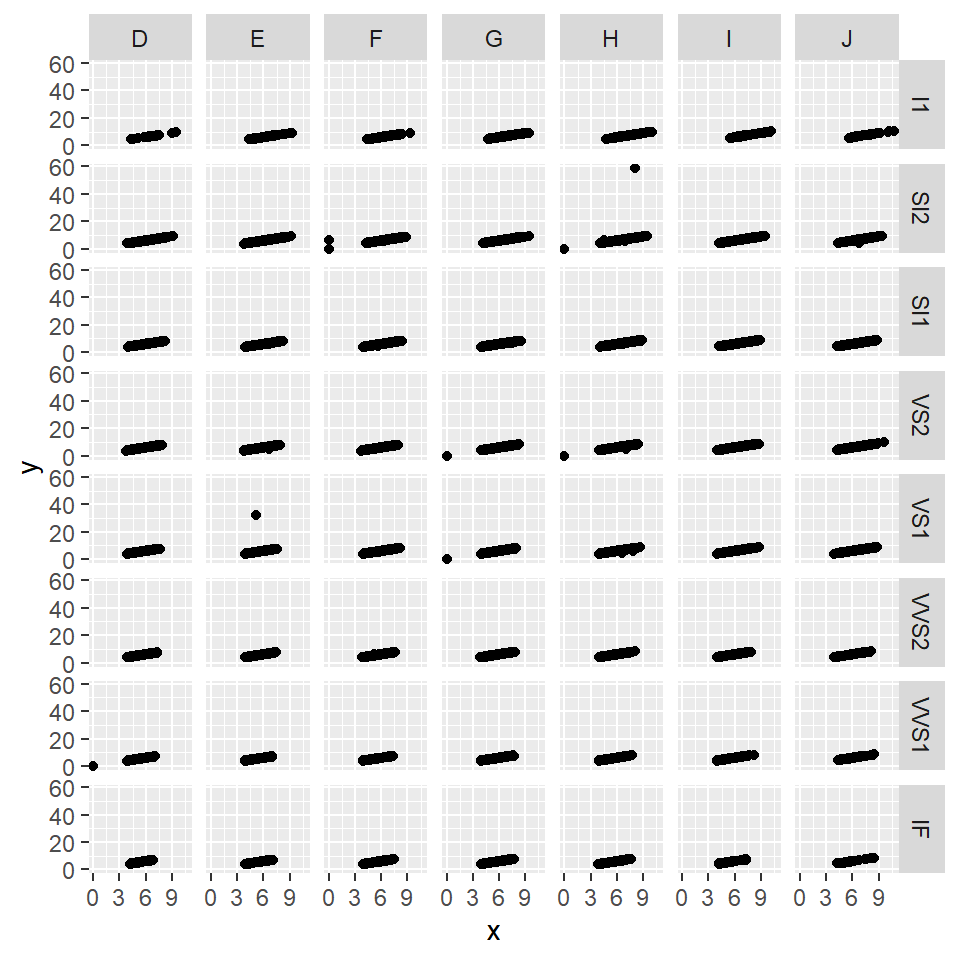

## Introduction

Hi! My name is Misha Sachdeva and I am a student at SMI. I have worked on the following the graphs using a common dataset of the "diamonds" since the data really surprised me and I wanted to explore more works on this.

## Graph 1

I have chosen the dataset of diamonds. The columns of carat and clarity seemed really interesting to me.


```r
glimpse(diamonds)
```

```
## Rows: 53,940
## Columns: 10
## $ carat   <dbl> 0.23, 0.21, 0.23, 0.29, 0.31, 0.24, 0.24, 0.26, 0.22, 0.23, 0.~
## $ cut     <ord> Ideal, Premium, Good, Premium, Good, Very Good, Very Good, Ver~
## $ color   <ord> E, E, E, I, J, J, I, H, E, H, J, J, F, J, E, E, I, J, J, J, I,~
## $ clarity <ord> SI2, SI1, VS1, VS2, SI2, VVS2, VVS1, SI1, VS2, VS1, SI1, VS1, ~
## $ depth   <dbl> 61.5, 59.8, 56.9, 62.4, 63.3, 62.8, 62.3, 61.9, 65.1, 59.4, 64~
## $ table   <dbl> 55, 61, 65, 58, 58, 57, 57, 55, 61, 61, 55, 56, 61, 54, 62, 58~
## $ price   <int> 326, 326, 327, 334, 335, 336, 336, 337, 337, 338, 339, 340, 34~
## $ x       <dbl> 3.95, 3.89, 4.05, 4.20, 4.34, 3.94, 3.95, 4.07, 3.87, 4.00, 4.~
## $ y       <dbl> 3.98, 3.84, 4.07, 4.23, 4.35, 3.96, 3.98, 4.11, 3.78, 4.05, 4.~
## $ z       <dbl> 2.43, 2.31, 2.31, 2.63, 2.75, 2.48, 2.47, 2.53, 2.49, 2.39, 2.~
```

The following graph represents the ratio of density and clarity of the diamonds in relation to the color of those diamonds.


```r
ggplot(diamonds) + 
    geom_density(aes(x = clarity,
                 color = color, 
                 fill = color), 
                 alpha = 0.2)
```




I especially really liked the alpha feature in the graph.

## Graph 2

The data set chosen is diamonds.


```r
glimpse(diamonds)
```

```
## Rows: 53,940
## Columns: 10
## $ carat   <dbl> 0.23, 0.21, 0.23, 0.29, 0.31, 0.24, 0.24, 0.26, 0.22, 0.23, 0.~
## $ cut     <ord> Ideal, Premium, Good, Premium, Good, Very Good, Very Good, Ver~
## $ color   <ord> E, E, E, I, J, J, I, H, E, H, J, J, F, J, E, E, I, J, J, J, I,~
## $ clarity <ord> SI2, SI1, VS1, VS2, SI2, VVS2, VVS1, SI1, VS2, VS1, SI1, VS1, ~
## $ depth   <dbl> 61.5, 59.8, 56.9, 62.4, 63.3, 62.8, 62.3, 61.9, 65.1, 59.4, 64~
## $ table   <dbl> 55, 61, 65, 58, 58, 57, 57, 55, 61, 61, 55, 56, 61, 54, 62, 58~
## $ price   <int> 326, 326, 327, 334, 335, 336, 336, 337, 337, 338, 339, 340, 34~
## $ x       <dbl> 3.95, 3.89, 4.05, 4.20, 4.34, 3.94, 3.95, 4.07, 3.87, 4.00, 4.~
## $ y       <dbl> 3.98, 3.84, 4.07, 4.23, 4.35, 3.96, 3.98, 4.11, 3.78, 4.05, 4.~
## $ z       <dbl> 2.43, 2.31, 2.31, 2.63, 2.75, 2.48, 2.47, 2.53, 2.49, 2.39, 2.~
```

The graph below represents teh ratio of the price and the carat of the diamonds in relation to the color.


```r
ggplot(diamonds) + geom_point(aes(x = price , y = carat , color = color))  # It can be observed that the higher the carat value if of the diamond, the higher is its price.This response was expected. The specific colors of the diamonds also affect the price and the carat value of the diamonds.This was new information for me and i did not know how important color was with diamonds.
```



## Graph 3

The data set chosen is diamonds.


```r
glimpse(diamonds)
```

```
## Rows: 53,940
## Columns: 10
## $ carat   <dbl> 0.23, 0.21, 0.23, 0.29, 0.31, 0.24, 0.24, 0.26, 0.22, 0.23, 0.~
## $ cut     <ord> Ideal, Premium, Good, Premium, Good, Very Good, Very Good, Ver~
## $ color   <ord> E, E, E, I, J, J, I, H, E, H, J, J, F, J, E, E, I, J, J, J, I,~
## $ clarity <ord> SI2, SI1, VS1, VS2, SI2, VVS2, VVS1, SI1, VS2, VS1, SI1, VS1, ~
## $ depth   <dbl> 61.5, 59.8, 56.9, 62.4, 63.3, 62.8, 62.3, 61.9, 65.1, 59.4, 64~
## $ table   <dbl> 55, 61, 65, 58, 58, 57, 57, 55, 61, 61, 55, 56, 61, 54, 62, 58~
## $ price   <int> 326, 326, 327, 334, 335, 336, 336, 337, 337, 338, 339, 340, 34~
## $ x       <dbl> 3.95, 3.89, 4.05, 4.20, 4.34, 3.94, 3.95, 4.07, 3.87, 4.00, 4.~
## $ y       <dbl> 3.98, 3.84, 4.07, 4.23, 4.35, 3.96, 3.98, 4.11, 3.78, 4.05, 4.~
## $ z       <dbl> 2.43, 2.31, 2.31, 2.63, 2.75, 2.48, 2.47, 2.53, 2.49, 2.39, 2.~
```

The below graph represents the length and the width of the diamonds in relation of the clarity and color of the diamonds.


```r
ggplot(diamonds) + geom_point(aes(x = x,
                                  y = y,
                                  ))+ facet_grid(clarity~color)
```



## My Course Reflection

> This course in the r language really allowed me to explore a new medium which I did not experiment with before. The whole workshop was a little hard for me to understand and it took me time to grasp around the concept of this language. Most of my doubts were always cleared by Arvind and he made it smoother for me to understand with his support and non judgemental attitute towards even the silliest of the questions. 

> In all, even though the syllabus was a little hard for me, I really enjoyed coding with this language and I will probably continue to work slowly with this language and take it forward with me.
