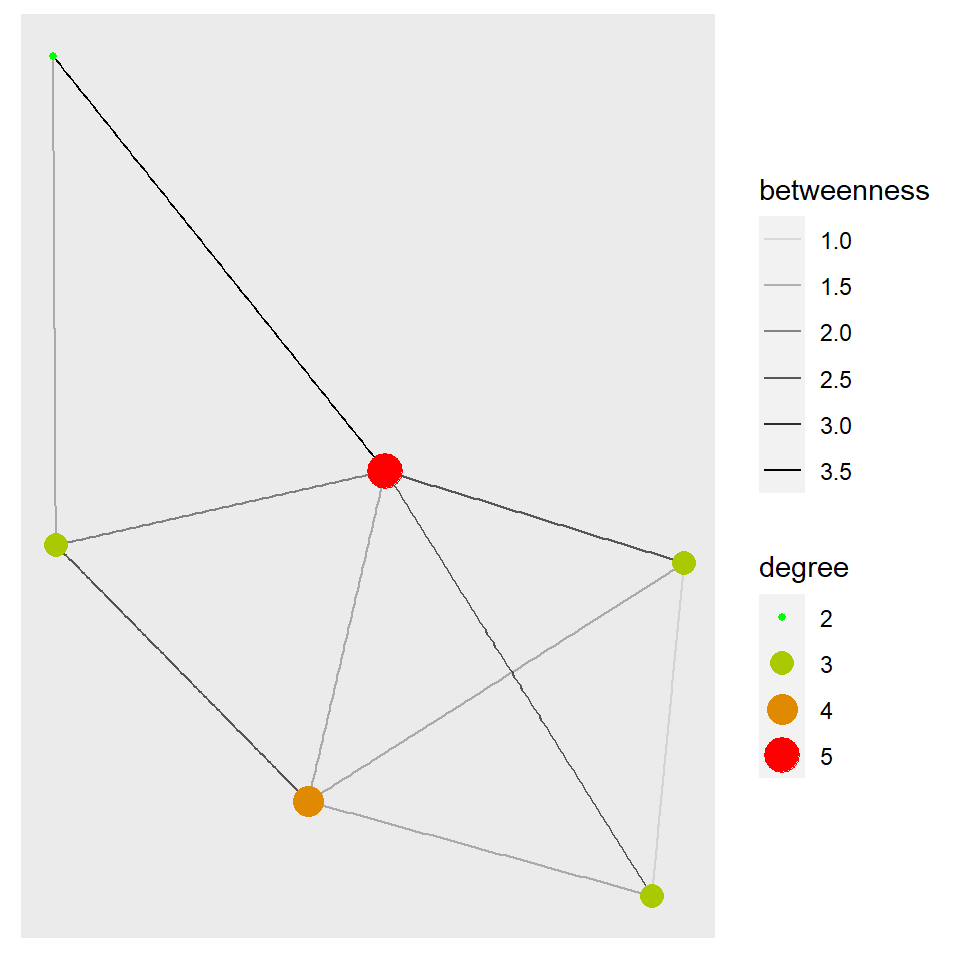
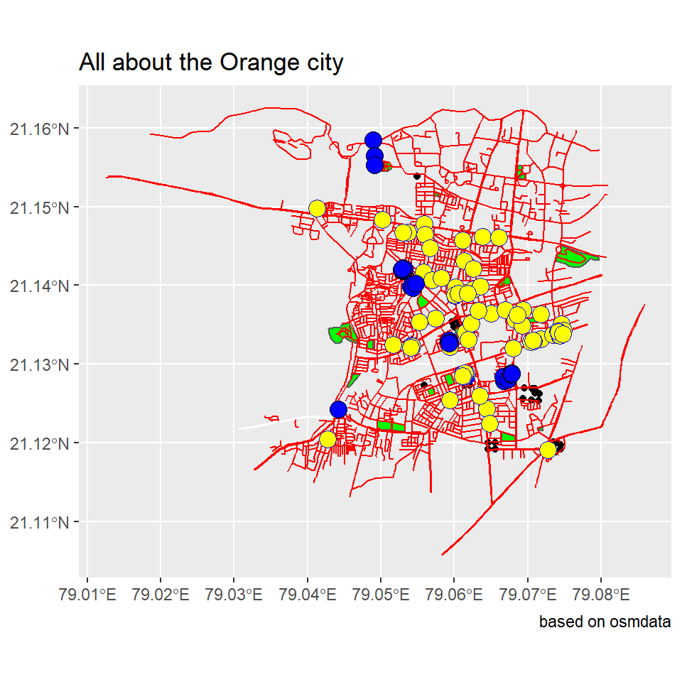

## Introduction

Hello. I am Nidhee Deshak, an oddball who freaks out if my code isn't running XD. Below are the works that according to me are my best and for which I've put in my maximum efforts. 

## Graph 1

I created a dataset where I chose the famous TV show "Friends". I chose the six main characters and looked at their sex, relationship status, birthyear and zodiac signs. I think these chosen variables are quite accurate to define and portray the characters. 

I entered this information in an excel sheet and exported it as a **"csv"** file. 

I also created a sub data set where the **centrality deagree** and **betweenness** are introduced. Centrality degree measures the number of edges connected to a node and betweenness shows us how much a node is playing a part in connecting a pair of other nodes. 


```
## # A tibble: 6 x 7
##   name        id sex   `relationship status` ...5  birthyear signs    
##   <chr>    <dbl> <chr> <chr>                 <lgl>     <dbl> <chr>    
## 1 Rachel       1 F     recently broken up    NA         1969 Taurus   
## 2 Ross         2 M     divorced              NA         1967 Libra    
## 3 Monica       3 F     single                NA         1969 Aries    
## 4 Chandler     4 M     taken                 NA         1967 Aries    
## 5 Joey         5 M     single                NA         1967 Capricorn
## 6 Phoebe       6 F     single                NA         1965 Aquarius
```

```
##        from       to weight friendship_status
## 1    Monica   Rachel     15      best friends
## 2    Phoebe   Monica     11      good friends
## 3    Phoebe   Rachel      9           friends
## 4    Monica     Ross     20      best friends
## 5      Ross Chandler      8           friends
## 6      Ross     Joey     10           friends
## 7      Joey   Monica     12      good friends
## 8    Monica Chandler     22 more than friends
## 9  Chandler     Joey     19      best friends
## 10   Rachel     Ross     21 more than friends
```


```
## # A tbl_graph: 6 nodes and 10 edges
## #
## # An undirected simple graph with 1 component
## #
## # Node Data: 6 x 7 (active)
##   name        id sex   `relationship status` ...5  birthyear signs    
##   <chr>    <dbl> <chr> <chr>                 <lgl>     <dbl> <chr>    
## 1 Rachel       1 F     recently broken up    NA         1969 Taurus   
## 2 Ross         2 M     divorced              NA         1967 Libra    
## 3 Monica       3 F     single                NA         1969 Aries    
## 4 Chandler     4 M     taken                 NA         1967 Aries    
## 5 Joey         5 M     single                NA         1967 Capricorn
## 6 Phoebe       6 F     single                NA         1965 Aquarius 
## #
## # Edge Data: 10 x 4
##    from    to weight friendship_status
##   <int> <int>  <int> <chr>            
## 1     1     3     15 best friends     
## 2     3     6     11 good friends     
## 3     1     6      9 friends          
## # ... with 7 more rows
```


```
## # A tbl_graph: 6 nodes and 10 edges
## #
## # An undirected simple graph with 1 component
## #
## # Edge Data: 10 x 5 (active)
##    from    to weight friendship_status betweenness
##   <int> <int>  <int> <chr>                   <dbl>
## 1     1     3     15 best friends              2  
## 2     3     6     11 good friends              3.5
## 3     1     6      9 friends                   1.5
## 4     2     3     20 best friends              1.5
## 5     2     4      8 friends                   1.5
## 6     2     5     10 friends                   1.5
## # ... with 4 more rows
## #
## # Node Data: 6 x 8
##   name      id sex   `relationship status` ...5  birthyear signs  degree
##   <chr>  <dbl> <chr> <chr>                 <lgl>     <dbl> <chr>   <dbl>
## 1 Rachel     1 F     recently broken up    NA         1969 Taurus      3
## 2 Ross       2 M     divorced              NA         1967 Libra       4
## 3 Monica     3 F     single                NA         1969 Aries       5
## # ... with 3 more rows
```


As mentioned above, the graph below represents the ***centrality degree*** and ***betweenness*** of the nodes. 





As we can see, Monica has the maximum betweenness. This tells us that she is the connecting entity between almost every other individual. She is probably the mutual friend everyone had before getting introduced. 

We can say that she is the hub which holds everything quite together. Ross, though he has a lot of incoming edges, they are merely introductory connections and he's not really close to a lot of people.

The thickness of the edges represent the **betweenness** among every node. Thicker the edge, more is their betweenness. The color gradation and size of the nodes show us the **degree of centrality** which corresponds to number of edges incoming or emerging from a node i.e. the degree of interaction one character has with others.  


## Graph 2

The given dataset is derived from the **"osmdata"**. I wanted to plot the map of my birthplace i.e. Nagpur. I specifically chose the are of "Shivaji Nagar" and created sub datasets like highways, parks, buildings and landuse that are present in Shivaji Nagar. 

I further divided these and found how many buildings are schools, hospitals, place of worhsip or how many highways are primary type. 


```
##        min      max
## x 79.03496 79.07496
## y 21.11906 21.15906
```

```
## Simple feature collection with 280 features and 51 fields
## Geometry type: POLYGON
## Dimension:     XY
## Bounding box:  xmin: 79.04121 ymin: 21.1188 xmax: 79.07543 ymax: 21.15882
## Geodetic CRS:  WGS 84
## First 10 features:
##              osm_id                      name access addr.city addr.district
## 27112965   27112965            Hostel Block 1   <NA>      <NA>          <NA>
## 27112969   27112969            Hostel Block 2   <NA>      <NA>          <NA>
## 27112979   27112979            Hostel Block 6   <NA>      <NA>          <NA>
## 27112998   27112998            Hostel Block 7   <NA>      <NA>          <NA>
## 27113025   27113025            Hostel Block 8   <NA>      <NA>          <NA>
## 27113038   27113038            Hostel Block 9   <NA>      <NA>          <NA>
## 27113053   27113053           New Boys Hostel   <NA>      <NA>          <NA>
## 27113062   27113062 New Boys Hostel Extension   <NA>      <NA>          <NA>
## 27113120   27113120          VNIT Admin Block   <NA>      <NA>          <NA>
## 162019777 162019777                      <NA>   <NA>      <NA>          <NA>
##           addr.full addr.housename addr.housenumber addr.postcode addr.state
## 27112965       <NA>           <NA>             <NA>          <NA>       <NA>
## 27112969       <NA>           <NA>             <NA>          <NA>       <NA>
## 27112979       <NA>           <NA>             <NA>          <NA>       <NA>
## 27112998       <NA>           <NA>             <NA>          <NA>       <NA>
## 27113025       <NA>           <NA>             <NA>          <NA>       <NA>
## 27113038       <NA>           <NA>             <NA>          <NA>       <NA>
## 27113053       <NA>           <NA>             <NA>          <NA>       <NA>
## 27113062       <NA>           <NA>             <NA>          <NA>       <NA>
## 27113120       <NA>           <NA>             <NA>          <NA>       <NA>
## 162019777      <NA>           <NA>             <NA>          <NA>       <NA>
##           addr.street addr.subdistrict alt_name amenity area  atm brand
## 27112965         <NA>             <NA>     <NA>    <NA> <NA> <NA>  <NA>
## 27112969         <NA>             <NA>     <NA>    <NA> <NA> <NA>  <NA>
## 27112979         <NA>             <NA>     <NA>    <NA> <NA> <NA>  <NA>
## 27112998         <NA>             <NA>     <NA>    <NA> <NA> <NA>  <NA>
## 27113025         <NA>             <NA>     <NA>    <NA> <NA> <NA>  <NA>
## 27113038         <NA>             <NA>     <NA>    <NA> <NA> <NA>  <NA>
## 27113053         <NA>             <NA>     <NA>    <NA> <NA> <NA>  <NA>
## 27113062         <NA>             <NA>     <NA>    <NA> <NA> <NA>  <NA>
## 27113120         <NA>             <NA>     <NA> college <NA> <NA>  <NA>
## 162019777        <NA>             <NA>     <NA>    <NA> <NA> <NA>  <NA>
##           brand.wikidata brand.wikipedia    building building.levels
## 27112965            <NA>            <NA> residential            <NA>
## 27112969            <NA>            <NA> residential            <NA>
## 27112979            <NA>            <NA> residential            <NA>
## 27112998            <NA>            <NA> residential            <NA>
## 27113025            <NA>            <NA> residential            <NA>
## 27113038            <NA>            <NA> residential            <NA>
## 27113053            <NA>            <NA> residential            <NA>
## 27113062            <NA>            <NA>         yes            <NA>
## 27113120            <NA>            <NA>     college            <NA>
## 162019777           <NA>            <NA>         yes            <NA>
##           building.material denomination description designation drive_through
## 27112965               <NA>         <NA>        <NA>        <NA>          <NA>
## 27112969               <NA>         <NA>        <NA>        <NA>          <NA>
## 27112979               <NA>         <NA>        <NA>        <NA>          <NA>
## 27112998               <NA>         <NA>        <NA>        <NA>          <NA>
## 27113025               <NA>         <NA>        <NA>        <NA>          <NA>
## 27113038               <NA>         <NA>        <NA>        <NA>          <NA>
## 27113053               <NA>         <NA>        <NA>        <NA>          <NA>
## 27113062               <NA>         <NA>        <NA>        <NA>          <NA>
## 27113120               <NA>         <NA>        <NA>        <NA>          <NA>
## 162019777              <NA>         <NA>        <NA>        <NA>          <NA>
##           foot healthcare healthcare.speciality height highway historic
## 27112965  <NA>       <NA>                  <NA>   <NA>    <NA>     <NA>
## 27112969  <NA>       <NA>                  <NA>   <NA>    <NA>     <NA>
## 27112979  <NA>       <NA>                  <NA>   <NA>    <NA>     <NA>
## 27112998  <NA>       <NA>                  <NA>   <NA>    <NA>     <NA>
## 27113025  <NA>       <NA>                  <NA>   <NA>    <NA>     <NA>
## 27113038  <NA>       <NA>                  <NA>   <NA>    <NA>     <NA>
## 27113053  <NA>       <NA>                  <NA>   <NA>    <NA>     <NA>
## 27113062  <NA>       <NA>                  <NA>   <NA>    <NA>     <NA>
## 27113120  <NA>       <NA>                  <NA>   <NA>    <NA>     <NA>
## 162019777 <NA>       <NA>                  <NA>   <NA>    <NA>     <NA>
##           historic.civilization int_name layer leisure office old_name operator
## 27112965                   <NA>     <NA>     1    <NA>   <NA>     <NA>     <NA>
## 27112969                   <NA>     <NA>     1    <NA>   <NA>     <NA>     <NA>
## 27112979                   <NA>     <NA>     1    <NA>   <NA>     <NA>     <NA>
## 27112998                   <NA>     <NA>     1    <NA>   <NA>     <NA>     <NA>
## 27113025                   <NA>     <NA>     1    <NA>   <NA>     <NA>     <NA>
## 27113038                   <NA>     <NA>     1    <NA>   <NA>     <NA>     <NA>
## 27113053                   <NA>     <NA>     1    <NA>   <NA>     <NA>     <NA>
## 27113062                   <NA>     <NA>     1    <NA>   <NA>     <NA>     <NA>
## 27113120                   <NA>     <NA>     1    <NA>   <NA>     <NA>     <NA>
## 162019777                  <NA>     <NA>  <NA>    <NA>   <NA>     <NA>     <NA>
##           phone power religion residential shop short_name source surface
## 27112965   <NA>  <NA>     <NA>     college <NA>       <NA>   <NA>    <NA>
## 27112969   <NA>  <NA>     <NA>     college <NA>       <NA>   <NA>    <NA>
## 27112979   <NA>  <NA>     <NA>     college <NA>       <NA>   <NA>    <NA>
## 27112998   <NA>  <NA>     <NA>     college <NA>       <NA>   <NA>    <NA>
## 27113025   <NA>  <NA>     <NA>     college <NA>       <NA>   <NA>    <NA>
## 27113038   <NA>  <NA>     <NA>     college <NA>       <NA>   <NA>    <NA>
## 27113053   <NA>  <NA>     <NA>     college <NA>       <NA>   <NA>    <NA>
## 27113062   <NA>  <NA>     <NA>     college <NA>       <NA>   <NA>    <NA>
## 27113120   <NA>  <NA>     <NA>        <NA> <NA>       <NA>   <NA>    <NA>
## 162019777  <NA>  <NA>     <NA>        <NA> <NA>       <NA>   <NA>    <NA>
##           tourism website wheelchair wikidata                       geometry
## 27112965     <NA>    <NA>       <NA>     <NA> POLYGON ((79.04704 21.12415...
## 27112969     <NA>    <NA>       <NA>     <NA> POLYGON ((79.04743 21.12505...
## 27112979     <NA>    <NA>       <NA>     <NA> POLYGON ((79.04648 21.12583...
## 27112998     <NA>    <NA>       <NA>     <NA> POLYGON ((79.04711 21.12581...
## 27113025     <NA>    <NA>       <NA>     <NA> POLYGON ((79.04759 21.12625...
## 27113038     <NA>    <NA>       <NA>     <NA> POLYGON ((79.04808 21.12666...
## 27113053     <NA>    <NA>       <NA>     <NA> POLYGON ((79.04834 21.12586...
## 27113062   hostel    <NA>       <NA>     <NA> POLYGON ((79.04918 21.12673...
## 27113120     <NA>    <NA>       <NA>     <NA> POLYGON ((79.05123 21.12318...
## 162019777    <NA>    <NA>       <NA>     <NA> POLYGON ((79.0689 21.1523, ...
```

```
## Simple feature collection with 1114 features and 28 fields
## Geometry type: LINESTRING
## Dimension:     XY
## Bounding box:  xmin: 79.01256 ymin: 21.10569 xmax: 79.08591 ymax: 21.16256
## Geodetic CRS:  WGS 84
## First 10 features:
##            osm_id                name Road  access bicycle bridge building
## 27082729 27082729 South Ambazari Road <NA>    <NA>    <NA>   <NA>     <NA>
## 27108286 27108286                <NA> <NA>    <NA>    <NA>   <NA>     <NA>
## 27112413 27112413                <NA> <NA>    <NA>    <NA>   <NA>     <NA>
## 27112464 27112464                <NA> <NA>    <NA>    <NA>   <NA>     <NA>
## 27112621 27112621                <NA> <NA> private    <NA>   <NA>     <NA>
## 27112687 27112687                <NA> <NA> private    <NA>   <NA>     <NA>
## 27112697 27112697                <NA> <NA> private    <NA>   <NA>     <NA>
## 27112701 27112701                <NA> <NA> private    <NA>   <NA>     <NA>
## 27112705 27112705                <NA> <NA> private    <NA>   <NA>     <NA>
## 27112712 27112712                <NA> <NA> private    <NA>   <NA>     <NA>
##              created_by description embankment foot footway handrail
## 27082729           <NA>        <NA>       <NA> <NA>    <NA>     <NA>
## 27108286           <NA>        <NA>       <NA> <NA>    <NA>     <NA>
## 27112413           <NA>        <NA>       <NA> <NA>    <NA>     <NA>
## 27112464           <NA>        <NA>       <NA>  yes    <NA>     <NA>
## 27112621           <NA>        <NA>       <NA> <NA>    <NA>     <NA>
## 27112687           <NA>        <NA>       <NA> <NA>    <NA>     <NA>
## 27112697 Potlatch 0.10b        <NA>       <NA> <NA>    <NA>     <NA>
## 27112701 Potlatch 0.10b        <NA>       <NA> <NA>    <NA>     <NA>
## 27112705           <NA>        <NA>       <NA> <NA>    <NA>     <NA>
## 27112712 Potlatch 0.10b        <NA>       <NA> <NA>    <NA>     <NA>
##              highway horse junction lanes layer  lit maxspeed oneway  ref
## 27082729   secondary  <NA>     <NA>  <NA>  <NA> <NA>     <NA>    yes <NA>
## 27108286   secondary  <NA>     <NA>  <NA>  <NA> <NA>     <NA>   <NA> <NA>
## 27112413     service  <NA>     <NA>  <NA>  <NA> <NA>     <NA>   <NA> <NA>
## 27112464     service  <NA>     <NA>  <NA>  <NA> <NA>     <NA>     no <NA>
## 27112621 residential  <NA>     <NA>  <NA>  <NA> <NA>     <NA>   <NA> <NA>
## 27112687 residential  <NA>     <NA>  <NA>  <NA> <NA>     <NA>   <NA> <NA>
## 27112697 residential  <NA>     <NA>  <NA>  <NA> <NA>     <NA>   <NA> <NA>
## 27112701 residential  <NA>     <NA>  <NA>  <NA> <NA>     <NA>   <NA> <NA>
## 27112705 residential  <NA>     <NA>  <NA>  <NA> <NA>     <NA>   <NA> <NA>
## 27112712 residential  <NA>     <NA>  <NA>  <NA> <NA>     <NA>   <NA> <NA>
##          ref.old service source stairs surface width
## 27082729    <NA>    <NA>   <NA>   <NA>    <NA>  <NA>
## 27108286    <NA>    <NA>   <NA>   <NA>    <NA>  <NA>
## 27112413    <NA>    <NA>   <NA>   <NA>    <NA>  <NA>
## 27112464    <NA>    <NA>   <NA>   <NA>    <NA>  <NA>
## 27112621    <NA>    <NA>   <NA>   <NA>    <NA>  <NA>
## 27112687    <NA>    <NA>   <NA>   <NA>    <NA>  <NA>
## 27112697    <NA>    <NA>   <NA>   <NA>    <NA>  <NA>
## 27112701    <NA>    <NA>   <NA>   <NA>    <NA>  <NA>
## 27112705    <NA>    <NA>   <NA>   <NA>    <NA>  <NA>
## 27112712    <NA>    <NA>   <NA>   <NA>    <NA>  <NA>
##                                geometry
## 27082729 LINESTRING (79.07608 21.128...
## 27108286 LINESTRING (79.04587 21.156...
## 27112413 LINESTRING (79.04691 21.132...
## 27112464 LINESTRING (79.0461 21.1331...
## 27112621 LINESTRING (79.05099 21.130...
## 27112687 LINESTRING (79.04771 21.123...
## 27112697 LINESTRING (79.04804 21.124...
## 27112701 LINESTRING (79.04694 21.124...
## 27112705 LINESTRING (79.04668 21.125...
## 27112712 LINESTRING (79.04861 21.125...
```

```
## Simple feature collection with 20 features and 15 fields
## Geometry type: POLYGON
## Dimension:     XY
## Bounding box:  xmin: 79.03483 ymin: 21.12016 xmax: 79.07972 ymax: 21.16059
## Geodetic CRS:  WGS 84
## First 10 features:
##              osm_id                       name addr.city addr.postcode
## 29103798   29103798                       <NA>    Nagpur        440010
## 29103807   29103807                       <NA>      <NA>          <NA>
## 280422678 280422678               Maharaj Bagh      <NA>          <NA>
## 281249291 281249291         Shivaji Nagar Park      <NA>          <NA>
## 295228758 295228758 Krazy Casle amusement Park      <NA>          <NA>
## 308835150 308835150          Telankhedi Garden      <NA>          <NA>
## 308838552 308838552                       <NA>      <NA>          <NA>
## 309050506 309050506            Ambazari Garden    Nagpur        440010
## 309050793 309050793                       <NA>      <NA>          <NA>
## 319966526 319966526               Lendhra Park    Nagpur        440010
##           addr.street                                              description
## 29103798         <NA>                  Local park and Basketball training area
## 29103807         <NA> Park with basketball ground and walking and seating area
## 280422678        <NA>                                                     <NA>
## 281249291        <NA>                                                     <NA>
## 295228758        <NA>                                                     <NA>
## 308835150        <NA>                                                     <NA>
## 308838552        <NA>                                                     <NA>
## 309050506        <NA>                                                     <NA>
## 309050793        <NA>                                                     <NA>
## 319966526  Ramdaspeth                                                     <NA>
##               dog  ele leisure
## 29103798     <NA> <NA>    park
## 29103807     <NA> <NA>    park
## 280422678    <NA> <NA>    park
## 281249291    <NA> <NA>    park
## 295228758    <NA> <NA>    park
## 308835150    <NA> <NA>    park
## 308838552    <NA> <NA>    park
## 309050506 leashed  350    park
## 309050793    <NA> <NA>    park
## 319966526    <NA> <NA>    park
##                                                                                               official_name
## 29103798                                                                                               <NA>
## 29103807                                                                                               <NA>
## 280422678                                                                                              <NA>
## 281249291                                                                                              <NA>
## 295228758                                                                                              <NA>
## 308835150                                                                                              <NA>
## 308838552                                                                                              <NA>
## 309050506 आदà¥\215य कà¥\215रांतिगà¥\201रू लहà¥\201जà¥\200 साळवे उदà¥\215यान
## 309050793                                                                                              <NA>
## 319966526                                                                                              <NA>
##            opening_hours operator smoking tourism          wikipedia
## 29103798            <NA>     <NA>    <NA>    <NA>               <NA>
## 29103807  sunrise-sunset     <NA>    <NA>    <NA>               <NA>
## 280422678           <NA>     <NA>    <NA>     zoo en:Maharajbagh zoo
## 281249291           <NA>     <NA>    <NA>    <NA>               <NA>
## 295228758           <NA>     <NA>    <NA>    <NA>               <NA>
## 308835150           <NA>     <NA>    <NA>    <NA>               <NA>
## 308838552           <NA>     <NA>    <NA>    <NA>               <NA>
## 309050506 sunrise-sunset     <NA>      no    <NA>               <NA>
## 309050793           <NA>     <NA>    <NA>    <NA>               <NA>
## 319966526           <NA>     <NA>    <NA>    <NA>               <NA>
##                                 geometry
## 29103798  POLYGON ((79.0563 21.12679,...
## 29103807  POLYGON ((79.05857 21.12855...
## 280422678 POLYGON ((79.07445 21.14507...
## 281249291 POLYGON ((79.05544 21.13885...
## 295228758 POLYGON ((79.04623 21.12878...
## 308835150 POLYGON ((79.05146 21.15495...
## 308838552 POLYGON ((79.06641 21.12016...
## 309050506 POLYGON ((79.04564 21.13524...
## 309050793 POLYGON ((79.04884 21.13193...
## 319966526 POLYGON ((79.07186 21.13529...
```

```
## Simple feature collection with 4 features and 8 fields
## Geometry type: POLYGON
## Dimension:     XY
## Bounding box:  xmin: 79.04345 ymin: 21.14022 xmax: 79.06882 ymax: 21.15967
## Geodetic CRS:  WGS 84
##              osm_id              name access          amenity contact.phone
## 314565435 314565435              <NA>   <NA>             <NA>          <NA>
## 463143564 463143564              <NA>   <NA>             <NA>          <NA>
## 486718835 486718835 High Court Garden    yes             <NA>          <NA>
## 658036081 658036081 DC Lakeside Lawns   <NA> community_centre    9823085462
##           landuse landuse_2    leisure                       geometry
## 314565435   grass      <NA> playground POLYGON ((79.05875 21.14595...
## 463143564   grass      <NA>       <NA> POLYGON ((79.0556 21.14037,...
## 486718835  garden     grass     garden POLYGON ((79.06783 21.15967...
## 658036081   grass      <NA>       <NA> POLYGON ((79.04345 21.1573,...
```

```
## Simple feature collection with 41 features and 14 fields
## Geometry type: POINT
## Dimension:     XY
## Bounding box:  xmin: 79.05371 ymin: 21.1188 xmax: 79.07448 ymax: 21.15382
## Geodetic CRS:  WGS 84
## First 10 features:
##                osm_id                                           name addr.city
## 2166440645 2166440645                         Nutan Bharat Vidyalaya      <NA>
## 2566007304 2566007304 Bal Mandir Secondary School (Paranjape School)    Nagpur
## 2683303993 2683303993                                           <NA>      <NA>
## 2683303996 2683303996                                           <NA>      <NA>
## 2683303998 2683303998                                           <NA>      <NA>
## 2683304000 2683304000                                           <NA>      <NA>
## 2683304002 2683304002                                           <NA>      <NA>
## 2683313312 2683313312                                           <NA>      <NA>
## 2683313315 2683313315                                           <NA>      <NA>
## 2683313317 2683313317                                           <NA>      <NA>
##            addr.housename addr.housenumber addr.postcode addr.street amenity
## 2166440645           <NA>             <NA>          <NA>        <NA>  school
## 2566007304    Bajaj Nagar             <NA>          <NA>        <NA>  school
## 2683303993           <NA>             <NA>          <NA>        <NA>    <NA>
## 2683303996           <NA>             <NA>          <NA>        <NA>    <NA>
## 2683303998           <NA>             <NA>          <NA>        <NA>    <NA>
## 2683304000           <NA>             <NA>          <NA>        <NA>    <NA>
## 2683304002           <NA>             <NA>          <NA>        <NA>    <NA>
## 2683313312           <NA>             <NA>          <NA>        <NA>    <NA>
## 2683313315           <NA>             <NA>          <NA>        <NA>    <NA>
## 2683313317           <NA>             <NA>          <NA>        <NA>    <NA>
##            designation note office opening_hours phone source
## 2166440645        <NA> <NA>   <NA>          <NA>  <NA>   <NA>
## 2566007304        <NA> <NA>   <NA>          <NA>  <NA>   <NA>
## 2683303993        <NA> <NA>   <NA>          <NA>  <NA>   <NA>
## 2683303996        <NA> <NA>   <NA>          <NA>  <NA>   <NA>
## 2683303998        <NA> <NA>   <NA>          <NA>  <NA>   <NA>
## 2683304000        <NA> <NA>   <NA>          <NA>  <NA>   <NA>
## 2683304002        <NA> <NA>   <NA>          <NA>  <NA>   <NA>
## 2683313312        <NA> <NA>   <NA>          <NA>  <NA>   <NA>
## 2683313315        <NA> <NA>   <NA>          <NA>  <NA>   <NA>
## 2683313317        <NA> <NA>   <NA>          <NA>  <NA>   <NA>
##                             geometry
## 2166440645 POINT (79.05594 21.12727)
## 2566007304 POINT (79.06159 21.12759)
## 2683303993 POINT (79.05965 21.13537)
## 2683303996 POINT (79.06029 21.13563)
## 2683303998 POINT (79.06048 21.13566)
## 2683304000 POINT (79.06077 21.13504)
## 2683304002 POINT (79.05992 21.13473)
## 2683313312   POINT (79.06183 21.128)
## 2683313315  POINT (79.06206 21.1273)
## 2683313317  POINT (79.06146 21.1273)
```

```
## Simple feature collection with 28 features and 6 fields
## Geometry type: POINT
## Dimension:     XY
## Bounding box:  xmin: 79.04416 ymin: 21.12427 xmax: 79.06786 ymax: 21.15844
## Geodetic CRS:  WGS 84
## First 10 features:
##                osm_id                      name addr.city          amenity
## 3153704604 3153704604 Telenkhedi Hanuman Mandir    Nagpur place_of_worship
## 3201880745 3201880745                      <NA>      <NA>             <NA>
## 3201880834 3201880834                      <NA>      <NA>             <NA>
## 3201880865 3201880865                      <NA>      <NA>             <NA>
## 3201880955 3201880955                      <NA>      <NA>             <NA>
## 3906199857 3906199857                      <NA>      <NA>             <NA>
## 3906199858 3906199858                      <NA>      <NA>             <NA>
## 3906199957 3906199957                      <NA>      <NA>             <NA>
## 3906199958 3906199958                      <NA>      <NA>             <NA>
## 3906201257 3906201257                      <NA>      <NA>   drinking_water
##            denomination religion                  geometry
## 3153704604         <NA>    hindu  POINT (79.0489 21.15844)
## 3201880745         <NA>     <NA> POINT (79.06717 21.12848)
## 3201880834         <NA>     <NA> POINT (79.06676 21.12787)
## 3201880865         <NA>     <NA> POINT (79.06663 21.12836)
## 3201880955         <NA>     <NA>  POINT (79.0673 21.12799)
## 3906199857         <NA>     <NA> POINT (79.06769 21.12884)
## 3906199858         <NA>     <NA> POINT (79.06772 21.12868)
## 3906199957         <NA>     <NA> POINT (79.06782 21.12887)
## 3906199958         <NA>     <NA> POINT (79.06786 21.12871)
## 3906201257         <NA>     <NA> POINT (79.06785 21.12875)
```

```
## Simple feature collection with 4 features and 4 fields
## Geometry type: LINESTRING
## Dimension:     XY
## Bounding box:  xmin: 79.03053 ymin: 21.12171 xmax: 79.04481 ymax: 21.1249
## Geodetic CRS:  WGS 84
##              osm_id        name      highway oneway
## 280487860 280487860 Hingna Road      primary    yes
## 304339573 304339573 Hingna Road      primary    yes
## 505246521 505246521        <NA> primary_link    yes
## 505246522 505246522        <NA> primary_link    yes
##                                 geometry
## 280487860 LINESTRING (79.04469 21.124...
## 304339573 LINESTRING (79.03053 21.121...
## 505246521 LINESTRING (79.04442 21.124...
## 505246522 LINESTRING (79.04481 21.124...
```

```
## Simple feature collection with 79 features and 17 fields
## Geometry type: POINT
## Dimension:     XY
## Bounding box:  xmin: 79.04127 ymin: 21.1191 xmax: 79.07486 ymax: 21.1498
## Geodetic CRS:  WGS 84
## First 10 features:
##                osm_id                                      name addr.city
## 2857626554 2857626554 Arneja Heart and Multispeciality Hospital    nagpur
## 3062461484 3062461484               Dhruv Pathology & Molecular      <NA>
## 3143414657 3143414657        Indus Health Care & Checkup Centre    Nagpur
## 3259587452 3259587452                         Narcaood Hospital      <NA>
## 3259594419 3259594419       Wockhardt Super Speciality Hospital    Nagpur
## 3259599209 3259599209                    Dr Baraskar Jaiprakash    Nagpur
## 3259601587 3259601587                         Avantika Hospital    Nagpur
## 3259604661 3259604661                  Sushrut Hospital, Nagpur    Nagpur
## 3261070276 3261070276  Sanjeevani Orthopaedic And Paediatric Ho    Nagpur
## 3274043280 3274043280  Sengupta Hospital and Research Institute    Nagpur
##            addr.country addr.district
## 2857626554           IN        Nagpur
## 3062461484         <NA>          <NA>
## 3143414657           IN          <NA>
## 3259587452         <NA>          <NA>
## 3259594419           IN          <NA>
## 3259599209         <NA>          <NA>
## 3259601587           IN        Nagpur
## 3259604661           IN        Nagpur
## 3261070276         <NA>          <NA>
## 3274043280           IN        Nagpur
##                                               addr.full addr.housenumber
## 2857626554 123, Ramdaspeth, Behind Sonalwar High School              123
## 3062461484                                         <NA>             <NA>
## 3143414657                                         <NA>             <NA>
## 3259587452                                         <NA>             <NA>
## 3259594419                                         <NA>             <NA>
## 3259599209                                         <NA>             <NA>
## 3259601587           34/2 Central Bazar Road Ramdaspeth             <NA>
## 3259604661                                         <NA>             <NA>
## 3261070276                                         <NA>             <NA>
## 3274043280             Ravi Nagar Square Amaravati Road             <NA>
##            addr.postcode  addr.state
## 2857626554        440010 Maharashtra
## 3062461484          <NA>        <NA>
## 3143414657        440033        <NA>
## 3259587452          <NA>        <NA>
## 3259594419          <NA>        <NA>
## 3259599209          <NA>        <NA>
## 3259601587        440012 Maharashtra
## 3259604661        440010 Maharashtra
## 3261070276          <NA>        <NA>
## 3274043280        440033 Maharashtra
##                                                         addr.street  amenity
## 2857626554                                                     <NA> hospital
## 3062461484                                                     <NA> hospital
## 3143414657              Plot No. 84, Rama Niwas, Hill Road Ramnagar hospital
## 3259587452     Narcod Physiotherapy Center Plot No 3, Shankar Nagar hospital
## 3259594419                   1643, North Ambazari Rd, Shankar Nagar hospital
## 3259599209 Baraskar Hospital, 276 Crystal Plaza, Central Bazar road hospital
## 3259601587  Avantika Hospital, Ashirwad Complex, Central Bazar road hospital
## 3259604661    Central Bazar Rd, Near Hotel Center Point, Ramdaspeth hospital
## 3261070276         Central Avenue Laxmi Nagar, V-2, Near Aath Rasta hospital
## 3274043280                                                Ravinagar hospital
##            email healthcare healthcare.speciality           phone
## 2857626554  <NA>   hospital            cardiology            <NA>
## 3062461484  <NA>       <NA>                  <NA>            <NA>
## 3143414657  <NA>   hospital                  <NA>    099677 80336
## 3259587452  <NA>   hospital                  <NA>            <NA>
## 3259594419  <NA>   hospital                  <NA>            <NA>
## 3259599209  <NA>   hospital                  <NA>            <NA>
## 3259601587  <NA>   hospital                  <NA>            <NA>
## 3259604661  <NA>   hospital                  <NA>            <NA>
## 3261070276  <NA>       <NA>                  <NA>            <NA>
## 3274043280  <NA>       <NA>                  <NA> +91 712 2532697
##                        source                        website
## 2857626554 OpenGovernmentData                           <NA>
## 3062461484               <NA>                           <NA>
## 3143414657               <NA>   https://indushealthplus.com/
## 3259587452               <NA>                           <NA>
## 3259594419               <NA>                           <NA>
## 3259599209               <NA>                           <NA>
## 3259601587 OpenGovernmentData                           <NA>
## 3259604661 OpenGovernmentData                           <NA>
## 3261070276               <NA>                           <NA>
## 3274043280 OpenGovernmentData https://senguptahospitals.com/
##                             geometry
## 2857626554 POINT (79.07458 21.13508)
## 3062461484 POINT (79.06439 21.12436)
## 3143414657 POINT (79.05581 21.14162)
## 3259587452 POINT (79.05941 21.13219)
## 3259594419 POINT (79.06504 21.13641)
## 3259599209 POINT (79.06804 21.13201)
## 3259601587 POINT (79.07418 21.13405)
## 3259604661 POINT (79.07486 21.13426)
## 3261070276 POINT (79.06482 21.12241)
## 3274043280 POINT (79.05586 21.14781)
```

I plotted a map of Shivaji Nagar, Nagpur, India. 
The green patches are the parks present in that area. 
The red lines are the highway roads.
The yellow dots are the hospitals.
The white line is the only primary highway present in that area. 
The blue dots are the different places of worship. 

The map making was quite an interesting process as it had its own systematic approach which gave a clearer idea of how documentation and mapping takes place. 



## Graph 3

I chose the dataset "msleep" which shows the sleep cycles and schedules of different animals. 

The table also tells us about the nature of those animals like genus, the type of vore, their orders and conservation.


```
## # A tibble: 83 x 11
##    name   genus vore  order conservation sleep_total sleep_rem sleep_cycle awake
##    <chr>  <chr> <chr> <chr> <chr>              <dbl>     <dbl>       <dbl> <dbl>
##  1 Cheet~ Acin~ carni Carn~ lc                  12.1      NA        NA      11.9
##  2 Owl m~ Aotus omni  Prim~ <NA>                17         1.8      NA       7  
##  3 Mount~ Aplo~ herbi Rode~ nt                  14.4       2.4      NA       9.6
##  4 Great~ Blar~ omni  Sori~ lc                  14.9       2.3       0.133   9.1
##  5 Cow    Bos   herbi Arti~ domesticated         4         0.7       0.667  20  
##  6 Three~ Brad~ herbi Pilo~ <NA>                14.4       2.2       0.767   9.6
##  7 North~ Call~ carni Carn~ vu                   8.7       1.4       0.383  15.3
##  8 Vespe~ Calo~ <NA>  Rode~ <NA>                 7        NA        NA      17  
##  9 Dog    Canis carni Carn~ domesticated        10.1       2.9       0.333  13.9
## 10 Roe d~ Capr~ herbi Arti~ lc                   3        NA        NA      21  
## # ... with 73 more rows, and 2 more variables: brainwt <dbl>, bodywt <dbl>
```

Th graph below shows the density of the sleep rem among different types of vore like herbivores, carnivores, etc. 

The aes() function helps us in visual differentiation as it assigns different colors by default. 


## My Course Reflection

This course was about learning the basics of R language and how we can plot different maps and graphs using that language. At first I was quite intimidated as I had never coded before. But under Arvind's guidance I was able to understand the most difficult of concepts pretty easily. 

I found some of the metaphorical connections in the language very interesting. One of them was the 'nodes' and 'edges' which refer to hubs or cluster and interactions or dependency respectively. I realized that the map making and graph plotting really helps us understand the information in a better manner. 

Thus, I am sure that I'll be applying these new learnt concepts in future to make people understand my thoughts in a better and visual manner. I feel that these methods also paves a new road to visually represent and document subjective and qualitative information, which I didn't imagine was possible. 

I have become fond of the satisfactory feeling I get after the file is knitted and I have a presentable html. 

I would like to work more on improving these concepts and think of ways in which I can use them to compliment my projects. 

Thank you :)
