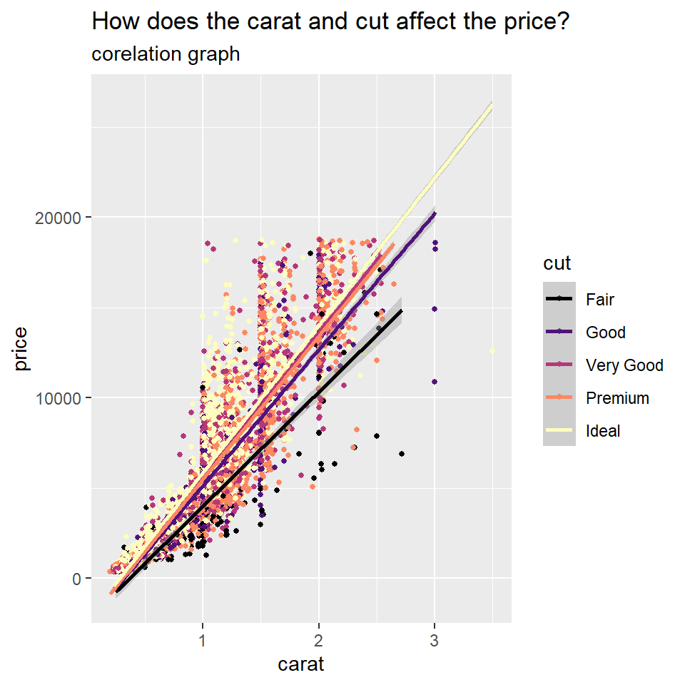

## Introduction

Hi! I'm Prisha, and today I'll be showing you a glimpse into what I've learnt in this workshop as we fell down the rabbit hole of R-studio.

## Graph 1

This is a dataset talking about the different features of a group of diamonds.


```r
glimpse(diamonds)
```

```
## Rows: 53,940
## Columns: 10
## $ carat   <dbl> 0.23, 0.21, 0.23, 0.29, 0.31, 0.24, 0.24, 0.26, 0.22, 0.23, 0.~
## $ cut     <ord> Ideal, Premium, Good, Premium, Good, Very Good, Very Good, Ver~
## $ color   <ord> E, E, E, I, J, J, I, H, E, H, J, J, F, J, E, E, I, J, J, J, I,~
## $ clarity <ord> SI2, SI1, VS1, VS2, SI2, VVS2, VVS1, SI1, VS2, VS1, SI1, VS1, ~
## $ depth   <dbl> 61.5, 59.8, 56.9, 62.4, 63.3, 62.8, 62.3, 61.9, 65.1, 59.4, 64~
## $ table   <dbl> 55, 61, 65, 58, 58, 57, 57, 55, 61, 61, 55, 56, 61, 54, 62, 58~
## $ price   <int> 326, 326, 327, 334, 335, 336, 336, 337, 337, 338, 339, 340, 34~
## $ x       <dbl> 3.95, 3.89, 4.05, 4.20, 4.34, 3.94, 3.95, 4.07, 3.87, 4.00, 4.~
## $ y       <dbl> 3.98, 3.84, 4.07, 4.23, 4.35, 3.96, 3.98, 4.11, 3.78, 4.05, 4.~
## $ z       <dbl> 2.43, 2.31, 2.31, 2.63, 2.75, 2.48, 2.47, 2.53, 2.49, 2.39, 2.~
```

I randomly selected a group of point from the aforementioned dataset, and used it to plot a graph to understand the trends in the cut, carat and prices of diamonds:


```r
diamonds %>% 
  slice_sample(prop = 0.2) %>% 
  ggplot(., aes(x = carat, y = price, colour = cut)) +
  geom_point(size = 1) +
               scale_colour_viridis_d(option = "magma") +
  geom_smooth(method = "lm") +
  labs(title = "How does the carat and cut affect the price?",
       subtitle = "corelation graph")
```

```
## `geom_smooth()` using formula 'y ~ x'
```


The price was higher with larger carats. There is an uoward trend with the cuts too.

## Graph 2

In this section, we learnt how to fetch coordinates and data about specific places, and use it to create a map. I created the map of New Delhi, and marked where the roads, buildings, schools and restaurants were. 


```r
bbox_delhi <- prettymapr::searchbbox("New Delhi, Delhi, India")
```

```
## Using default API key for pickpoint.io. If batch geocoding, please get your own (free) API key at https://app.pickpoint.io/sign-up
```

```r
bbox_delhi
```

```
##        min      max
## x 77.05037 77.25514
## y 28.48126 28.64568
```


```r
dat_delhi_B <- extract_osm_objects (bbox_delhi, key = "building") 
```

```
## Issuing query to Overpass API ...
```

```
## Rate limit: 2
```

```
## Query complete!
```

```
## converting OSM data to sf format
```

```r
dat_delhi_H <- extract_osm_objects (bbox_delhi, key = "highway")
```

```
## Issuing query to Overpass API ...
```

```
## Rate limit: 2
```

```
## Query complete!
```

```
## converting OSM data to sf format
```

```r
dat_delhi_R <- extract_osm_objects(bbox_delhi, 
                             key = "amenity", 
                             value = "restaurant", 
                             return_type = "point") #<<
```

```
## Issuing query to Overpass API ...
```

```
## Rate limit: 2
```

```
## Query complete!
```

```
## converting OSM data to sf format
```

```r
dat_delhi_S <- extract_osm_objects(bbox_delhi, 
                             key = "amenity", 
                             value = "school",
                             return_type = "point") #<<
```

```
## Issuing query to Overpass API ...
```

```
## Rate limit: 2
```

```
## Query complete!
```

```
## converting OSM data to sf format
```


```r
tm_shape(dat_delhi_B) +
  tm_fill(col = "darkgreen") +
  
  tm_shape(dat_delhi_H) +
  tm_lines(col = "blueviolet") +
  
  tm_shape(dat_delhi_R) +
  tm_dots(size = 1, col = "seagreen2", shape=  10) +
  
  tm_shape(dat_delhi_S) +
  tm_dots(size = 1, col = "pink", shape=  10) +
  
  tm_compass(type = "rose", position= c("right", "top")) +
  tm_scale_bar(width = 4, position = c("left", "bottom"), text.size = 1) +
  tm_layout(title = "New Delhi", title.size = 3, frame = TRUE, frame.lwd = 5, bg.color = "lightyellow") +
  tm_add_legend(type = "symbol", col = "pink",
                title="Schools")+
  tmap_style("watercolor")
```

```
## tmap style set to "watercolor"
```

```
## other available styles are: "white", "gray", "natural", "cobalt", "col_blind", "albatross", "beaver", "bw", "classic"
```

```
## Scale bar width set to 0.25 of the map width
```


guide:
Pink- school
Green- restaurants
Dark Green- buildings
Purple- roads


## Graph 3
For my last graph I wanted to show you an interactive network I made using the characters and their relationship with each other in the show Family Guy.


```r
familyguy_nodes <- read_delim(delim = ",", "./Data/familyguy-nodes.csv" )
```

```
## Rows: 19 Columns: 3
```

```
## -- Column specification --------------------------------------------------------
## Delimiter: ","
## chr (3): Names, Sex, Job
```

```
## 
## i Use `spec()` to retrieve the full column specification for this data.
## i Specify the column types or set `show_col_types = FALSE` to quiet this message.
```

```r
familyguy_edges <- read_delim(delim = ",", "./Data/familyguy-edges.csv")
```

```
## Rows: 60 Columns: 4
```

```
## -- Column specification --------------------------------------------------------
## Delimiter: ","
## chr (3): To, From, Type
## dbl (1): Weight
```

```
## 
## i Use `spec()` to retrieve the full column specification for this data.
## i Specify the column types or set `show_col_types = FALSE` to quiet this message.
```

```r
familyguy_nodes
```

```
## # A tibble: 19 x 3
##    Names         Sex   Job          
##    <chr>         <chr> <chr>        
##  1 Lois          F     Pianist      
##  2 Brian         M     writer       
##  3 Peter         M     desk job     
##  4 Stewie        M     baby         
##  5 Chris         M     student      
##  6 Meg           F     student      
##  7 Ronald Raegan M     ex-president 
##  8 Quagmire      M     pilot        
##  9 Joe           M     police       
## 10 Jerome        M     pub          
## 11 clone         N/A   lackey       
## 12 B-clone       N/A   lackey       
## 13 Candy         F     makeup school
## 14 Receptionist  F     office       
## 15 Kevin Conolly M     actor        
## 16 Horace        M     Bartender    
## 17 Baby          F     baby         
## 18 flintstones   M     gag          
## 19 cops          N/A   gag
```

```r
familyguy_edges
```

```
## # A tibble: 60 x 4
##    To          From          Weight Type      
##    <chr>       <chr>          <dbl> <chr>     
##  1 Peter       Quagmire           5 friends   
##  2 Lois        Peter             10 family    
##  3 Chris       Meg                8 family    
##  4 flintstones cops               1 gag       
##  5 Chris       Peter              8 family    
##  6 Peter       Ronald Raegan      5 gag       
##  7 Quagmire    Peter              5 friends   
##  8 Stewie      Brian              9 family    
##  9 Stewie      clone              2 experiment
## 10 Brian       clone              1 experiment
## # ... with 50 more rows
```


```r
fg <- tbl_graph(nodes = familyguy_nodes, 
                edges = familyguy_edges, 
                directed = FALSE)
fg
```

```
## # A tbl_graph: 19 nodes and 60 edges
## #
## # An undirected multigraph with 2 components
## #
## # Node Data: 19 x 3 (active)
##   Names  Sex   Job     
##   <chr>  <chr> <chr>   
## 1 Lois   F     Pianist 
## 2 Brian  M     writer  
## 3 Peter  M     desk job
## 4 Stewie M     baby    
## 5 Chris  M     student 
## 6 Meg    F     student 
## # ... with 13 more rows
## #
## # Edge Data: 60 x 4
##    from    to Weight Type   
##   <int> <int>  <dbl> <chr>  
## 1     3     8      5 friends
## 2     1     3     10 family 
## 3     5     6      8 family 
## # ... with 57 more rows
```


```r
library(visNetwork)
familyguy_nodes
```

```
## # A tibble: 19 x 3
##    Names         Sex   Job          
##    <chr>         <chr> <chr>        
##  1 Lois          F     Pianist      
##  2 Brian         M     writer       
##  3 Peter         M     desk job     
##  4 Stewie        M     baby         
##  5 Chris         M     student      
##  6 Meg           F     student      
##  7 Ronald Raegan M     ex-president 
##  8 Quagmire      M     pilot        
##  9 Joe           M     police       
## 10 Jerome        M     pub          
## 11 clone         N/A   lackey       
## 12 B-clone       N/A   lackey       
## 13 Candy         F     makeup school
## 14 Receptionist  F     office       
## 15 Kevin Conolly M     actor        
## 16 Horace        M     Bartender    
## 17 Baby          F     baby         
## 18 flintstones   M     gag          
## 19 cops          N/A   gag
```

```r
familyguy_edges
```

```
## # A tibble: 60 x 4
##    To          From          Weight Type      
##    <chr>       <chr>          <dbl> <chr>     
##  1 Peter       Quagmire           5 friends   
##  2 Lois        Peter             10 family    
##  3 Chris       Meg                8 family    
##  4 flintstones cops               1 gag       
##  5 Chris       Peter              8 family    
##  6 Peter       Ronald Raegan      5 gag       
##  7 Quagmire    Peter              5 friends   
##  8 Stewie      Brian              9 family    
##  9 Stewie      clone              2 experiment
## 10 Brian       clone              1 experiment
## # ... with 50 more rows
```

```r
familyguy_nodes_vis <- familyguy_nodes %>% 
  rowid_to_column(var = "id") %>% 
  rename("label" = Names) %>% 
  mutate(sex = case_when(Sex == "F" ~ "Female",
                         Sex == "M" ~ "Male",
                         Sex == "N/A" ~ "Not Applicable")) %>% 
  replace_na(., list(Sex = "Transgender?")) %>% 
  dplyr::rename("group" = Sex)
familyguy_nodes_vis
```

```
## # A tibble: 19 x 5
##       id label         group Job           sex           
##    <int> <chr>         <chr> <chr>         <chr>         
##  1     1 Lois          F     Pianist       Female        
##  2     2 Brian         M     writer        Male          
##  3     3 Peter         M     desk job      Male          
##  4     4 Stewie        M     baby          Male          
##  5     5 Chris         M     student       Male          
##  6     6 Meg           F     student       Female        
##  7     7 Ronald Raegan M     ex-president  Male          
##  8     8 Quagmire      M     pilot         Male          
##  9     9 Joe           M     police        Male          
## 10    10 Jerome        M     pub           Male          
## 11    11 clone         N/A   lackey        Not Applicable
## 12    12 B-clone       N/A   lackey        Not Applicable
## 13    13 Candy         F     makeup school Female        
## 14    14 Receptionist  F     office        Female        
## 15    15 Kevin Conolly M     actor         Male          
## 16    16 Horace        M     Bartender     Male          
## 17    17 Baby          F     baby          Female        
## 18    18 flintstones   M     gag           Male          
## 19    19 cops          N/A   gag           Not Applicable
```

```r
familyguy_edges_vis <- familyguy_edges %>% 
  select(From, To) %>% 
  left_join(., familyguy_nodes_vis, by = c("From" = "label")) %>% 
  left_join(., familyguy_nodes_vis, by = c("To" = "label")) %>%
  select("From"= id.x, "To" = id.y) %>% 
  rename("to" = To, "from"= From)

familyguy_edges_vis
```

```
## # A tibble: 60 x 2
##     from    to
##    <int> <int>
##  1     8     3
##  2     3     1
##  3     6     5
##  4    19    18
##  5     3     5
##  6     7     3
##  7     3     8
##  8     2     4
##  9    11     4
## 10    11     2
## # ... with 50 more rows
```


```r
familyguy_nodes_vis %>%

  visNetwork(nodes = ., edges = familyguy_edges_vis) %>% 
  visNodes(font = list(size = 40)) %>% 
  
  
  visGroups(groupname = "F", shape = "icon", 
            icon = list(code = "f182", size = 75, color = "tomato"),
            shadow = list(enabled = TRUE)) %>% 
  
  visGroups(groupname = "M", shape = "icon", 
            icon = list(code = "f183", size = 75, color = "slateblue"), 
            shadow = list(enabled = TRUE)) %>% 
  
  visGroups(groupname = "N/A", shape = "icon", 
            icon = list(code = "f22c", size = 75, color = "fuchsia"), 
            shadow = list(enabled = TRUE)) %>% 
  

  addFontAwesome() %>% 
  
 
  visInteraction(navigationButtons = TRUE,
                 hover = TRUE,
                 selectConnectedEdges = TRUE,
                 hoverConnectedEdges = TRUE,
                 zoomView = TRUE) 
```

```{=html}
<div id="htmlwidget-533f4b349f89128ad242" style="width:480px;height:480px;" class="visNetwork html-widget"></div>
<script type="application/json" data-for="htmlwidget-533f4b349f89128ad242">{"x":{"nodes":{"id":[1,2,3,4,5,6,7,8,9,10,11,12,13,14,15,16,17,18,19],"label":["Lois","Brian","Peter","Stewie","Chris","Meg","Ronald Raegan","Quagmire","Joe","Jerome","clone","B-clone","Candy","Receptionist","Kevin Conolly","Horace","Baby","flintstones","cops"],"group":["F","M","M","M","M","F","M","M","M","M","N/A","N/A","F","F","M","M","F","M","N/A"],"Job":["Pianist","writer","desk job","baby","student","student","ex-president","pilot","police","pub","lackey","lackey","makeup school","office","actor","Bartender","baby","gag","gag"],"sex":["Female","Male","Male","Male","Male","Female","Male","Male","Male","Male","Not Applicable","Not Applicable","Female","Female","Male","Male","Female","Male","Not Applicable"]},"edges":{"from":[8,3,6,19,3,7,3,2,11,11,11,7,4,2,2,8,7,1,8,4,12,8,13,8,8,3,8,8,8,17,14,2,11,9,3,8,9,3,8,3,3,9,8,3,9,3,9,8,3,10,10,1,3,4,10,1,4,2,8,10],"to":[3,1,5,18,5,3,8,4,4,2,4,3,11,4,11,7,9,8,17,2,2,13,8,17,13,8,9,3,14,8,8,12,4,3,2,3,3,9,17,9,8,3,15,2,3,16,10,3,10,3,1,4,1,10,1,3,2,8,10,6]},"nodesToDataframe":true,"edgesToDataframe":true,"options":{"width":"100%","height":"100%","nodes":{"shape":"dot","font":{"size":40}},"manipulation":{"enabled":false},"groups":{"F":{"shape":"icon","icon":{"code":"f182","size":75,"color":"tomato"},"shadow":{"enabled":true}},"M":{"shape":"icon","icon":{"code":"f183","size":75,"color":"slateblue"},"shadow":{"enabled":true}},"useDefaultGroups":true,"N/A":{"shape":"icon","icon":{"code":"f22c","size":75,"color":"fuchsia"},"shadow":{"enabled":true}}},"interaction":{"hover":true,"hoverConnectedEdges":true,"navigationButtons":true,"selectConnectedEdges":true,"zoomView":true}},"groups":["F","M","N/A"],"width":null,"height":null,"idselection":{"enabled":false},"byselection":{"enabled":false},"main":null,"submain":null,"footer":null,"background":"rgba(0, 0, 0, 0)","iconsRedraw":true,"tooltipStay":300,"tooltipStyle":"position: fixed;visibility:hidden;padding: 5px;white-space: nowrap;font-family: verdana;font-size:14px;font-color:#000000;background-color: #f5f4ed;-moz-border-radius: 3px;-webkit-border-radius: 3px;border-radius: 3px;border: 1px solid #808074;box-shadow: 3px 3px 10px rgba(0, 0, 0, 0.2);"},"evals":[],"jsHooks":[]}</script>
```

## My Course Reflection
This workshop was something completely new for me. Coding isn't my forte, but this class was really enjoyable for me- especially with the patience with which Arvind would teach us a code over and over again.
I learnt how numbers and graphs can be translated to patterns and trends that can tell us so much more about it, and it also taught me the importance of design in tables and graphs.
This is going to make me look at how I can include analysis, patterns and data into my work from an all new, digital perspective. It can also help me present my work, and include interactive code in it in a new way!

I really enjoyed this class, and I hope I can explore this further. 

