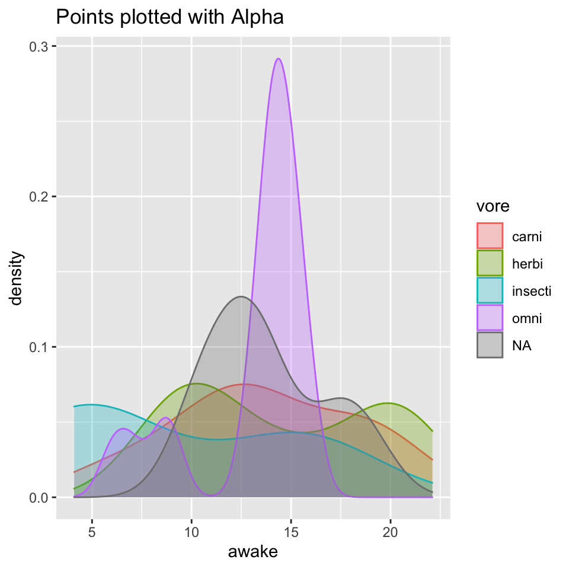
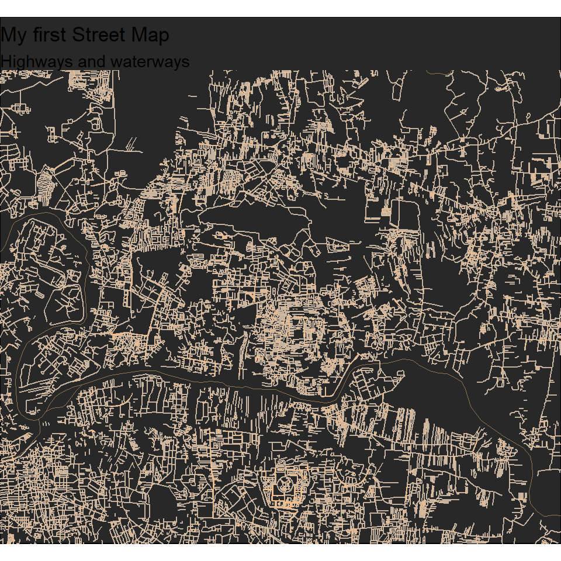

## Introduction

> Hi, I'm Ruhi Raisoni. Below are some graphs whose code I learnt in R studio with the help and guidance of our facilitator Mr. Arvind Venkatadri.

&nbsp;


## Graph 1- Plotting a line graph to show the amount of time spent awake by animals of different diets:  

```r
ggplot(msleep) + 
    geom_density(aes(x = awake, 
                 color = vore, 
                 fill = vore), 
                 alpha = 0.3) +
  labs(title = "Points plotted with Alpha")
```


 
I have used an updated and expanded version of the mammals sleep dataset. Updated sleep times and weights were taken from V. M. Savage and G. B. West. A quantitative, theoretical framework for understanding mammalian sleep. Proceedings of the National Academy of Sciences, 104 (3):1051-1056, 2007.
About the dataset:

```r
head(msleep)
```

```
## # A tibble: 6 × 11
##   name    genus vore  order conservation sleep_total sleep_rem sleep_cycle awake
##   <chr>   <chr> <chr> <chr> <chr>              <dbl>     <dbl>       <dbl> <dbl>
## 1 Cheetah Acin… carni Carn… lc                  12.1      NA        NA      11.9
## 2 Owl mo… Aotus omni  Prim… <NA>                17         1.8      NA       7  
## 3 Mounta… Aplo… herbi Rode… nt                  14.4       2.4      NA       9.6
## 4 Greate… Blar… omni  Sori… lc                  14.9       2.3       0.133   9.1
## 5 Cow     Bos   herbi Arti… domesticated         4         0.7       0.667  20  
## 6 Three-… Brad… herbi Pilo… <NA>                14.4       2.2       0.767   9.6
## # … with 2 more variables: brainwt <dbl>, bodywt <dbl>
```

**The above graph shows the amount of hours spent awake by animals of different diets like carnivore, herbivore and omnivore.The geometric aesthetic used in the graph is alpha. This aesthetic makes the graph translucent showing the plotted lines hidden as well.**
&nbsp;


## Graph 2- To find longitude and latitude for Pune:  

```r
getbb("Pune Maharashtra")
```

```
##        min      max
## x 73.74985 74.02021
## y 18.42950 18.62087
```
A positive latitude i.e. a positive y value indicates that Pune is above the equator.

### Exporting roads from the coordinate system:  

```r
streets <- getbb("Pune Maharashtra")%>%
  opq()%>%
  add_osm_feature(key = "highway", 
                  value = c("motorway", "primary", 
                            "secondary", "tertiary")) %>%
  osmdata_sf()
streets
```

```
## Object of class 'osmdata' with:
##                  $bbox : 18.429497,73.7498473,18.6208699,74.020214
##         $overpass_call : The call submitted to the overpass API
##                  $meta : metadata including timestamp and version numbers
##            $osm_points : 'sf' Simple Features Collection with 22802 points
##             $osm_lines : 'sf' Simple Features Collection with 2052 linestrings
##          $osm_polygons : 'sf' Simple Features Collection with 56 polygons
##        $osm_multilines : NULL
##     $osm_multipolygons : NULL
```

### Now we get the streets and waterways from the database:  

```r
small_streets <- getbb("Pune Maharashtra")%>%
  opq()%>%
  add_osm_feature(key = "highway", value = c("residential", "living_street",
                            "unclassified",
                            "service", "footway")) %>%
  osmdata_sf()

river <- getbb("Pune Maharashtra")%>%
  opq()%>%
  add_osm_feature(key = "waterway", value = "river") %>%
  osmdata_sf()
```

### Let's create our first streetmap:  

```r
#group1
ggplot() +
  geom_sf(data = small_streets$osm_lines,
          inherit.aes = FALSE,
          color = "#7fc0ff",
          size = .4,
          alpha = .8) +

#group2
 geom_sf(data = small_streets$osm_lines,
          inherit.aes = FALSE,
         color = "#ffbe7f",
          size = .4,
          alpha = .6) +
  geom_sf(data = river$osm_lines,
          inherit.aes = FALSE,
          color = "#ffbe7f",
          size = .2,
          alpha = .5) +
 coord_sf(xlim = c(73.85, 74.00), #Didn't used original values to get a more spaced out map. This is a slightly zoomed in map of Pune.
           ylim = c(18.50, 18.62), #Use getbb("Pune Maharashtra") to find original values.
           expand = FALSE) + 
  labs(title= "My first Street Map", subtitle = "Highways and waterways") +
   theme_void() + #to hide the x and y axis
theme(plot.background = element_rect(fill = "#282828"))
```



I have used Imports OpenStreetMap (OSM) data into R as either 'sf' or 'sp' objects. OSM data are extracted from the overpass API and processed with very fast C++ routines for return to R. The package enables simple overpass queries to be constructed without the user necessarily understanding the syntax of the overpass query language, while retaining the ability to handle arbitrarily complex queries. Functions are also provided to enable recursive searching between different kinds of OSM data (for example, to find all lines which intersect a given point).

**The above map shows  highways and waterways in the city of Pune, Maharashtra.**
&nbsp;


## Graph 3- Reading the data:  

```r
mh_nodes <-read_csv("./Data/moneyheist-nodes.csv")
```

```
## New names:
## * `` -> ...6
## * `` -> ...7
```

```
## Rows: 19 Columns: 7
```

```
## ── Column specification ────────────────────────────────────────────────────────
## Delimiter: ","
## chr (3): Names, Sex, Race
## dbl (2): Born, Part
## lgl (2): ...6, ...7
```

```
## 
## ℹ Use `spec()` to retrieve the full column specification for this data.
## ℹ Specify the column types or set `show_col_types = FALSE` to quiet this message.
```

```r
mh_edges <- read_csv("./Data/moneyheist-edges.csv")
```

```
## Rows: 48 Columns: 4
```

```
## ── Column specification ────────────────────────────────────────────────────────
## Delimiter: ","
## chr (3): From, To, Type
## dbl (1): Weight
```

```
## 
## ℹ Use `spec()` to retrieve the full column specification for this data.
## ℹ Specify the column types or set `show_col_types = FALSE` to quiet this message.
```

```r
mh_nodes
```

```
## # A tibble: 19 × 7
##    Names     Sex   Race   Born  Part ...6  ...7 
##    <chr>     <chr> <chr> <dbl> <dbl> <lgl> <lgl>
##  1 Professor M     White  1975     1 NA    NA   
##  2 Tokyo     F     White  1989     1 NA    NA   
##  3 Berlin    M     White  1971     1 NA    NA   
##  4 Denver    M     White  1991     1 NA    NA   
##  5 Nairobi   F     Black  1986     1 NA    NA   
##  6 Moscow    M     White  1964     1 NA    NA   
##  7 Rio       M     White  1996     1 NA    NA   
##  8 Helsinki  M     Black  1977     1 NA    NA   
##  9 Oslo      M     Black  1979     1 NA    NA   
## 10 Monica    F     White  1983     1 NA    NA   
## 11 Artorito  M     White  1978     1 NA    NA   
## 12 Ariadna   F     White  1984     1 NA    NA   
## 13 <NA>      <NA>  <NA>     NA    NA NA    NA   
## 14 <NA>      <NA>  <NA>     NA    NA NA    NA   
## 15 <NA>      <NA>  <NA>     NA    NA NA    NA   
## 16 <NA>      <NA>  <NA>     NA    NA NA    NA   
## 17 <NA>      <NA>  <NA>     NA    NA NA    NA   
## 18 <NA>      <NA>  <NA>     NA    NA NA    NA   
## 19 <NA>      <NA>  <NA>     NA    NA NA    NA
```

```r
mh_edges
```

```
## # A tibble: 48 × 4
##    From      To        Weight Type                    
##    <chr>     <chr>      <dbl> <chr>                   
##  1 Professor Tokyo         13 Guardian Angel          
##  2 Professor Berlin        21 Right Hand              
##  3 Professor Denver        10 Acquaintances           
##  4 Professor Moscow         8 Acquaintances           
##  5 Denver    Moscow         5 Son                     
##  6 Helsinki  Oslo           4 Twins                   
##  7 Oslo      Professor      1 Soldier                 
##  8 Nairobi   Professor      4 Quality Control  Manager
##  9 Rio       Professor      5 Coding                  
## 10 Helsinki  Professor      3 Soldier                 
## # … with 38 more rows
```

### About the dataset:  

```r
head(mh_nodes)#The first six rows of the nodes dataset
```

```
## # A tibble: 6 × 7
##   Names     Sex   Race   Born  Part ...6  ...7 
##   <chr>     <chr> <chr> <dbl> <dbl> <lgl> <lgl>
## 1 Professor M     White  1975     1 NA    NA   
## 2 Tokyo     F     White  1989     1 NA    NA   
## 3 Berlin    M     White  1971     1 NA    NA   
## 4 Denver    M     White  1991     1 NA    NA   
## 5 Nairobi   F     Black  1986     1 NA    NA   
## 6 Moscow    M     White  1964     1 NA    NA
```

```r
head(mh_edges)#The first six rows of the edges dataset
```

```
## # A tibble: 6 × 4
##   From      To     Weight Type          
##   <chr>     <chr>   <dbl> <chr>         
## 1 Professor Tokyo      13 Guardian Angel
## 2 Professor Berlin     21 Right Hand    
## 3 Professor Denver     10 Acquaintances 
## 4 Professor Moscow      8 Acquaintances 
## 5 Denver    Moscow      5 Son           
## 6 Helsinki  Oslo        4 Twins
```

```r
dim(mh_nodes)#Dimensions of the nodes dataset
```

```
## [1] 19  7
```

```r
dim(mh_edges)#Dimensions of the edges dataset
```

```
## [1] 48  4
```

### Creating a network object using tidygraph:  

```
## # A tbl_graph: 19 nodes and 48 edges
## #
## # An undirected multigraph with 8 components
## #
## # Node Data: 19 × 7 (active)
##   Names     Sex   Race   Born  Part ...6  ...7 
##   <chr>     <chr> <chr> <dbl> <dbl> <lgl> <lgl>
## 1 Professor M     White  1975     1 NA    NA   
## 2 Tokyo     F     White  1989     1 NA    NA   
## 3 Berlin    M     White  1971     1 NA    NA   
## 4 Denver    M     White  1991     1 NA    NA   
## 5 Nairobi   F     Black  1986     1 NA    NA   
## 6 Moscow    M     White  1964     1 NA    NA   
## # … with 13 more rows
## #
## # Edge Data: 48 × 4
##    from    to Weight Type          
##   <int> <int>  <dbl> <chr>         
## 1     1     2     13 Guardian Angel
## 2     1     3     21 Right Hand    
## 3     1     4     10 Acquaintances 
## # … with 45 more rows
```

```r
# setting theme_graph 
set_graph_style()

mh %>% 
  activate(nodes) %>% 
  
  # Who has the most connections?
  mutate(degree = centrality_degree()) %>% 
  
  activate(edges) %>% 
  # Who is the go-through person?
  mutate(betweenness = centrality_edge_betweenness()) %>%
  
  # Now to continue with plotting
  ggraph(layout = "nicely") +
  geom_edge_link(aes(alpha = betweenness)) +
  geom_node_point(aes(size = degree, colour = degree)) + 
  
  # discrete colour legend
  scale_color_gradient(guide = "legend")
```


```r
# or even less typing
  ggraph(mh,layout = "nicely") +
  geom_edge_link(aes(alpha = centrality_edge_betweenness())) +
  geom_node_point(aes(colour = centrality_degree(), 
                      size = centrality_degree())) + 
  scale_color_gradient(guide = "legend",
                       low = "lightskyblue",
                       high = "magenta")
```


About the datasets:

```r
head(mh_nodes)
```

```
## # A tibble: 6 × 7
##   Names     Sex   Race   Born  Part ...6  ...7 
##   <chr>     <chr> <chr> <dbl> <dbl> <lgl> <lgl>
## 1 Professor M     White  1975     1 NA    NA   
## 2 Tokyo     F     White  1989     1 NA    NA   
## 3 Berlin    M     White  1971     1 NA    NA   
## 4 Denver    M     White  1991     1 NA    NA   
## 5 Nairobi   F     Black  1986     1 NA    NA   
## 6 Moscow    M     White  1964     1 NA    NA
```

```r
head(mh_edges)
```

```
## # A tibble: 6 × 4
##   From      To     Weight Type          
##   <chr>     <chr>   <dbl> <chr>         
## 1 Professor Tokyo      13 Guardian Angel
## 2 Professor Berlin     21 Right Hand    
## 3 Professor Denver     10 Acquaintances 
## 4 Professor Moscow      8 Acquaintances 
## 5 Denver    Moscow      5 Son           
## 6 Helsinki  Oslo        4 Twins
```

We draw a conclusion that the biggest circle-light blue is of Professor who forms a bond with the core members of the heist. The second biggest circle is of Berlin who has connections with three hostages.   
&nbsp;

## My Course Reflection

This course was about R, a language and environment for statistical computing and graphics. I learnt how to code graphs and maps in R Markdown. It's always difficult to find your own mistakes and that made me impatient several times through this course. Having learnt how to make my own datasets, I am confident that in future as a designer I can use my own data for reasoning and evaluating to attain a conclusion. 
 &nbsp;


### Thank you!
