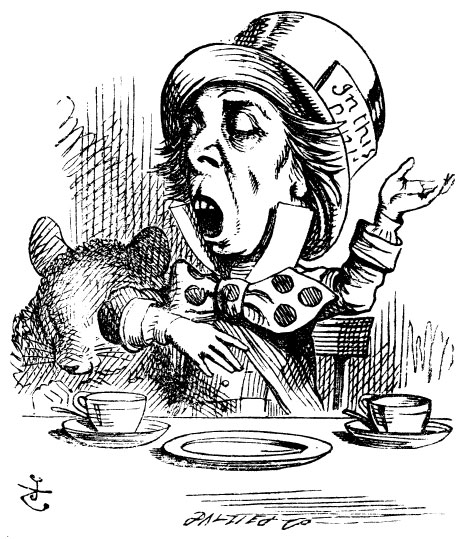

## Instructions

Delete all of this and paste in your own content right here!!

### Portfolio File Format

To create a new Portfolio entry, make sure that you selected `R Markdown (.Rmd)` as the _format_ option of the post when using the `New Post` `blogdown` addin.

### Setup chunk

Make sure you edit the setup chunk above and bring in **all** packages you need using *r library(package_name)*. 


### Inserting a Custom image in your Post

The easiest option is to use the `blogdown` _Insert Image_ RStudio addin to add an external image.

Another way: use a code chunk, if you already have the image downloaded and ready. Place the image in the **same folder** as this Post, and link to it with the chunk below:



### Narrative Text and Futher Code chunks

Start typing/pasting text here.

Diamonds are forever. We can see that from this graph below:


# I have added this chunk right now to check the rmd. 


```
##  [1] "name"         "genus"        "vore"         "order"        "conservation"
##  [6] "sleep_total"  "sleep_rem"    "sleep_cycle"  "awake"        "brainwt"     
## [11] "bodywt"
```

```
## # A tibble: 6 x 11
##   name    genus vore  order conservation sleep_total sleep_rem sleep_cycle awake
##   <chr>   <chr> <chr> <chr> <chr>              <dbl>     <dbl>       <dbl> <dbl>
## 1 Cheetah Acin~ carni Carn~ lc                  12.1      NA        NA      11.9
## 2 Owl mo~ Aotus omni  Prim~ <NA>                17         1.8      NA       7  
## 3 Mounta~ Aplo~ herbi Rode~ nt                  14.4       2.4      NA       9.6
## 4 Greate~ Blar~ omni  Sori~ lc                  14.9       2.3       0.133   9.1
## 5 Cow     Bos   herbi Arti~ domesticated         4         0.7       0.667  20  
## 6 Three-~ Brad~ herbi Pilo~ <NA>                14.4       2.2       0.767   9.6
## # ... with 2 more variables: brainwt <dbl>, bodywt <dbl>
```

```
## # A tibble: 6 x 11
##   name    genus vore  order conservation sleep_total sleep_rem sleep_cycle awake
##   <chr>   <chr> <chr> <chr> <chr>              <dbl>     <dbl>       <dbl> <dbl>
## 1 Tenrec  Tenr~ omni  Afro~ <NA>                15.6       2.3      NA       8.4
## 2 Tree s~ Tupa~ omni  Scan~ <NA>                 8.9       2.6       0.233  15.1
## 3 Bottle~ Turs~ carni Ceta~ <NA>                 5.2      NA        NA      18.8
## 4 Genet   Gene~ carni Carn~ <NA>                 6.3       1.3      NA      17.7
## 5 Arctic~ Vulp~ carni Carn~ <NA>                12.5      NA        NA      11.5
## 6 Red fox Vulp~ carni Carn~ <NA>                 9.8       2.4       0.35   14.2
## # ... with 2 more variables: brainwt <dbl>, bodywt <dbl>
```

```
## [1] 83 11
```

```
## [1] TRUE
```


#ENDDDDD

