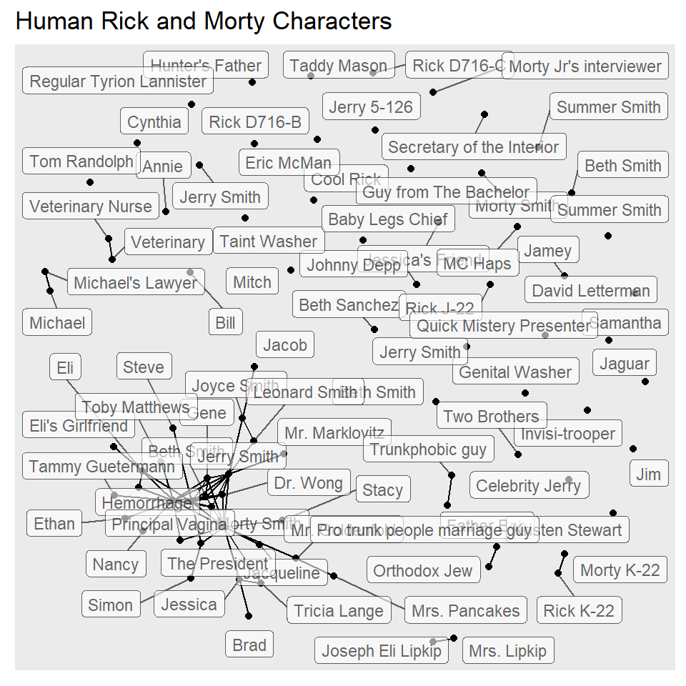

This workshop involved all of us learning to code using R. We made different kinds of graphs for different things. Here are some of the graphs we made:

### **Looking at baby names in the United States:**

Here, we looked at different baby names and tried to see how many times they occured in a year. This graph analyses the names, Leslie, Lesley and Leslee:

### **Looking at the sleep patterns of animals:**

In this graph, we looked at the sleep patterns of animals depending on their feeding type.

### **Looking at connections between characters of your favorite show:**

The graph below shows the different human relationships in the show, Rick & Morty. 

### **Reflections:**

At first, coding may seem rather complex and blood-curdling. However, it isn't really the case. I do admit, it's got a small learning curve but it isn't rocket science. The things achieved from a single line of code is quite mind-boggling! The fact that one can tell stories, identify data, plot maps and find relationships and networks using simple codes, makes the whole learning process worth it.

The graphs above are only a small fragment of what can be achieved. In two weeks, we've been able to learn a lot about coding, plotting graphs and even making maps! 

