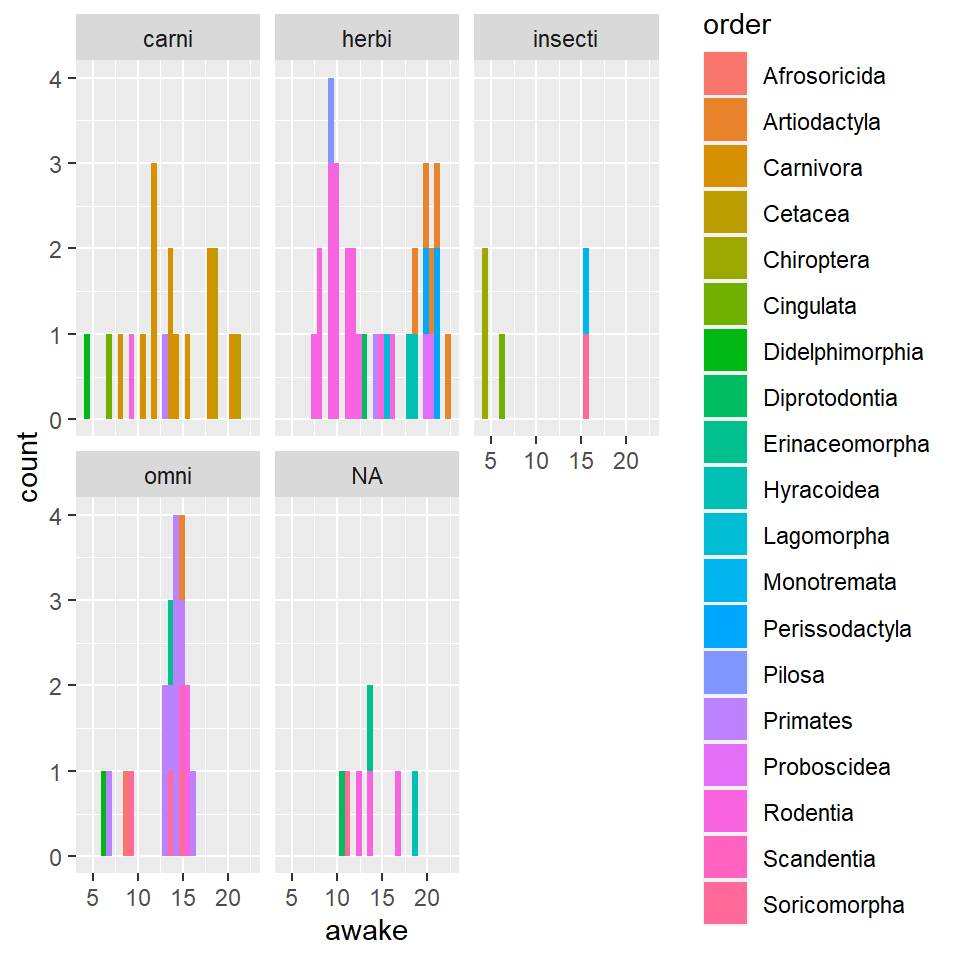
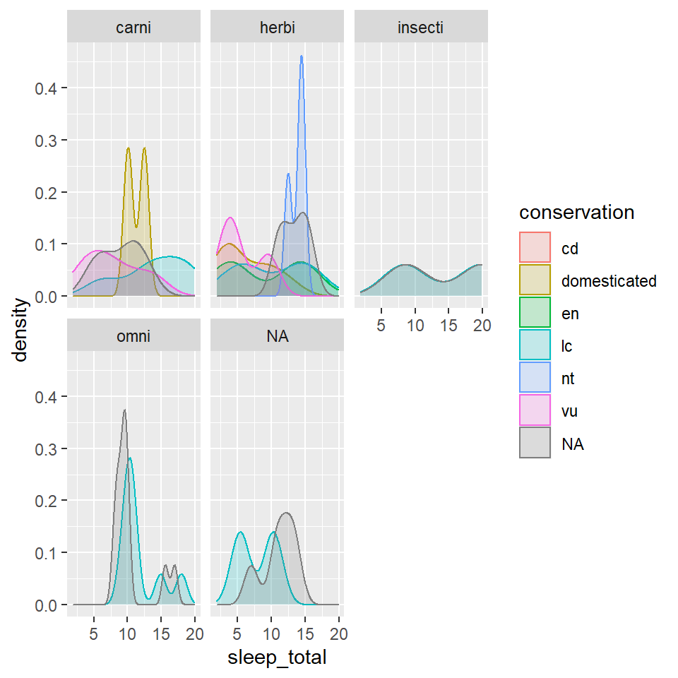
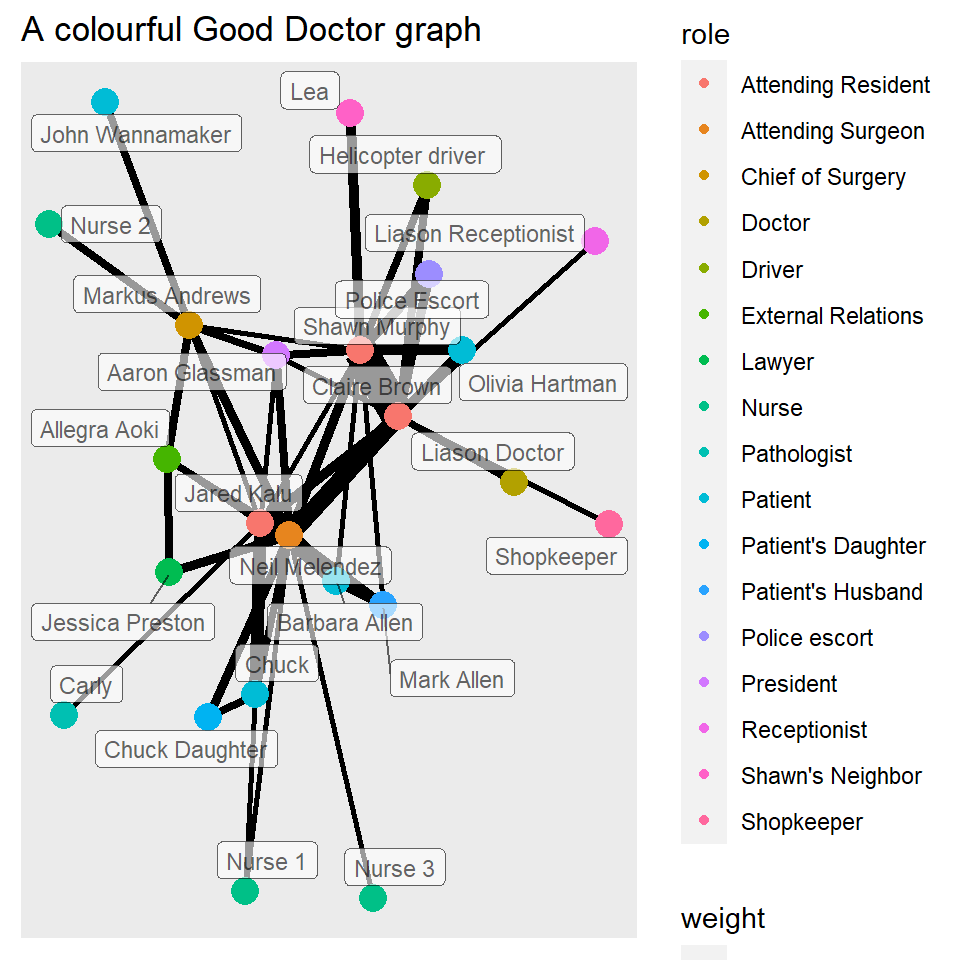

## **PORTFOLIO**

##### _Tanvi Patravali_

 

### ANALYSING MSLEEP DATA

###### _A bar graph showing the awake time of species, classified by order and eating habits_

 

###### _A density chart showing the total sleep time of different species, classifies by conservation status and thier eating habits_

### A NETWORK ANALYSIS FROM THE SERIES _THE GOOD DOCTOR_

###### _A network analysis between different characters from episode 3 and 4 of season 1_

### REFLECTION

During this course, I learnt the importance of analysis of data. I realised that there are so many ways data can be represented, and doing it the right way makes the entire process of comprehension a whole lot easier. I also really liked playing around with maps and having fun with the datasets. Working with code to make these was a bit intimidating at first, but I did like that we were given time to play around and experiment with each module, to understand it better. After this workshop, I also feel like I am a lot more comfortable coding, and I think I understand programming better. 
