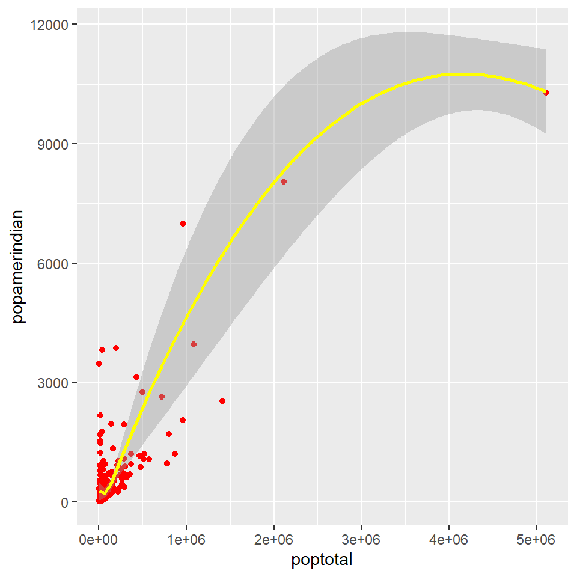
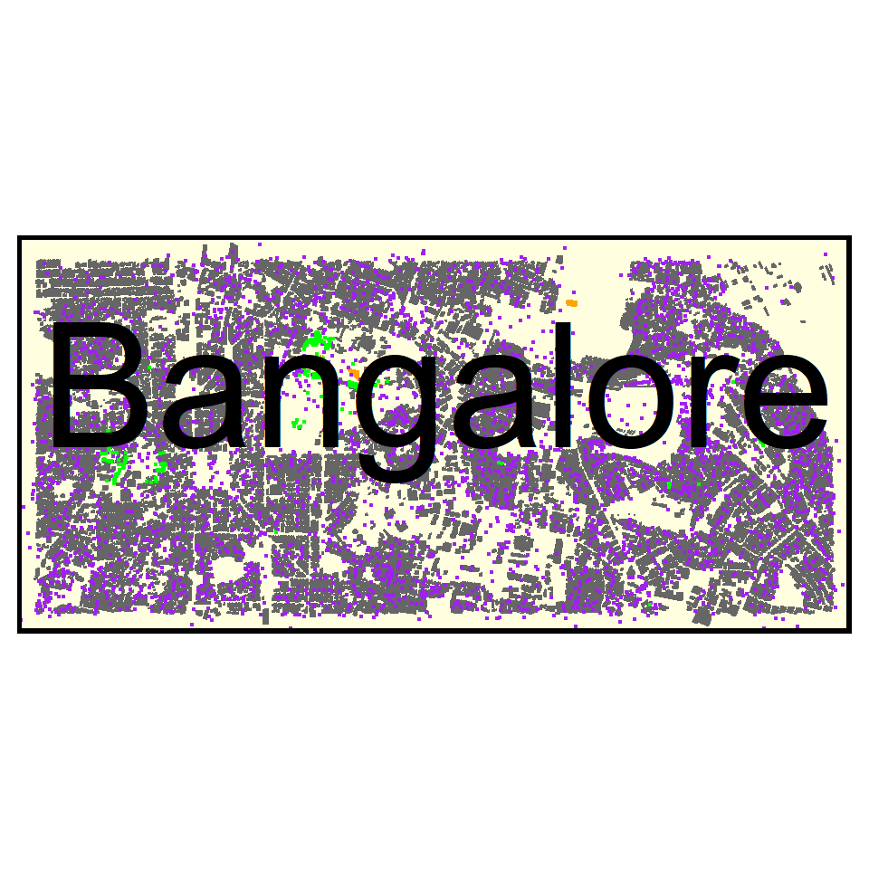
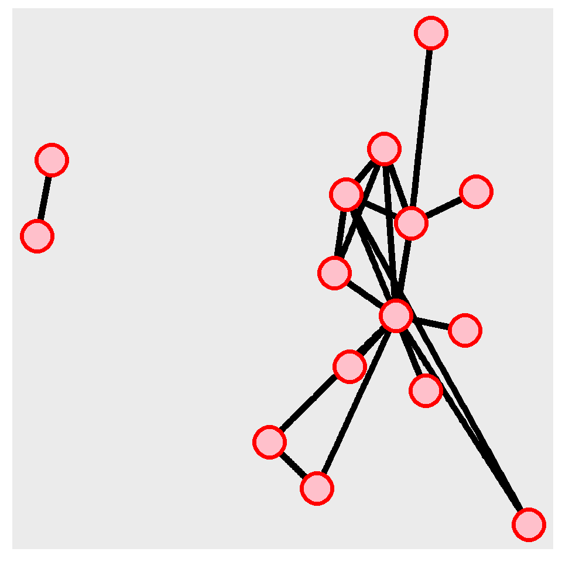

## 3 of my favourite graphs

1.  Graph 1

    A graph of the American Indian population in the midwest USA.


```r
ggplot(midwest, aes(x = poptotal, y = popamerindian)) + geom_point(colour = "red") + geom_smooth(colour = "yellow") 
```

```
## `geom_smooth()` using method = 'loess' and formula 'y ~ x'
```



2.  Graph 2


```r
bbox_l <- bbox <- osmplotr::get_bbox(c(77.56,12.93,77.63,12.96))
bbox_l
```

```
##     min   max
## x 77.56 77.63
## y 12.93 12.96
```


```r
dat_B <- extract_osm_objects(key = "building", bbox = bbox_l) 
```

```
## Issuing query to Overpass API ...
```

```
## Rate limit: 2
```

```
## Query complete!
```

```
## converting OSM data to sf format
```

```r
dat_H <- extract_osm_objects(key = 'highway', bbox = bbox_l)
```

```
## Issuing query to Overpass API ...
```

```
## Rate limit: 2
```

```
## Query complete!
```

```
## converting OSM data to sf format
```

```r
dat_P <- extract_osm_objects(key = 'park', bbox = bbox_l)
```

```
## Issuing query to Overpass API ...
```

```
## Rate limit: 2
```

```
## Query complete!
```

```
## converting OSM data to sf format
```

```r
dat_G <- extract_osm_objects(key = 'landuse', value = 'grass', bbox = bbox_l)
```

```
## Issuing query to Overpass API ...
```

```
## Rate limit: 2
```

```
## Request failed [429]. Retrying in 1.5 seconds...
```

```
## Query complete!
```

```
## converting OSM data to sf format
```

```r
dat_T <- extract_osm_objects(key = 'natural', value = 'tree', bbox = bbox_l)
```

```
## Issuing query to Overpass API ...
```

```
## Rate limit: 2
```

```
## Query complete!
```

```
## converting OSM data to sf format
```


#### Bangalore map

This map visualises the highways, parks and trees around Bangalore, my hometown. The gray are the highways, orange the parks and purple are the trees.


```r
tm_shape(dat_B) + tm_polygons(col = "gray40") +
tm_shape(dat_G) + tm_fill(size = 4, col = "orange") +
tm_shape(dat_H) + tm_dots(col = "purple") +
tm_shape(dat_T) + tm_dots(col = "green") +

tm_layout(title = "Bangalore", title.size = 6, frame = TRUE, frame.lwd = 5, bg.color = "lightyellow")
```



### Network Graph


```r
bojack_nodes <- read_csv("./Data/bojack-nodes.csv",trim_ws = TRUE) %>% 
  select(1:4) %>% 
  drop_na()
```

```
## Rows: 15 Columns: 4
```

```
## -- Column specification --------------------------------------------------------
## Delimiter: ","
## chr (3): Name, Sex, Animal
## dbl (1): Season
```

```
## 
## i Use `spec()` to retrieve the full column specification for this data.
## i Specify the column types or set `show_col_types = FALSE` to quiet this message.
```

```r
bojack_edges <- read_csv("./Data/bojack-edges.csv",trim_ws = TRUE)%>% 
  select(1:4) %>% 
  drop_na()
```

```
## Rows: 20 Columns: 4
```

```
## -- Column specification --------------------------------------------------------
## Delimiter: ","
## chr (3): from, to, Type
## dbl (1): weight
```

```
## 
## i Use `spec()` to retrieve the full column specification for this data.
## i Specify the column types or set `show_col_types = FALSE` to quiet this message.
```

```r
bojack_nodes
```

```
## # A tibble: 15 x 4
##    Name                Sex    Animal       Season
##    <chr>               <chr>  <chr>         <dbl>
##  1 Bojack Horseman     male   Horse             1
##  2 Princess Carolyn    female Cat               1
##  3 Diane Nguyen        female Human             1
##  4 Todd Chavez         male   Human             1
##  5 Mr. Peanutbutter    male   Dog               1
##  6 Vincent Adultman    male   Human             1
##  7 Secretariat         male   Horse             1
##  8 Dick Cavett         male   Human             1
##  9 Random character    female Human             1
## 10 Random character #2 female Human             1
## 11 Sebastian St. Clair male   Snow Leopard      1
## 12 Random character #3 male   Horse             1
## 13 Lenny Turtletaub    male   Turtle            1
## 14 Kelsey Jannings     female Human             1
## 15 Photographers       male   Human             1
```

```r
bojack_edges
```

```
## # A tibble: 20 x 4
##    from             to                  weight Type        
##    <chr>            <chr>                <dbl> <chr>       
##  1 Dick Cavett      Secretariat              1 Professional
##  2 Mr. Peanutbutter Bojack Horseman          3 Friends     
##  3 Bojack Horseman  Todd Chavez              3 Friends     
##  4 Princess Carolyn Bojack Horseman          3 Friends     
##  5 Vincent Adultman Bojack Horseman          1 Friends     
##  6 Vincent Adultman Princess Carolyn         4 Partners    
##  7 Mr. Peanutbutter Vincent Adultman         1 Friends     
##  8 Princess Carolyn Mr. Peanutbutter         1 Friends     
##  9 Bojack Horseman  Random character         1 Acquaintance
## 10 Bojack Horseman  Random character #2      1 Acquaintance
## 11 Bojack Horseman  Random character #3      1 Acquaintance
## 12 Diane Nguyen     Photographers            1 Professional
## 13 Diane Nguyen     Sebastian St. Clair      2 Professional
## 14 Mr. Peanutbutter Todd Chavez              4 Friends     
## 15 Diane Nguyen     Mr. Peanutbutter         1 Partners    
## 16 Bojack Horseman  Lenny Turtletaub         2 Professional
## 17 Bojack Horseman  Kelsey Jannings          2 Professional
## 18 Kelsey Jannings  Lenny Turtletaub         1 Professional
## 19 Princess Carolyn Diane Nguyen             1 Friends     
## 20 Bojack Horseman  Diane Nguyen             1 Friends
```

3.  Graph 3

    This graph shows the connections/interactions between characters appearing in Season 1, Episode 12 of Bojack Horseman.


```r
bojack <- tbl_graph(nodes = bojack_nodes, 
                    edges = bojack_edges,
                    directed = FALSE)

ggraph(graph = bojack,  layout = "kk") +
geom_edge_link(width = 2, color = "black") +
geom_node_point(shape = 21, size = 8, fill = "pink", color = "red", stroke = 2) 
```



## Reflection

Learning this particular language of code was a different experience for me. I've had several encounters with code and they were always very stressful. This course was also stressful but one thing different is that I enjoyed learning and working with it.


